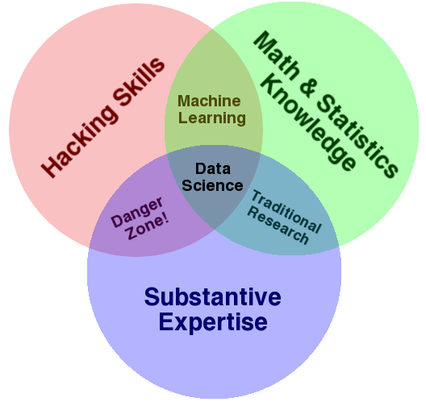
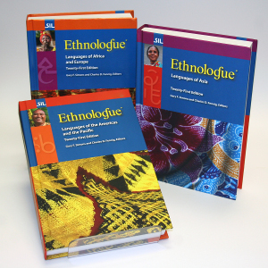
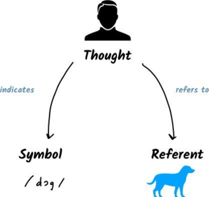

```python
---
jupyter:
  jupytext:
    cell_markers: region,endregion
    comment_magics: false
    formats: ipynb,.pct.py:hydrogen,Rmd,md
    text_representation:
      extension: .py
      format_name: hydrogen
      format_version: '1.1'
      jupytext_version: 1.1.5
  kernelspec:
    display_name: Python 3
    language: python
    name: python3
---
```

<!-- #region {"slideshow": {"slide_type": "slide"}} -->
*ANLY 580: Natural Language Processing for Data Analytics* <br>
*Fall 2019* <br>
# 1. Introduction
<!-- #endregion -->

<!-- #region {"slideshow": {"slide_type": "slide"}} -->
# Logistics
- [Syllabus](https://georgetown.instructure.com/courses/81464/assignments/syllabus) on Canvas
- [Course GitHub repository](https://anyl580.github.io)
- Assignments
- Scientific Paper
- Rubrics
- Readings
<!-- #endregion -->

<!-- #region {"slideshow": {"slide_type": "notes"}} -->
If you haven't yet filled out the questionnaire, please go to canvas to get the Survey in Canvas. This is a rather large class and this should facilitate our getting to know each other and the skills / background you bring to the program. Hopefully, this will also help us to somewhat tailor the course to your needs and interests!

Questions include:

- Name
- Educational background
- First language (what did you grow up speaking at home?)
- Other languages you may know conversationally or have some competency
- Programming languages you have experience with
- Do you (or have you) already worked in data science at work?
- Do you already use any NLP tools?
- Topics in NLP that most interest you and why?
<!-- #endregion -->

<!-- #region {"slideshow": {"slide_type": "slide"}} -->
# Course Objectives
* Ability to identify language data problems, translate to NLP tasks, and communicate findings clearly
* Understanding of NLP tasks
* Basic familiarity with NLP tools for data science
* Ability to evaluate performance in applied settings
* Knowledge about where to find NLP resources
* Practice at producing and presenting scientific work
<!-- #endregion -->

<!-- #region {"slideshow": {"slide_type": "slide"}} -->
# Understanding the Problem



For NLP this can mean both:
- Domain expertise in language
- Domain expertise with respect to the business need

Image credit: http://drewconway.com/zia/2013/3/26/the-data-science-venn-diagram
<!-- #endregion -->


<!-- #region {"slideshow": {"slide_type": "notes"}} -->
Perhaps, the most important skill as a data scientist is your ability to understand the user problem so that you solve the *right* problem. It's extremely easy to get caught up in hearing "translation" problem and immediately gravitating to the assumption that the problem is "Machine Translation."

When you have the opportunty, visit users in *their* environment and ask them to show you what they are trying to do. Try to understand the problem from their perspective and think about different ways to solve the problem. Get feedback on your ideas and try to avoid talking about tools, rather focus on ideas. Keep in mind that you are solving both a business problem and a user problem.

More thoughts in this vein: [Don't do Data Science, Solve Business Problems](https://towardsdatascience.com/dont-do-data-science-solve-business-problems-6b70c4ee0083)
<!-- #endregion -->

<!-- #region {"slideshow": {"slide_type": "slide"}} -->
# Properties of Language





- Cooperative - SOCIAL
- Multi-signal: spoken (incl. gesture), signed, written
- Generative - symbolic, logical, compositional, structurally complex
- Encode information grammatically and through convention
- Perpetually changing
<!-- #endregion -->


<!-- #region {"slideshow": {"slide_type": "notes"}} -->
More than 6ooo human languages today. 94% of the world's language account for only 6% of the world's population.

There is no clear distinction between a language and dialect. Languages tend to be grouped sociopolitically and also in terms of mutual intelligibility, writing systems, geography, and culture.

Regardless, language is a *social* phenomenon. What makes human language unique from other forms of animal communication is it's *productivity* (i.e.,, generative nature) and it's *expressiveness.* Theoretical linguistics has long sought to tease out universal principles that underlie all human language. In addition to basic cognitive capacity, language must be learned early in childhood and is also deeply entwined with culture and convention.

Because it is inherently social, language use is variable -- crossing social boundaries, conventional use across media, and over time. In fact, language changes very quickly - and especially where different cultures contact one another. Because language is so variable, it poses particular challenges for language processing.
<!-- #endregion -->




<!-- #region {"slideshow": {"slide_type": "slide"}} -->
# Language in the Brain
[](https://youtu.be/k61nJkx5aDQ)
<!-- #endregion -->

<!-- #region {"slideshow": {"slide_type": "notes"}} -->
What we know about human language in the brain comes from studying people with damaged people and more recently from brain imaging. Anatomical studies indicate that certain regions of the brain play a role in linguistic processes.

For example, Broca's area, once thought to be a center in speech production and syntactic processing is probably not the center of such functionality, but participating as a node in broader neural processes (e.g., motor processes, computational processes).

The study of language is highly inter-disciplinary including not just linguists but neuroscientists, psychologists, anthropologists, sociologists, computer scientists, and others.
<!-- #endregion -->


<!-- #region {"slideshow": {"slide_type": "slide"}} -->
# Representations in the Brain
<iframe width="560" height="315" src="https://www.youtube.com/embed/k61nJkx5aDQ" frameborder="0" allow="accelerometer; autoplay; encrypted-media; gyroscope; picture-in-picture" allowfullscreen></iframe>
<!-- #endregion -->


<!-- #region {"slideshow": {"slide_type": "slide"}} -->
[](https://youtu.be/k61nJkx5aDQ)
Image copyright Alexander Huth / The Regents of the University of California
<!-- #endregion -->


<!-- #region {"slideshow": {"slide_type": "notes"}} -->
https://www.theguardian.com/science/2016/apr/27/brain-atlas-showing-how-words-are-organised-neuroscience

This image  depicts a person’s right cerebral hemisphere. The overlaid words, when heard in context, are predicted to evoke strong responses near the corresponding location. Green words are mostly visual and tactile, red words are mostly social.

 This view intimates that linguistic capacity is distributed across your entire cerebral cortex. A single location in the brain is associated with a number of words and one word may activate multiple regions of the brain. Thus, semantic concepts are activated by priming or stimulating neural networks.

The original scientific article is found here: https://www.ncbi.nlm.nih.gov/pmc/articles/PMC4852309/pdf/nihms765514.pdf

If this interests you,  play around with semantic maps in an [Interactive 3D viewer](https://gallantlab.org/huth2016/)
<!-- #endregion -->

<!-- #region {"slideshow": {"slide_type": "slide"}} -->
# Dual Processing
**The** fast-thinking part **of your** brain creates **the** basic structure **of the** sentence (**the** words **here** marked **in** bold). **The** other words require **the** slower, more calculating part **of your** brain.
<!-- #endregion -->


<!-- #region {"slideshow": {"slide_type": "notes"}} -->
Example from: https://www.technologyreview.com/s/611640/data-mining-reveals-fundamental-pattern-of-human-thinking/

There is a difference between "function words" such as the articles, prepositions, pronouns, and other "closed class" words, and "content words".

"In English, the most popular word is the, which makes up about 7 percent of all words, followed by and, which occurs 3.5 percent of the time, and so on. Indeed, about 135 words account for half of all word appearances. So a few words appear often, while most hardly ever appear."

Other languages follow the same sort of distributional pattern.

A possible explanation for this distribution is accounted for by dual process theory, as described by Kahneman (2010). There may be two ways in which we process words (or phrases) in the brain. Dual process theory provides an account for thought arising from both the unconscious (fast) and controlled (slow). The multiplication of two three digit numbers in one’s head  involves the use of working memory and planning circuitry. But estimating whether a car looks cheap or expensive involves a more heuristic process and judgement is largely formed through unconscious processes.

The same may be true of language. Function words are largely grammaticalized information accessible via unconscious processes. Indeed, when you first learn a new language it is effortful to form utterances and later becomes much easier as unconscious processes assimilate patterns at different levels of analysis. Yet, you still make conscious choices about the words you might use to frame your thoughts, depending on the audience. And despite this, you would not expend much energy thinking about whether to insert smaller, grammaticalized pieces of information. Your ability to use such information is largely driven by unconscious processes. In fact, our brains are quite efficient in the use of language using as little effort as possible.
<!-- #endregion -->


<!-- #region {"slideshow": {"slide_type": "slide"}} -->
# Symbolic Processing


<!-- #endregion -->


<!-- #region {"slideshow": {"slide_type": "slide"}} -->
Formal languages and models were adapted for language analysis at least back as far as the early 1950’s when [Bar-Hillel suggested the possibility of universal syntactic categories](http://www.mt-archive.info/Bar-Hillel-1953.pdf) and potential ramification for machine translation.

Noam Chomsky went on to compose a treatise on syntactic structures to show that  a limited set of rules could generate all well-formed (i.e., valid) grammatical sentences for a language. (And excluding those that are not.)

Indeed, our own perception of language seems categorical. Think about your perception of color. While colors are clearly gradational, we make distinction along the spectrum and have discrete color names, accordingly.
<!-- #endregion -->

