# -*- coding: utf-8 -*-
---
jupyter:
  jupytext:
    comment_magics: false
    formats: ipynb,md
    text_representation:
      extension: .md
      format_name: markdown
      format_version: '1.1'
      jupytext_version: 1.1.5
  kernelspec:
    display_name: Python 3
    language: python
    name: python3
---

```python slideshow={"slide_type": "skip"}
from IPython.display import HTML
```

<!-- #region {"slideshow": {"slide_type": "slide"}} -->
*ANYL 580: NLP for Data Analytics*

# **Information Extraction**
<!-- #endregion -->

<!-- #region {"slideshow": {"slide_type": "slide"}} -->
# Topics

* Syntax
* Part-of-Speech
* Extraction Tasks
  * Keywords
  * Multi-word Expressions
  * Named Entity Recognition
  * Referring Expressions
  * Co-reference
  * Relation Extraction
* Annotation
* SpaCy - Customizing extraction
* Transformers
<!-- #endregion -->

<!-- #region {"slideshow": {"slide_type": "slide"}} -->
# Where are we?
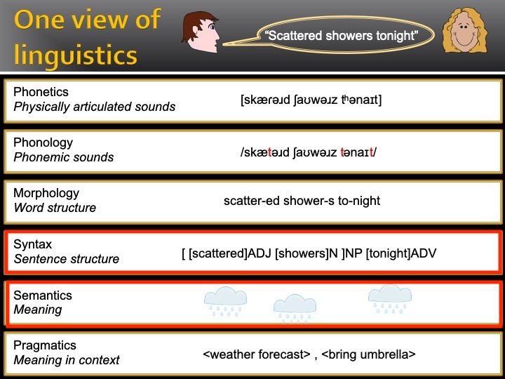
<!-- #endregion -->

<!-- #region {"slideshow": {"slide_type": "notes"}} -->
Linguists tend to think of language processing and NLP in terms of levels of abstraction. This is a fairly typical perspective. 

- When you decode language in your brain, it comes in as sounds and is mapped to phonemes (which are themselves abstractions, though also perceptual entities). 
- The smallest unit of meaning is a morpheme, and morphemes can be combined into larger structure such as words. 
- Words are articulated in sequences that align to syntactic structures with properties such as nesting and recursion.
- Movement of words in a sequence result in meaning change. So the relationship between syntax and semantics is important in NLP. This is our topic today.
- And, finally meaning is NOT just the sum compositional meaning of words in a sequence, but is enriched by other representations in the world (e.g., the visual world), convention, and how the speaker intends to produce an utterance and have it understood. And we'll talk about this last bit next week.
<!-- #endregion -->

<!-- #region {"slideshow": {"slide_type": "slide"}} -->
# Syntax

- Structure
	- Word order
	- Relations between words
- Compositionality 
- Properties of categories - part of a grammar or belonging to words themselves?
<!-- #endregion -->

<!-- #region {"slideshow": {"slide_type": "notes"}} -->
Syntax encodes relations between words. It also determines the arrangement of words, to include general patterns of movement. For example, 

- The time is 4:30
- What time is it?

Where the wh-word is 
"fronted"

- Very generally, the meaning of an expression is derived by the meaning of its parts.
- A corollary to this is that syntactic operations result in meaning change.

The problem with compositionality has to do with knowledge that speaker's and hearer's have that contribute to meaning. We'll talk more about this next week when we talk about inference

<!-- #endregion -->

<!-- #region {"slideshow": {"slide_type": "slide"}} -->
## Word Order and Apparent Movement

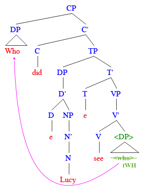
<!-- #endregion -->

<!-- #region {"slideshow": {"slide_type": "notes"}} -->
This representation of "wh-movement" does not express  reality, but is represented here in only one of many theories of syntax.

Linguists study patterns in language and have constructed theories that account for regularities across the world's languages. 

This syntactic tree is a representation from one theory of grammar where meaning is expressed at a deep level differently than at the surface.
<!-- #endregion -->

<!-- #region {"slideshow": {"slide_type": "slide"}} -->
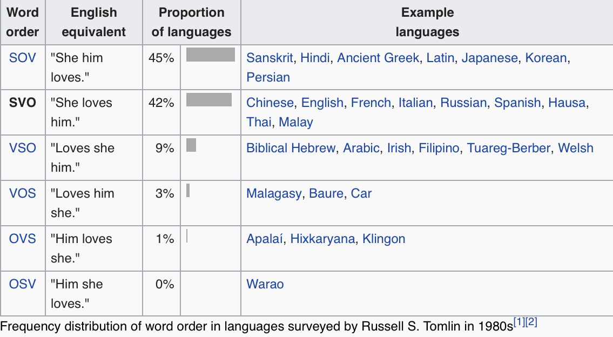
<!-- #endregion -->

<!-- #region {"slideshow": {"slide_type": "notes"}} -->
Image from Wikipedia: https://en.wikipedia.org/wiki/Subject%E2%80%93verb%E2%80%93object

- If you are curious about questions such as global patterns in phonology and syntax, check out https://wals.info/
- How many languages are there in the world? https://www.ethnologue.com/guides/how-many-languages


There are indeed repeated patterns across languages and for this reason, syntacticians working under Chomskian theories (e.g., generative linguistics) refer to **principles and parameters** of language. Principles are expressed as abstract rules while parameters are functions that are either present or absent.

There are a lot of problems with Chomskyan generative linguistics around ideas of innateness, language modularity, poverty of the stimulus, etc. But some of the ideas around grammars are still useful, in that there is certainly interaction between words and word structure.
<!-- #endregion -->

<!-- #region {"slideshow": {"slide_type": "slide"}} -->
## Syntactic Theories

- **Generative grammar** (emphasis on a grammar-based model)
- **Dependency grammar** (emphasis on relations between words)
- **Categorial grammar** (emphasis on properties of syntactic categories)
- **Functional / Cognitive** grammar (emphasis on lexicon and schemas)
<!-- #endregion -->

<!-- #region {"slideshow": {"slide_type": "notes"}} -->
There are many different theories of syntax or how words are combined to express meaning. These are a few important ones you may hear about.

Both functional grammar and cognitive grammar approach language from a lexical perspective. 

Why am I telling you all of this?
<!-- #endregion -->

<!-- #region {"slideshow": {"slide_type": "slide"}} -->
## NLP Tasks around Structure

https://nlpprogress.com

Consituency parsing
- Dependency parsing
- Semantic parsing
- Semantic role labeling
- Shallow syntax
- ...
<!-- #endregion -->

<!-- #region {"slideshow": {"slide_type": "notes"}} -->
Next week we'll talk more about some of these tasks as they pertain to meaning and understanding
<!-- #endregion -->

<!-- #region {"slideshow": {"slide_type": "slide"}} -->
## Part of Speech: Word Categories

Closed class - Rarely new words added
	- Determiners
	- Conjunctions
	- Pronouns
	- Cardinal numbers
	- Etc.
Open class  - Productive (new words often added)
	- Nouns
	- Adjectives
	- Verbs
	- ...

<!-- #endregion -->

<!-- #region {"slideshow": {"slide_type": "notes"}} -->
Integral to a discussion of compositionality and meaning are categories referred to as "part of speech".
<!-- #endregion -->

<!-- #region {"slideshow": {"slide_type": "slide"}} -->
## Phrasal Categories
- Determined by the headword (e.g., noun, verb, adj, ...)

- too **slowly** (AdvP)
- The **man** (NP)
- At **lunch** (PP)
- **Run** a mile (VP)
- Very **happy** (AdjP)
<!-- #endregion -->

<!-- #region {"slideshow": {"slide_type": "notes"}} -->
The word 'phrase' can mean different things to different folks.
<!-- #endregion -->

<!-- #region {"slideshow": {"slide_type": "slide"}} -->
## Part of Speech Categories in NLP

Common tag sets:
- **Brown** - about 80
- **Penn Treebank** (WSJ); 45 tags
- **Universal Dependencies**; 6 open class 8 closed
- **OntoNotes**; variant of Penn Treebank

https://spacy.io/api/annotation#pos-tagging

<!-- #endregion -->

<!-- #region {"slideshow": {"slide_type": "notes"}} -->
Parts of speech are determined within a theory of grammar. Thus, there is no absolute set. They are categories, and categories are a slippery construct in theories of language. 
<!-- #endregion -->

<!-- #region {"slideshow": {"slide_type": "slide"}} -->
## POS.... use in Data Science?

- Pattern sequences (e.g., in Regex). Check out the matcher in SpaCy!
  - https://spacy.io/usage/rule-based-matching
  - https://explosion.ai/demos/matcher
- Filtering (e.g., IR)
- Features (e.g., NER as we will talk about below)
<!-- #endregion -->

<!-- #region {"slideshow": {"slide_type": "slide"}} -->
# Extraction

* Keywords
* Multi-word Expressions
* Information Extraction
  - Named Entity Extraction
    - Co-reference
    - Entity resolution
  - Relation Extraction
  - Event Extraction
<!-- #endregion -->

<!-- #region {"slideshow": {"slide_type": "slide"}} -->
## What are Keywords?
- **Index Term (IR perspective)** - used for retrieval. Could be a controlled vocabulary,  topics,TF-IDF with weighted words such as in titles.
- **User-generated (Content creator perspective)** - e.g., Hashtags, terminology
- **Linguistic-textual** - words that occur in text more often than by chance alone (e.g., PMI)

*Condensed representation of the essential meaning of a document*
<!-- #endregion -->

<!-- #region {"slideshow": {"slide_type": "slide"}} -->
## Key Phrases

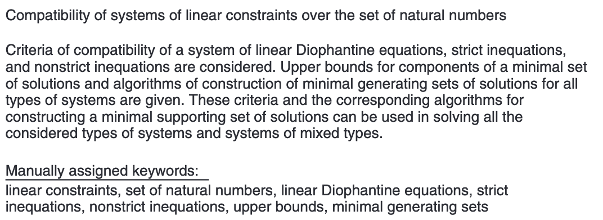
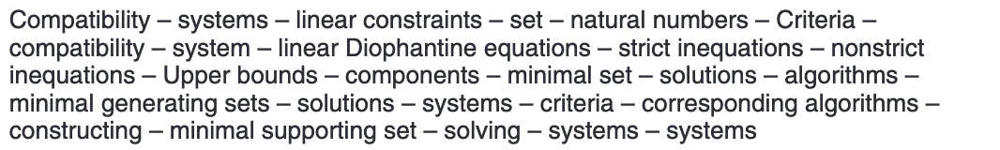
<!-- #endregion -->

<!-- #region {"slideshow": {"slide_type": "notes"}} -->
From: [Automatic keyword extraction from individual documents]( https://pdfs.semanticscholar.org/5a58/00deb6461b3d022c8465e5286908de9f8d4e.pdf)

- The hyphen-delimited terms on the bottom were extracted from an algorithm called RAKE.

- RAKE begins keyword extraction on a document by parsing its text into a set of **candidate keywords**.
  - Tokenize
  - Use stop words as delimeters
- Score (uses frequency and length of phrase)
- Rank (top n)
<!-- #endregion -->

<!-- #region {"slideshow": {"slide_type": "slide"}} -->
## TextRank

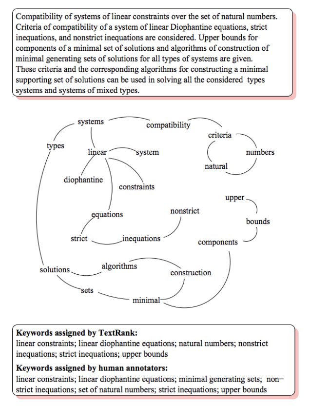
<!-- #endregion -->

<!-- #region {"slideshow": {"slide_type": "notes"}} -->
- Builds off the PageRank algorithm - Textrank is a "graph-based ranking algorithm is a way of deciding on the importance of a vertex within a graph by taking into account global information recursively computed from the entire graph,rather than relying only on local vertex-specific information"

- Mihalcea and Tarau assigned nouns and adjectives as vertices in the graph. Intuitively, verbs, prepositions, and other parts of speech are not generally as important when considering keywords. Verticies are connected by **weighted edges based on co-occurrence, or closeness, scores between words**. If two words appear within a certain number of words from each other in the passage, they are connected in the graph with a higher edge weight the closer they are.

- This algorithm is used for both keyword and sentence extraction

  - Tokenize
  - Add syntactic filters
  - Use only unigrams
  - Add to uni-directed, un-weighted graph - edge is added between words that co-occur between a window of n words
  - Each vertex initialized to 1
  - Run modified "pagerank" until convergence (typically 20-30 times; dampening at .85)

Mihalcea & Tarau (2004) - [TextRank:BringingOrderintoTexts](https://www.aclweb.org/anthology/W04-3252.pdf)


<!-- #endregion -->

<!-- #region {"slideshow": {"slide_type": "slide"}} -->
## Ranking (based on PageRank)


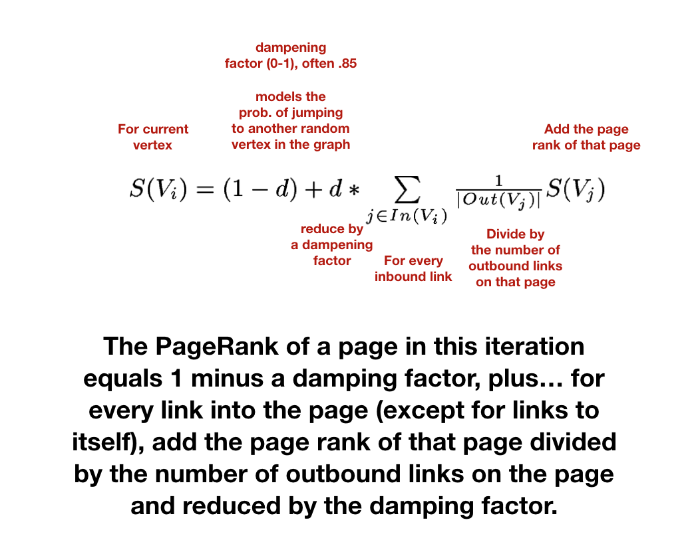
<!-- #endregion -->

<!-- #region {"slideshow": {"slide_type": "notes"}} -->
- Great explanation of how to use TextRank for sentence extraction (summarization)
https://www.analyticsvidhya.com/blog/2018/11/introduction-text-summarization-textrank-python/

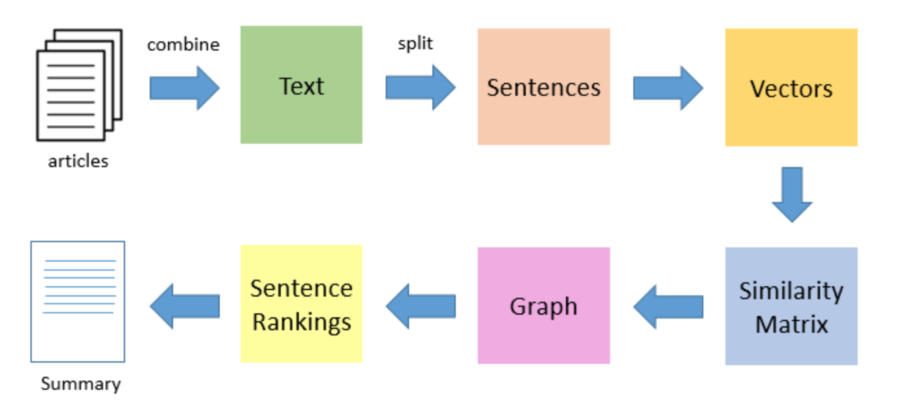
- Simple implementation description using TF-IDF and not dense vectors: https://www.slideshare.net/andrewkoo/textrank-algorithm
<!-- #endregion -->

```python slideshow={"slide_type": "slide"}
# TextRank with SpaCy

import spacy
import pytextrank

# example text
text = "Compatibility of systems of linear constraints over the set of natural numbers. Criteria of compatibility of a system of linear Diophantine equations, strict inequations, and nonstrict inequations are considered. Upper bounds for components of a minimal set of solutions and algorithms of construction of minimal generating sets of solutions for all types of systems are given. These criteria and the corresponding algorithms for constructing a minimal supporting set of solutions can be used in solving all the considered types systems and systems of mixed types."

# load a spaCy model, depending on language, scale, etc.
nlp = spacy.load("en_core_web_sm")

# add PyTextRank to the spaCy pipeline
tr = pytextrank.TextRank()
nlp.add_pipe(tr.PipelineComponent, name="textrank", last=True)

doc = nlp(text)

# examine the top-ranked phrases in the document
for p in doc._.phrases:
    print("{:.4f} {:5d}  {}".format(p.rank, p.count, p.text))
    print(p.chunks)

```

<!-- #region {"slideshow": {"slide_type": "notes"}} -->
https://pypi.org/project/pytextrank/

... And also a nice explanation of how to implement from scratch (essentially). https://towardsdatascience.com/textrank-for-keyword-extraction-by-python-c0bae21bcec0
<!-- #endregion -->

<!-- #region {"slideshow": {"slide_type": "slide"}} -->
## MWE

*Expressions which are made up of at least 2 words and which can be syntactically and/or semantically idiosyncratic in nature. Moreover, they act as a single unit at some level of linguistic analysis.*

- Lexicalized (act as words)
  - Fixed (can't be varied); "in short", "rest assured"
  - Semi-Fixed
    - non-decomposable (can be inflected) - "kick the bucket", "kicked the bucket"
    - compound - "peanut butter"
    - proper name - "San Franciso 49ers", "49ers"
  - Syntactically-Flexible
    - "call up", "call her up"
- Institutionalized (conventions); "salt and pepper" (hair color)
<!-- #endregion -->

<!-- #region {"slideshow": {"slide_type": "notes"}} -->
Examples from: https://aclweb.org/aclwiki/Multiword_Expressions

Multi-word Expressions can be challenging for a number of reason. Most obvious, they are often idiomatic and non-compositional (semantically). 

This is a problem for current neural models of attention. 

Here's a purely statistical approach from Wall and Gries (2018): 
http://www.stgries.info/research/2018_AW-STG_MWEs-MERGE&AFL.pdf
<!-- #endregion -->

<!-- #region {"slideshow": {"slide_type": "slide"}} -->
# Information Extraction Sub-Tasks

- Extraction of semantic content from task. Sub-tasks include:
  - Named Entity Recognition (NER)
  - Co-reference Resolution (and entity linking)
  - Relation Extraction
  - Event Extraction (& co-reference)
<!-- #endregion -->

<!-- #region {"slideshow": {"slide_type": "slide"}} -->
## Named Entity Recognition

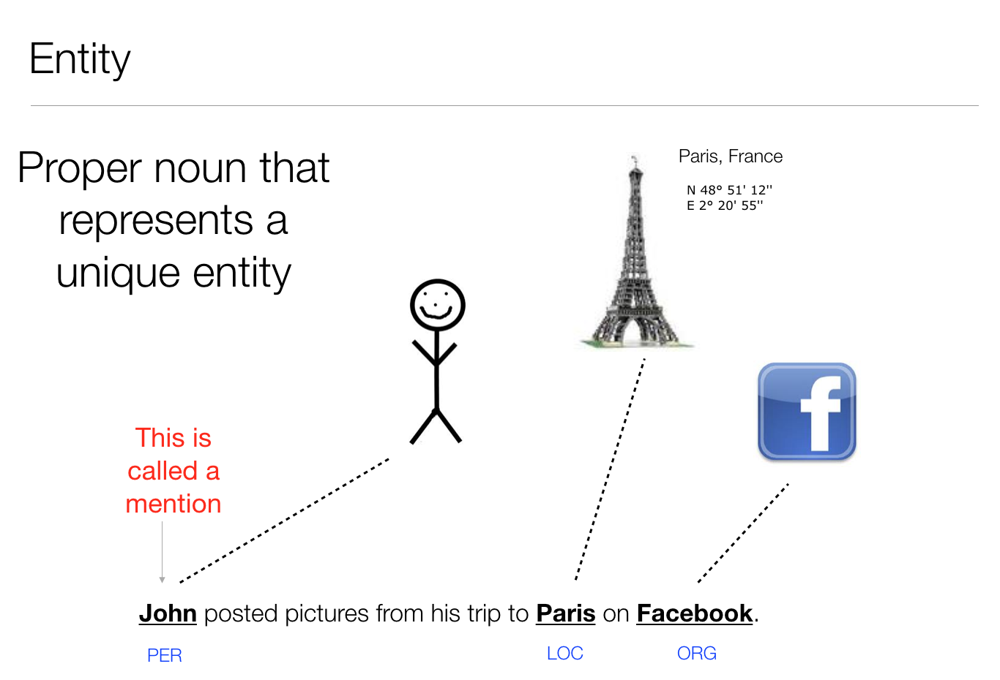
<!-- #endregion -->

<!-- #region {"slideshow": {"slide_type": "notes"}} -->
NER is a sub-task of information extraction. The task is to recognize (find) and classify named entity **mentions** in unstructured text into pre-defined categories such as the person names, organizations, locations, medical codes, time expressions, quantities, monetary values, percentages, etc.
<!-- #endregion -->

<!-- #region {"slideshow": {"slide_type": "slide"}} -->
## Why mentions?


<!-- #endregion -->

<!-- #region {"slideshow": {"slide_type": "slide"}} -->
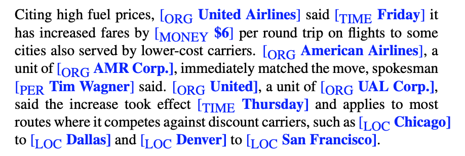
<!-- #endregion -->

<!-- #region {"slideshow": {"slide_type": "slide"}} -->
## Another Sequence Problem? 

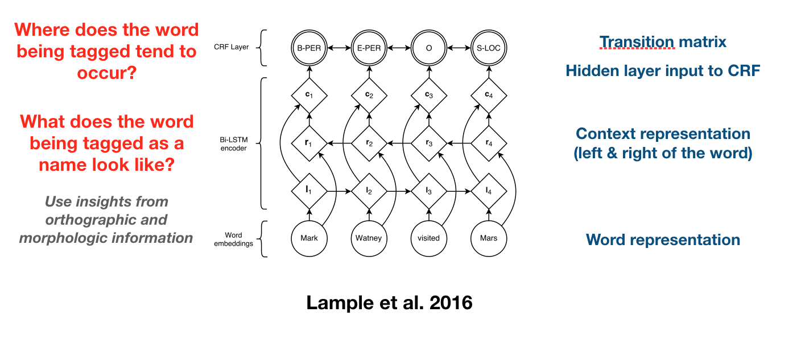
<!-- #endregion -->

<!-- #region {"slideshow": {"slide_type": "notes"}} -->
Image from: Lample et al. (2016) Neural Architectures for Named Entity Recognition. First approach without hand-crafted features.


Nice synopsis of related work. http://www.davidsbatista.net/blog/2018/10/22/Neural-NER-Systems/
<!-- #endregion -->

<!-- #region {"slideshow": {"slide_type": "slide"}} -->
## NER challenges

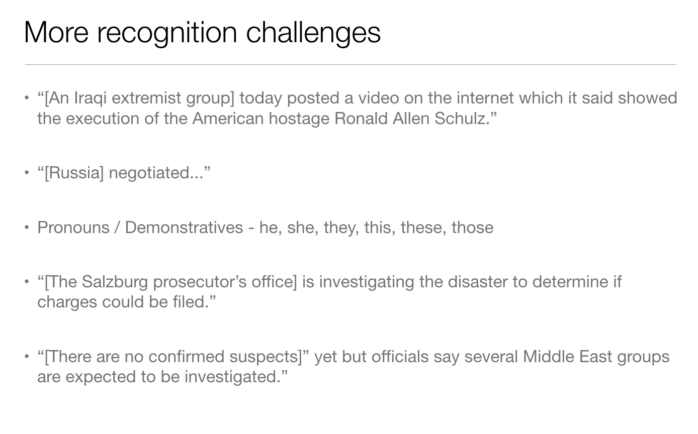
<!-- #endregion -->

<!-- #region {"slideshow": {"slide_type": "slide"}} -->
## DARPA MUC Challenge

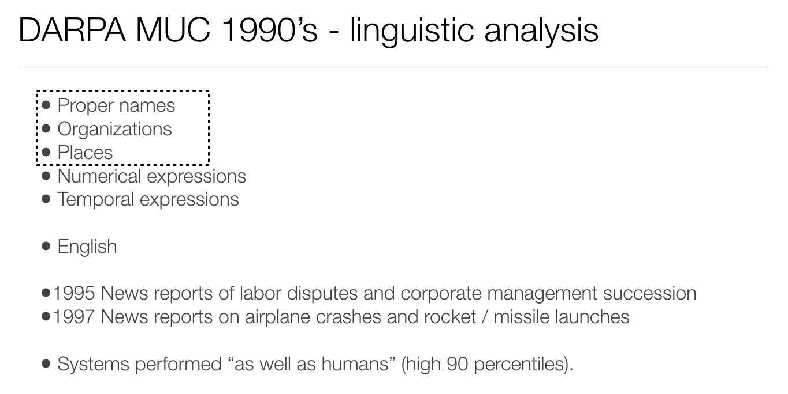
<!-- #endregion -->

<!-- #region {"slideshow": {"slide_type": "slide"}} -->
## ACE Overview

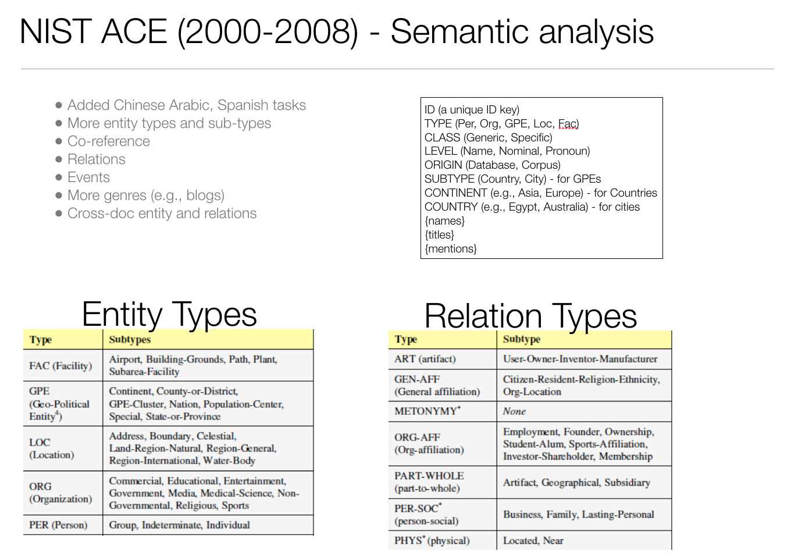
<!-- #endregion -->

<!-- #region {"slideshow": {"slide_type": "slide"}} -->
## ACE Types
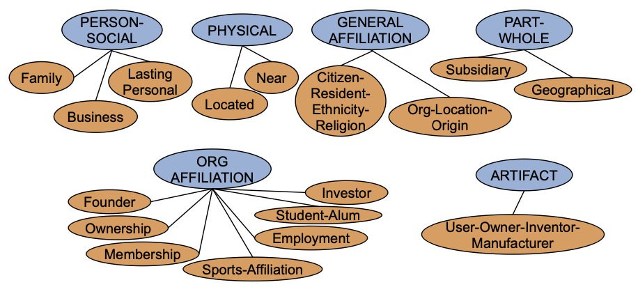
<!-- #endregion -->

<!-- #region {"slideshow": {"slide_type": "slide"}} -->
## NER SOTA

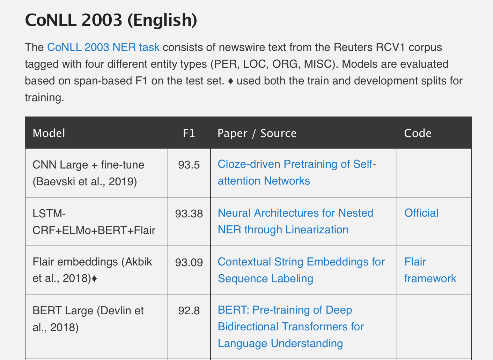
<!-- #endregion -->

<!-- #region {"slideshow": {"slide_type": "notes"}} -->
http://nlpprogress.com/english/named_entity_recognition.html
<!-- #endregion -->

<!-- #region {"slideshow": {"slide_type": "slide"}} -->
## NER... Solved?

- State of the art (SOTA) NER systems for English produce near-human performance on standard benchmark tests.
- But... systems are still difficult to port to new domains and with new labels (not "universal")
- Test results assume unambiguous categories & labels

Nonetheless, industry considers this a solved problem...

Though, let's talk on a bit about other sorts of referring expressions
<!-- #endregion -->

<!-- #region {"slideshow": {"slide_type": "slide"}} -->
## Referring Expressions

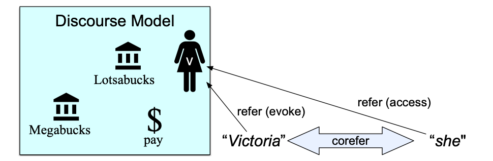
<!-- #endregion -->

<!-- #region {"slideshow": {"slide_type": "notes"}} -->
Recall that we talk about references in text as mentions and that they refer to some abstract entity not in the text. When a reference refers to a previous mention - we call it an **anaphor**. And when two mentioned refer to the same entity, they are said to be related by **co-reference**.

Co-reference resolution is the task of determining whether two mentions co-refer. Sets of co-referring mentions are often called a co-reference chain.
<!-- #endregion -->

<!-- #region {"slideshow": {"slide_type": "slide"}} -->
## Information (Cognitive) Status


A. I couldn't sleep last night. **It** kept me awake.

B. I couldn't sleep last night. **That dog next door** kept me awake.

C. I couldn't sleep last night. **The dog next door** kept me awake.

D. I couldn't sleep last night. **A dog kept me awake** kept me awake.
<!-- #endregion -->

<!-- #region {"slideshow": {"slide_type": "notes"}} -->
From Gundel: 
http://web.stanford.edu/group/cslipublications/cslipublications/HPSG/2003/gundel.pdf

We'll talk more about pragmatics next week, but because we're talking about entities and reference -- we'll be touching upon concepts in this space.
<!-- #endregion -->

<!-- #region {"slideshow": {"slide_type": "slide"}} -->
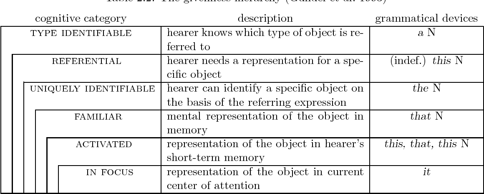
<!-- #endregion -->

<!-- #region {"slideshow": {"slide_type": "notes"}} -->
Note that the bottom three categories are representations in the current center of attention in both the speaker and hearer's mind.

In fact, when we talk about reference we MUST talk about inferencing. What you hear is decoded in parallel with inferences - or aspects of intended meaning that are left under-specified by the speaker. 
<!-- #endregion -->

<!-- #region {"slideshow": {"slide_type": "slide"}} -->
## Co-reference
https://huggingface.co/coref/

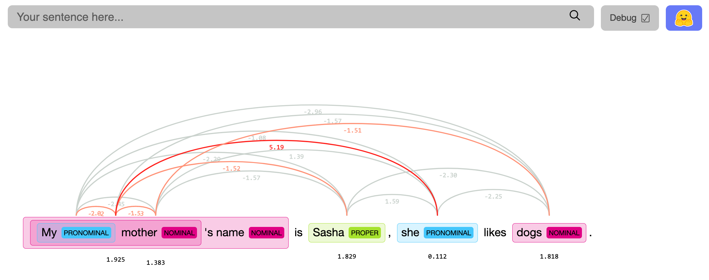
<!-- #endregion -->

<!-- #region {"slideshow": {"slide_type": "slide"}} -->
HuggingFace medium post: https://medium.com/huggingface/state-of-the-art-neural-coreference-resolution-for-chatbots-3302365dcf30

This doesn't work so well... why not?
- I have two dogs. Shelby is larger than Lily, but Lily runs faster. My big poodle likes to sit in my lap.
<!-- #endregion -->

<!-- #region {"slideshow": {"slide_type": "slide"}} -->
## Entity Resolution (or Linking)

- **Map mentions to entities** (a knowledge-base, for example)
- When mixed with structured data, often this process looks like:
  - De-duplication (in a single data set)
  - Match records across data sets
  - Link to an entity

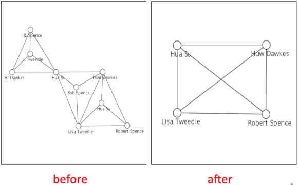
<!-- #endregion -->

<!-- #region {"slideshow": {"slide_type": "slide"}} -->
Entity resolution is a task that overlaps with NLP.

Data Community DC has a nice tutorial around entity resolution - http://www.datacommunitydc.org/blog/2013/08/entity-resolution-for-big-data
<!-- #endregion -->

<!-- #region {"slideshow": {"slide_type": "slide"}} -->
## Relation Extraction

1. Approach 1: Relations Mentions
**Elevation Partners**, the $1.9 billion private equity group that was *founded* by **Roger McNamee**...

- Is there a relation between entity mentions?
- What is the relation? (founded)


2. Approach 2: Relations
**Roger McNamee**, a managing director at **Elevation Partners**,...

- Create a relation variable between pairs of mentions
- Create a relations mention variable for each mention and connect to the relation variable
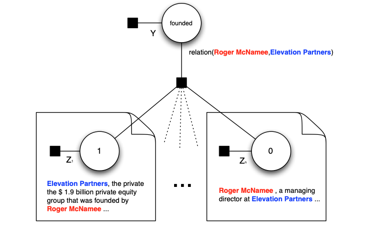
<!-- #endregion -->

<!-- #region {"slideshow": {"slide_type": "notes"}} -->
Image from: Riedel, Yao, and McCallum (2010), Modeling Relations and Their Mentions without Labeled Text.

In approach 2, for each pair of entities mentioned together in at least one sentence, create one relation variable. For each pairs of entity mentions that appear in a sentence, create one relation mention variable and connect it to the relation variable.

The standard corpus for distantly supervised relationship extraction is the New York Times (NYT) corpus, published in Riedel et al, 2010.

This contains text from the New York Times Annotated Corpus with named entities extracted from the text using the Stanford NER system and automatically linked to entities in the Freebase knowledge base. Pairs of named entities are labelled with relationship types by aligning them against facts in the Freebase knowledge base. (The process of using a separate database to provide label is known as ‘distant supervision’)
<!-- #endregion -->

<!-- #region {"slideshow": {"slide_type": "slide"}} -->
# Customizing NER

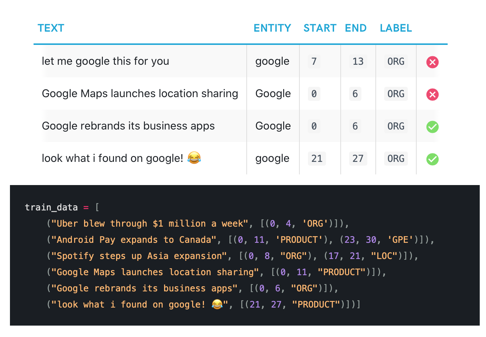
<!-- #endregion -->

<!-- #region {"slideshow": {"slide_type": "notes"}} -->
https://spacy.io/usage/training

To update an existing model, you will need some training and evaluation data. Your goal is to generalize -- not to fit to your data. 
<!-- #endregion -->

<!-- #region {"slideshow": {"slide_type": "slide"}} -->
## Annotation standards and guidelines

https://www.ldc.upenn.edu/sites/www.ldc.upenn.edu/files/english-entities-guidelines-v6.6.pdf

Example:

3.1.3 Fictional characters, names of animals, and names of fictional animals.

Names of fictional characters are to be tagged; however, character names used as TV show titles will not be tagged when they refer to the show rather than the character name.

- [**Batman**] has become a popular icon
- [Adam West] s costume from Batman the TV series 

Names of animals are not to be tagged, as they do not refer to person entities.  The same is true for fictional animals and non-human characters.  These two examples do not yield mentions. 
- Morris the cat 
- Snuggle, the fabric softener bear
<!-- #endregion -->

<!-- #region {"slideshow": {"slide_type": "notes"}} -->
To do this well, you need to specify an annotation specification. Here are the guidelines from ACE.
https://www.ldc.upenn.edu/sites/www.ldc.upenn.edu/files/english-entities-guidelines-v6.6.pdf

In it, are positive and negative examples of annotations.
<!-- #endregion -->

<!-- #region {"slideshow": {"slide_type": "slide"}} -->
## Annotations specs

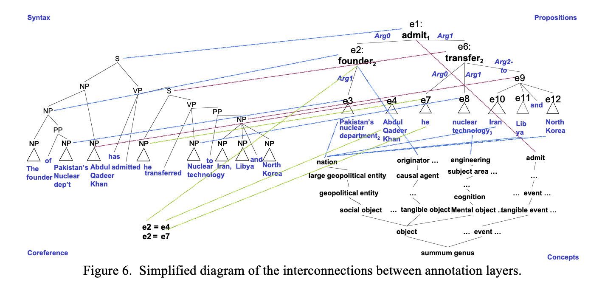

https://spacy.io/api/annotation#named-entities
<!-- #endregion -->

<!-- #region {"slideshow": {"slide_type": "slide"}} -->
SpaCy supports other models and annotation specs. 

This one represented in the slide is ontonotes.
Weischedel et al. (2010) OntoNotes: A Large Training Corpus for Enhanced Processing, https://www.researchgate.net/publication/230876724_OntoNotes_A_Large_Training_Corpus_for_Enhanced_Processing

This level of semantic representation goes far beyond the entity and relation types targeted in the ACE program, since every concept in the text is indexed, not just 100 pre-specified types. 
https://catalog.ldc.upenn.edu/docs/LDC2013T19/OntoNotes-Release-5.0.pdf

The Ontonotes corpus v5 is a richly annotated corpus with several layers of annotation, including named entities, coreference, part of speech, word sense, propositions, and syntactic parse trees. These annotations are over a large number of tokens, a broad cross-section of domains, and 3 languages (English, Arabic, and Chinese). The NER dataset (of interest here) includes 18 tags, consisting of 11 types (PERSON, ORGANIZATION, etc) and 7 values (DATE, PERCENT, etc), and contains 2 million tokens. 
<!-- #endregion -->

<!-- #region {"slideshow": {"slide_type": "slide"}} -->
## Annotation Tools

- Prodigy - https://prodi.gy/
- Doccano - https://doccano.herokuapp.com/
- Brat - http://brat.nlplab.org/
<!-- #endregion -->

<!-- #region {"slideshow": {"slide_type": "slide"}} -->
# SpaCy - Customizing Extraction

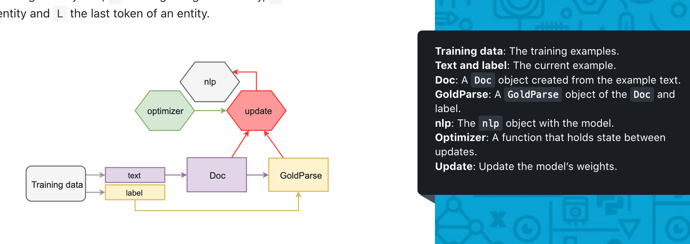
<!-- #endregion -->

<!-- #region {"slideshow": {"slide_type": "notes"}} -->
You can tune your pipeline fairly easily. 

You’ll usually need to provide many examples to meaningfully improve the system — a few hundred is a good start, although more is better.

Also, instead of sequences of Doc and GoldParse objects, you can use the “simple training style” and pass raw texts and dictionaries of annotations.
<!-- #endregion -->

<!-- #region {"slideshow": {"slide_type": "slide"}} -->
# Attention (again)

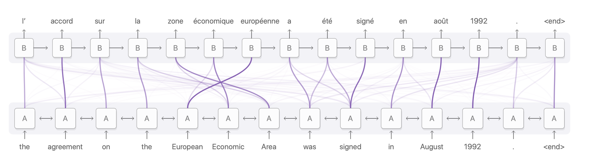

https://distill.pub/2016/augmented-rnns/
<!-- #endregion -->

<!-- #region {"slideshow": {"slide_type": "notes"}} -->
If you recall from last week, we talked a bit about the idea of a recurrent NN with attention. 

RNNs are not difficult to understand in the context of Machine Translation. The basic idea is that that the next item in a sequence gets as an input hidden states (context weights) from prior states.

The RNN takes an input word vector and hidden state from the prior word and then the decoder essential unrolls this and does the same thing. Where attention comes into play is that the encoder passes ALL the hidden states for a sentence to the decoder. Then the decoder considers all the hidden states and scores them.

Last week, you read an article from Chris Olah, who also founded the site distill.pub. Let's take a look!

One of the challenges with this approach are long-distance relations (like co-reference!). In fact, there are no great representations and architectures for this yet... but Transformers do improve performance for this sort of problem.
<!-- #endregion -->

<!-- #region {"slideshow": {"slide_type": "slide"}} -->
## Transformers

- Vaswani et al. (2017) Attention is all you need https://arxiv.org/abs/1706.03762
- Overcome serial nature of RNNs by being more parallelizable
- More accurate
- Fast to train
<!-- #endregion -->

<!-- #region {"slideshow": {"slide_type": "notes"}} -->
Tranformers let us eliminate RNNs by introducing a new architecture. Transformers have a mechanism for attention and also positional encoding within a fully end-to-end NN. Transformers are more parallelized, faster and more accurate.
<!-- #endregion -->

<!-- #region {"slideshow": {"slide_type": "slide"}} -->
## Architecture
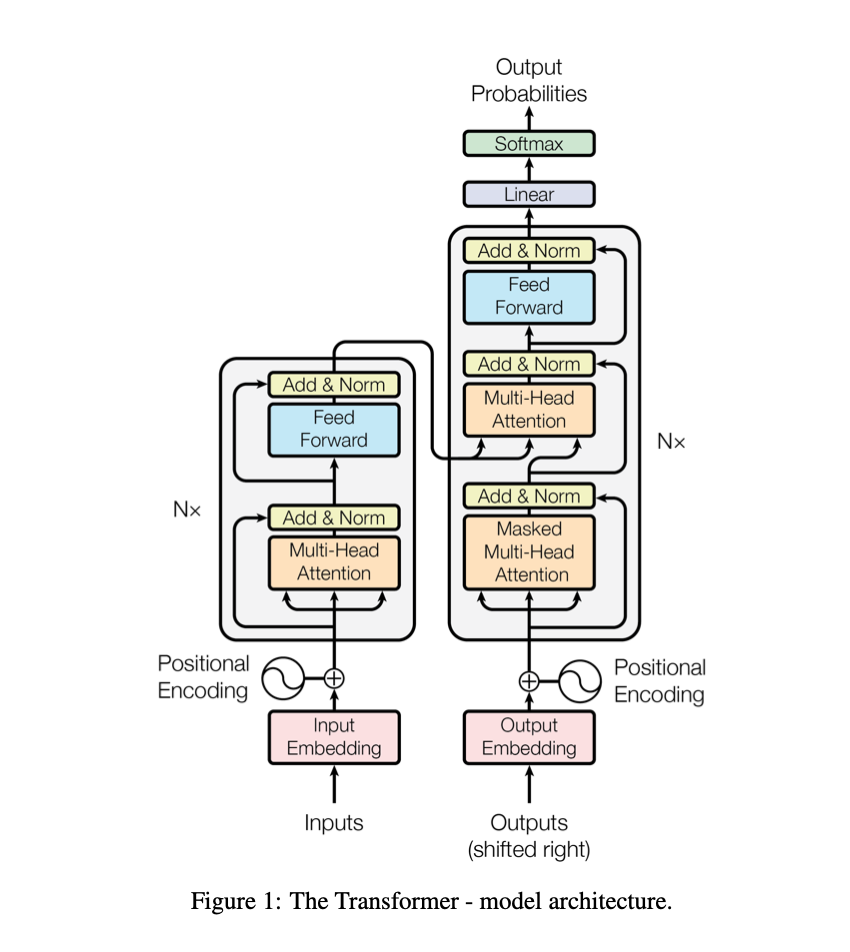
<!-- #endregion -->

<!-- #region {"slideshow": {"slide_type": "notes"}} -->
This looks super complicated. But let's pull out the major concepts.

- There is still an encoder and decoder, but with N identical layers. (This is 6 in the paper and basically means there are 6 iterations)
- The three orange boxes are the attention parts. Without them, you have a standard feed-forward NN.
- Without recurrent or convolutions, the model needs to know something about the position of a word. This is the positional encoding.
- Mult-head attention basically is a set of matrices. Let's look at them next.
- The feedforward from the input to the attention module in the output is analogous to attention in the previous seq2seq model.
<!-- #endregion -->

<!-- #region {"slideshow": {"slide_type": "slide"}} -->
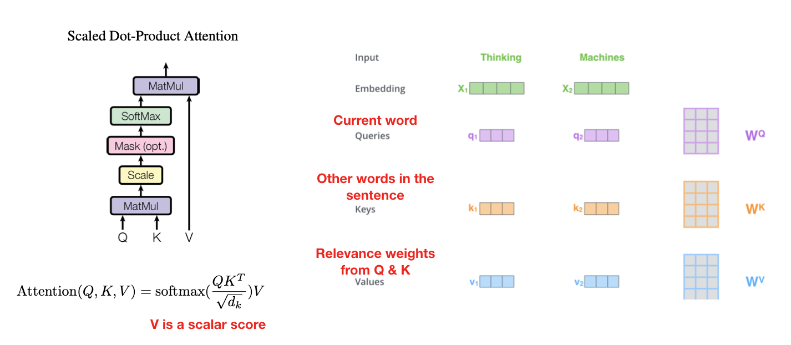
<!-- #endregion -->

<!-- #region {"slideshow": {"slide_type": "notes"}} -->
For Jay Alammar's example of "Thinking Machines", we calculate matrices for each word.

The Q, K, V values are all matrices that are learned. 

- Q is learned for the current word
- K is learned for all the other words in the sentence
- Q&K get combined to a representation of relevance

Then V is returned as a vector for the whole sentence.
<!-- #endregion -->

<!-- #region {"slideshow": {"slide_type": "slide"}} -->
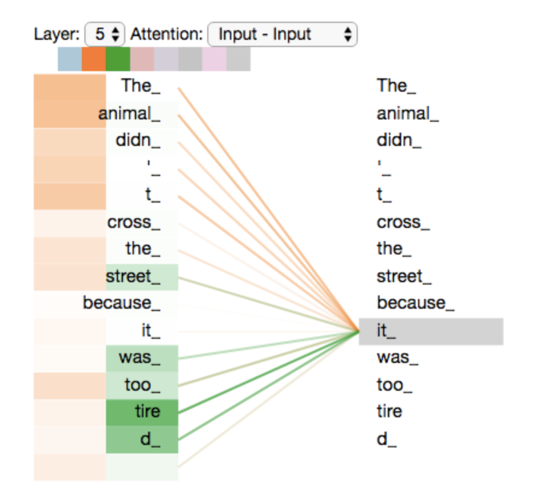
<!-- #endregion -->

<!-- #region {"slideshow": {"slide_type": "notes"}} -->
The paper further refined the self-attention layer by adding a mechanism called “multi-headed” attention. This improves the performance of the attention layer in two ways:

- It expands the model’s ability to focus on different positions. This useful if we’re translating a sentence like “The animal didn’t cross the street because it was too tired”, we would want to know which word “it” refers to.
- It gives the attention layer multiple “representation subspaces”.With multi-headed attention we have not only one, but multiple sets of Query/Key/Value weight matrices (the Transformer uses eight attention heads, so we end up with eight sets for each encoder/decoder).
<!-- #endregion -->

<!-- #region {"slideshow": {"slide_type": "slide"}} -->
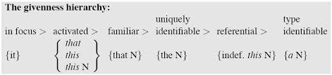
<!-- #endregion -->

<!-- #region {"slideshow": {"slide_type": "notes"}} -->
This looks very analogous to the sort of neural model of linguistic saliency we talked about earlier!
<!-- #endregion -->

<!-- #region {"slideshow": {"slide_type": "slide"}} -->
# Intro to SpCy

- https://notebooks.azure.com/csbailey/projects/intro-nlp-spacy
- [SpaCy 101](https://spacy.io/usage/spacy-101)
- [Advanced SpaCy](https://course.spacy.io)
<!-- #endregion -->
