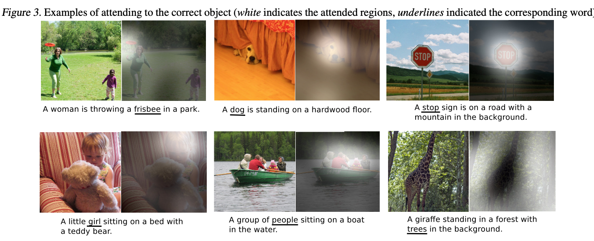
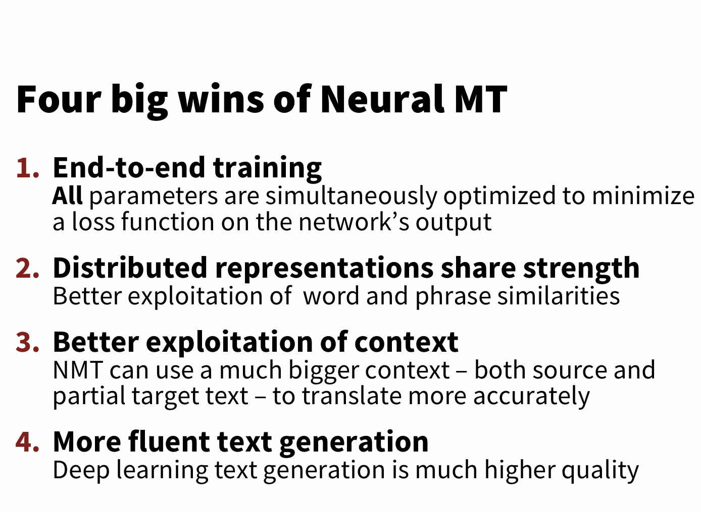

# -*- coding: utf-8 -*-
---
jupyter:
  jupytext:
    comment_magics: false
    formats: ipynb,md
    text_representation:
      extension: .md
      format_name: markdown
      format_version: '1.1'
      jupytext_version: 1.1.5
  kernelspec:
    display_name: Python 3
    language: python
    name: python3
---

```python slideshow={"slide_type": "skip"}
from IPython.display import HTML
```

<!-- #region {"slideshow": {"slide_type": "slide"}} -->
*ANYL 580: NLP for Data Analytics*

# **Natural Language Understanding**
<!-- #endregion -->

<!-- #region {"slideshow": {"slide_type": "slide"}} -->
# Topics

* Where are we?
* NLP and data science
* What is HLT?
* What is NLU?
* Use Cases - Extraction Tasks
    * Search
    * Knowledge bases
* Discourse: Beyond the sentence
    * Referring expressions (last week)
    * Document structure
    * Argument structure & Coherence
    * Discourse structure
* Use Cases - NLU
    * Summarization
    * Question-Answer
    * Reading comprehension
    * Natural language generation
    * Captioning & image understanding
    * Chat & dialog (follow-up notebook)
* Embeddings redux
* Bert & Elmo
* What next?
<!-- #endregion -->

<!-- #region {"slideshow": {"slide_type": "notes"}} -->
Last week we talked a lot about Information Extraction (IE). But we didn't really talk about how you would use IE. Thus this week we'll walk through some use cases. We'll also talk about context that is much harder to get from the context of a sentence - or even a few sentences.

Also, if you want to dig more deeply into any topic we've discussed since moving on to MT, please check out other chapters in J&M. They are still making updates, but NLP is a broad topic and today we will only scratch the surface of other topics in this space.

https://web.stanford.edu/~jurafsky/slp3/
<!-- #endregion -->

<!-- #region {"slideshow": {"slide_type": "slide"}} -->
# Where are we?

<!-- #endregion -->

<!-- #region {"slideshow": {"slide_type": "notes"}} -->
Recap from last week:

Linguists tend to think of language processing and NLP in terms of levels of abstraction. This is a fairly typical perspective. 

- When you decode language in your brain, it comes in as sounds and is mapped to **phonemes** (which are themselves abstractions, though also perceptual entities). 
- The smallest unit of meaning is a **morpheme**, and morphemes can be combined into larger structure such as words. 
    - A good example are English prefixes and suffixes such as "intra-" (e.g., inward; intraspective) and "-tion" (e.g., investigation; property of being a noun or a nominalization). Note that the suffix grammaticizes meaning.
- Words are articulated in sequences that align to **syntactic structures** with properties such as nesting and recursion. 
    - This means we can say things like "the old old building" or longer structures such as "the guy who you saw last week who had the big floppy hat and who bumped into us during the intermission."
- Movement of words in a sequence result in meaning change. Last week we looked at wh-fronting where question words look like sentences where a nominal moves up to the front of a sentence in order to change from an assertion to a question.
- And, finally **meaning is NOT just the sum compositional meaning of words in a sequence, but is enriched by other representations in the world** (e.g., the visual world), convention, and how the speaker intends to produce an utterance and have it understood. 

This last problem becomes incredibly important when we talk about context that extends beyond a sentence and we'll look at that more closely today.
<!-- #endregion -->

<!-- #region {"slideshow": {"slide_type": "notes"}} -->
# NLP and Data Science

Perspective #1
* **Answering questions from text data sets** to generate actionable intelligence
    - Do people largely agree/disagree, like/dislike our product/brand?
    - Who was the author of this piece?
    - Which documents are about politics?
    - *You guys all came up with great ideas for your final project!*
* **Business analytics** - building tools to help users generate insights from textual data
* Building **predictive models** to generate understanding of textual data as it becomes available

Perspective #2
* **Data Science** - text analytics around clustering, classification, and basic extraction tasks
* **Research** - HLT & NLU which we'll discuss more below

Both tracks require the basic knowledge you are learning. How far you decided to go with NLP as a data scientists depends on you!
<!-- #endregion -->

<!-- #region {"slideshow": {"slide_type": "notes"}} -->
In some sense, I'm back-tracking to our very first class. You were bombarded with a bunch of concepts and I'm returning to the over-arching themes, because now you may see them in a different light.

Near as I can see, there are few curriculum's in data science programs around teaching NLP to data scientists. The difference between a data scientist and someone who comes from computational linguistics is really the difference between a practitioner and a researcher. And since most of NLP had recently been research, you all are the very first generation of practitioners!

So how do we teach NLP given this? We don't really know yet and it may take some time to really tune such a course or program.
<!-- #endregion -->

<!-- #region {"slideshow": {"slide_type": "slide"}} -->
# What's HLT?

*Study of how computers can analyze, produce, modify or respond to human texts and speech*

1. *Systems that require multiple NLP modules* or tasks and whose function is primarly language-based. For example, 
    - **Speech Transcription** (language, identification, speech recognition, transcription, localization, document editing context for spelling, etc.)
    - **Machine Translation** (language identification, language decoding, language encoding, localization)
    - Search, OCR, Captioning... all complex tasks involving humans and machines
    
    
2. A *human-centric* view of NLP:
    - NLP in support of *interaction* between humans and machines
    - NLP that supports human-human interaction    
    - NLP that understands human communication
    
    
3. Strongly *inter-disciplinary* field involving computional linguistics, NLP, ML, UX, psychology, social science, etc.
<!-- #endregion -->

<!-- #region {"slideshow": {"slide_type": "notes"}} -->
Perhaps, you can think of these as "super"-tasks. I tend to think of HLT as a kind of technology that is NLP-centric, but within the context of some specific user tasks. Multi-task learners look like a very exciting innovation that will benefit HLT. 

But also, HLT is really focused on human problems. So let's talk aboud some in the context of use cases.
<!-- #endregion -->

<!-- #region {"slideshow": {"slide_type": "slide"}} -->
# What is NLU?

> I think the biggest open problems are all related to natural language
understanding. [...] we should develop systems that read and
understand text the way a person does, by forming a representation of
the world of the text, with the agents, objects, settings, and the
relationships, goals, desires, and beliefs of the agents, and everything else
that humans create to understand a piece of text. Until we can do that, all of our progress is in improving our systems’ ability to do pattern matching.
– Kevin Gimpel

https://ruder.io/4-biggest-open-problems-in-nlp/
<!-- #endregion -->

<!-- #region {"slideshow": {"slide_type": "notes"}} -->
In the very first lecture, we talked about the some of the toughest problems left in NLP today. Sebastian Ruder in his blog does a very good job of summarizing a panel discussion on the topic and I don't think there'd be much controversy on the broad challenges identified:

- Natural language understanding
- NLP for low-resource scenarios (languages for which little training data exists)
- Reasoning about large or multiple documents
- Datasets, problems, and evaluation

Toward this last bullet, many of you by now have had a taste of this on your projects. If you've tried to use pre-trained word vectors, maybe you've discovered your performance is not as good as you'd like. We'll talk more about this later.

In any case, one of the key debates today is what should be learned, and what should be represented in models. This is, in fact, a huge area of discussion in AI. Are we trying to build machines that are modeled on human neural and cognitive processes, or do we simply want them to act as if they were?
<!-- #endregion -->

<!-- #region {"slideshow": {"slide_type": "slide"}} -->
# Use Cases

* Search (from last week)
* Knowledge bases (from last week)
* **Summarization**
* **Question-Answer** & **Reading comprehension**
* **Natural language generation**
* **Captioning & image understanding**
* **Chat & dialog** (follow-up notebook)
<!-- #endregion -->

<!-- #region {"slideshow": {"slide_type": "notes"}} -->
We're distinguishing use cases from NLP tasks (e.g., computational challenges) since use cases more tell you about broader practical challenges where we use NLP in some context of use.

Because of emerging models such as BERT, Elmo, and XLNet - the same underlying models that support NLU are also used for more basic data science tasks. 

Also - there is no comprehensive set of NLU tasks. For example, we'll talk about summarization, but a related task is paraphrasing.
<!-- #endregion -->

<!-- #region {"slideshow": {"slide_type": "slide"}} -->
## Search


<!-- #endregion -->

<!-- #region {"slideshow": {"slide_type": "notes"}} -->
With this example, we can see that BERT helps Google understand the user query better in terms of Brazilians traveling "to" the US instead of the other way around.


https://www.blog.google/products/search/search-language-understanding-bert/

"This breakthrough was the result of Google research on transformers: models that process words in relation to all the other words in a sentence, rather than one-by-one in order. BERT models can therefore consider the full context of a word by looking at the words that come before and after it—particularly useful for understanding the intent behind search queries."

Google released and open-source a neural network-based technique for natural language processing (NLP) pre-training called Bidirectional Encoder Representations from Transformers -- or BERT.

BERT is the first deeply bidirectional, unsupervised language representation, pre-trained using only a plain text corpus (in this case, Wikipedia). We'll talk about BERT and related models a bit today.


Google applies BERT models to both ranking and featured snippets in Search.
<!-- #endregion -->

<!-- #region {"slideshow": {"slide_type": "slide"}} -->

<!-- #endregion -->

<!-- #region {"slideshow": {"slide_type": "notes"}} -->
In this example, the important connection between estheticians and "stand" has to do with physical demand or effort. (I had to look up "esthetician"... it seems to overlap heavily with "cosmetology".

BERT is an incredibly computationally model to build at scale. But you can tune BERT to help solve a variety of tasks.
<!-- #endregion -->

<!-- #region {"slideshow": {"slide_type": "slide"}} -->
## Knowledge Bases (and Graphs)

> “The Knowledge Graph is a knowledge base used by Google to enhance its search engine's search results with semantic-search information gathered from a wide variety of sources.”


<!-- #endregion -->

<!-- #region {"slideshow": {"slide_type": "notes"}} -->
"The Knowledge Graph has millions of entries that describe real-world entities like people, places, and things. These entities form the nodes of the graph." https://developers.google.com/knowledge-graph

- Answered "roughly one-third" of the 100 billion monthly searches Google processed in May 2016. 
- Information from the Knowledge Graph is presented as a box, which Google has referred to as the "knowledge panel"
- Powered in part by FreeBase (Wikipedia mappings)
- But... there is a dark side. It relies on data from Wikipedia -- and if that data is consumed here in Google, there may be less readership of Wikipedia. 
- And Google has been rightly criticized on its lack of source attribution
<!-- #endregion -->

<!-- #region {"slideshow": {"slide_type": "slide"}} -->
### Dbpedia

Soccer players, who are born in a country with more than 10 million inhabitants, who played as goalkeeper for a club that has a stadium with more than 30.000 seats and the club country is different from the birth country


<!-- #endregion -->

<!-- #region {"slideshow": {"slide_type": "notes"}} -->
https://wiki.dbpedia.org/about

The English version of the DBpedia knowledge base describes 4.58 million things, out of which 4.22 million are classified in a consistent ontology, including 1,445,000 persons, 735,000 places (including 478,000 populated places), 411,000 creative works (including 123,000 music albums, 87,000 films and 19,000 video games), 241,000 organizations (including 58,000 companies and 49,000 educational institutions), 251,000 species and 6,000 diseases.

In addition, we provide localized versions of DBpedia in 125 languages.
<!-- #endregion -->

<!-- #region {"slideshow": {"slide_type": "slide"}} -->

<!-- #endregion -->

<!-- #region {"slideshow": {"slide_type": "notes"}} -->
Image from: http://sumitbhatia.net/papers/KG_Tutorial_CIKM17_part1.pdf

So how do you build knowledge graphs. You need to be able to identify entities (or nominal expressions) and relations.

Pre-defined schemas can be high accuracy, but are difficult to develop in terms of generating labeled data.
<!-- #endregion -->

<!-- #region {"slideshow": {"slide_type": "slide"}} -->

<!-- #endregion -->

<!-- #region {"slideshow": {"slide_type": "notes"}} -->
Image from: http://sumitbhatia.net/papers/KG_Tutorial_CIKM17_part1.pdf

Distant supervision relies on an external knowledge source for linking. This is great since you need less labeled training data, but now you need a knowledge graph and related text.
<!-- #endregion -->

<!-- #region {"slideshow": {"slide_type": "slide"}} -->

<!-- #endregion -->

<!-- #region {"slideshow": {"slide_type": "notes"}} -->
Image from: http://sumitbhatia.net/papers/KG_Tutorial_CIKM17_part1.pdf

OpenIE works as a series of templates using parts of speech and dependencies. This gets around the need for labeling data, but it's brittle and noisy. What happens when relations do not occur in close syntactic proximity?
<!-- #endregion -->

<!-- #region {"slideshow": {"slide_type": "slide"}} -->

<!-- #endregion -->

<!-- #region {"slideshow": {"slide_type": "notes"}} -->
If you are concerned with deriving knowledge in a specific domain -- these are some methods by which you may consider tackling the problem. 

There are also companies that explicitly focus on this business area.

https://www.ontotext.com/knowledgehub/fundamentals/what-is-a-knowledge-graph/
<!-- #endregion -->

<!-- #region {"slideshow": {"slide_type": "slide"}} -->
# Discourse - Beyond the Sentence

- Sequences longer than a sentence
- Conversation turns
  - Face-to-face
  - Email
  - Chat


Not only is discourse context important (context from prior sentences) - but also other sorts of knowledge.
<!-- #endregion -->

<!-- #region {"slideshow": {"slide_type": "notes"}} -->
As you can see -- we're already talking about linking things across sentences. But what kind of structures occur across sentences?
<!-- #endregion -->

<!-- #region {"slideshow": {"slide_type": "slide"}} -->
## Referring Expressions (last week)

- [John]1 was a doctor. [He]1 paid for [his]1 [studies]2 by [himself]1.
- John [drove]1 Mary to the office. [It]1 took forever.
- [Lions]1 are fierce. But [Leo the Lion]2 was the fiercest of [all]1.
- [Monday]1 was a busy day. [That morning]2 John woke early.
<!-- #endregion -->

<!-- #region {"slideshow": {"slide_type": "notes"}} -->
Some examples from: http://projects.csail.mit.edu/workbench/update/guides/02%20-%20Referring%20Expressions%20and%20Co-reference_v2.1.2.pdf

Last week we learned that doing things like figuring out who or what is referred to is hard. We use referring expressions to do so, but they can be hard to relate to previous mentions.

We care about this if we are going to extract facts or information from text.
<!-- #endregion -->

<!-- #region {"slideshow": {"slide_type": "slide"}} -->
## Document Structure


<!-- #endregion -->

<!-- #region {"slideshow": {"slide_type": "notes"}} -->
If you had a large corpus of scientific documents, and you wanted to create a knowledge base to connect authors or concepts, there is knowledge in the structure of the documents themselves.
<!-- #endregion -->

<!-- #region {"slideshow": {"slide_type": "slide"}} -->
## Argument Structure & Coherence


<!-- #endregion -->

<!-- #region {"slideshow": {"slide_type": "subslide"}} -->
Image from Peldszus and Stede 2016. https://pdfs.semanticscholar.org/6eae/4638ce558188803580a791aceb29602c00c5.pdf

Of course, you also know about conventions around document structure. Not just layout -- but also where to find specific sorts of information. For example, in the scientific paper above, there is generally an introduction, a problem statement, approach, methods, etc.

Here you can see that there is a claim. And then, when you look at the segments following -- marked by words such as "yet", "besides" there seems to be a sort of structure across larger chunks of text.

This is a sort of textual coherence that is not linguistic, per se.

What is coherence? It is some sort of meaningfulness in a connected conext. That is, the sentences you see are communicating an idea and the thoughts that follow expand upon the main thought.

Another view of the idea of coherence is the sense we make of things in the world. We need very little information to build a narrative around an observation. If you observe someone you know stumble, for example, you may quickly imagine an explantion such as "drunk". The behavior is now coherent with respect to some idea.

Coherence in language use involves a number of linguistic processes such as tense, referring expressions, world knowledge, etc. But you can also see there are certain cue words that help mark changes between ideas.
<!-- #endregion -->

<!-- #region {"slideshow": {"slide_type": "slide"}} -->
## Discourse Structure

- Structure of the **sequence of sentences / utterances** (linguistic)
- Structure of **intentions** (purpose; note the cue words in the example above)
- **Attentional state** (what is in focus? new versus old; e.g., "the man" versus "him")
<!-- #endregion -->

<!-- #region {"slideshow": {"slide_type": "notes"}} -->
This basic model holds whether discourse is produced in a written form or unfolds in conversation.
<!-- #endregion -->

<!-- #region {"slideshow": {"slide_type": "slide"}} -->

<!-- #endregion -->

<!-- #region {"slideshow": {"slide_type": "notes"}} -->
From: Grosz and Sidner 1980. https://www.aclweb.org/anthology/J86-3001/

This is an example from task-based dialogue. Note the embedding that happens in parts of dialogue. There is inherent structure that is not purely sequential.
<!-- #endregion -->

<!-- #region {"slideshow": {"slide_type": "slide"}} -->
## Q&A & Reading Comprehension

... Beyond discourse context

- Answer a question
- Often framed in the context of reading comprehension

What sorts of Q&A tasks? 
http://nlpprogress.com/english/question_answering.html

Demo: https://demo.allennlp.org/reading-comprehension
<!-- #endregion -->

<!-- #region {"slideshow": {"slide_type": "notes"}} -->
Now we're moving more to language processing problems that involve knowledge as context. I'll try to break this down as different sorts of context or knowledge.
<!-- #endregion -->

<!-- #region {"slideshow": {"slide_type": "slide"}} -->
## Linguistic/Textual Entailment


<!-- #endregion -->

<!-- #region {"slideshow": {"slide_type": "notes"}} -->
This is also called natural language inference.
<!-- #endregion -->

<!-- #region {"slideshow": {"slide_type": "slide"}} -->
### Demo AllenNLP

Why does this matter? Example:

Text: **Eyeing the huge market potential, currently led by Google, Yahoo took over search company Overture Services Inc last year.**

Hypothesis: Yahoo bought Overture

- Gathering evidence (e.g., KB)
- Summarization
- Answer questions - What companies did Yahoo buy last year?

https://demo.allennlp.org/textual-entailment
<!-- #endregion -->

<!-- #region {"slideshow": {"slide_type": "slide"}} -->
## Reasoning

> Which property of a mineral can be determined just by looking at it? (A) luster [correct] (B) mass (C) weight (D) hardness

> A student riding a bicycle observes that it moves faster on a smooth road than on a rough road. This happens because the smooth road has (A) less gravity (B) more gravity (C) less friction [correct] (D) more friction
<!-- #endregion -->

<!-- #region {"slideshow": {"slide_type": "notes"}} -->
"Both these questions are difficult to answer via simple retrieval or word correlation. For example, there are no Web sentences of the form “luster can be determined by looking at something”; similarly, “mineral” is strongly correlated with “hardness” (an incorrect answer option)." 

Neither IR or PMI style systems do well with these problems.

[Think you have Solved Question Answering? Try ARC, the AI2 Reasoning Challenge](http://ai2-website.s3.amazonaws.com/publications/AI2ReasoningChallenge2018.pdf) Clark et al. 2018

- Science text corpus
- Two baseline neural models provided

Essentially, none of the baseline systems significantly outperform a random baseline on the Challenge set. Including those that test well against other known Q&A problems (SNLI & SQUAD)
<!-- #endregion -->

<!-- #region {"slideshow": {"slide_type": "slide"}} -->
### ARC Reasoning types


<!-- #endregion -->

<!-- #region {"slideshow": {"slide_type": "notes"}} -->

<!-- #endregion -->

<!-- #region {"slideshow": {"slide_type": "slide"}} -->
### Commonsense knowledge


<!-- #endregion -->

<!-- #region {"slideshow": {"slide_type": "notes"}} -->
From: Zellers et al. 2018 [Swag: A Large-Scale Adversarial Dataset for Grounded Commonsense Inference](https://arxiv.org/pdf/1808.05326.pdf)
<!-- #endregion -->

<!-- #region {"slideshow": {"slide_type": "slide"}} -->
## Natural Language Generation

Production of natural language:

- Text
- Dialogue

https://talktotransformer.com/
<!-- #endregion -->

<!-- #region {"slideshow": {"slide_type": "slide"}} -->
### OpenAI GPT-2

> GPT-2 is a large transformer-based language model with 1.5 billion parameters, trained on a dataset of 8 million web pages. GPT-2 is trained with a simple objective: predict the next word, given all of the previous words within some text.

Demo: https://openai.com/blog/better-language-models/

*Adapts to the style and content of the conditioning text*

But... https://srconstantin.wordpress.com/2019/02/25/humans-who-are-not-concentrating-are-not-general-intelligences
<!-- #endregion -->

<!-- #region {"slideshow": {"slide_type": "notes"}} -->

Keep in mind, this is just a language model. It sounds fluent, and models training data very well. But you can tune to simply parrot your training data or too loosely to be nonsensical. 
<!-- #endregion -->

<!-- #region {"slideshow": {"slide_type": "slide"}} -->

<!-- #endregion -->

<!-- #region {"slideshow": {"slide_type": "notes"}} -->
This model stems from Dale and Reiter (2000). https://arxiv.org/pdf/cmp-lg/9605002.pdf. 
<!-- #endregion -->

<!-- #region {"slideshow": {"slide_type": "slide"}} -->
## Uses (listed on the blog)

- AI writing assistants
- More capable dialogue agents
- Unsupervised translation between languages
- Better speech recognition systems

BUT...

- Generate misleading news articles
- Impersonate others online
- Automate the production of abusive or faked content to post on social media
- Automate the production of spam/phishing content
<!-- #endregion -->

<!-- #region {"slideshow": {"slide_type": "slide"}} -->
## Automatic Summarization

*Shorten a document to capture main ideas*

- Methods
    - Templates (slot-filling)
    - Sentence extraction
    - Abstraction of ideas + Natural Language Generation
<!-- #endregion -->

<!-- #region {"slideshow": {"slide_type": "slide"}} -->


https://primer.ai/blog/quicksilver/

<!-- #endregion -->

<!-- #region {"slideshow": {"slide_type": "notes"}} -->
Using Wikipedia text and Wikdata KB:

- Take a seed population of scientists
- Map to their *mentions* in text
- Use distant supervision to bootstrap models for relation extraction
- Update KB
- RNN on Wikpedia articles for language modeling

<!-- #endregion -->

<!-- #region {"slideshow": {"slide_type": "slide"}} -->
## Primer Use Case


<!-- #endregion -->

<!-- #region {"slideshow": {"slide_type": "notes"}} -->
This image is from https://primer.ai/blog/quicksilver/ 

<!-- #endregion -->

<!-- #region {"slideshow": {"slide_type": "slide"}} -->
## Captioning & Image Understanding

*Describe the contents of images*


From: Xu et al. (2015) [Show, Attend and Tell: Neural Image Caption Generation with Visual Attention](https://arxiv.org/pdf/1502.03044.pdf)
<!-- #endregion -->

<!-- #region {"slideshow": {"slide_type": "slide"}} -->

<!-- #endregion -->

<!-- #region {"slideshow": {"slide_type": "slide"}} -->

<!-- #endregion -->

<!-- #region {"slideshow": {"slide_type": "slide"}} -->
# Representation in NLP


- Distributed word representation has led to tremendous advancement.
	- We're capturing both meaning and some structural relationships.
	- Pre-training on large amounts of data are useful as input into Neural Networks.
<!-- #endregion -->

<!-- #region {"slideshow": {"slide_type": "slide"}} -->

<!-- #endregion -->

<!-- #region {"slideshow": {"slide_type": "slide"}} -->
## Word Embeddings Redux

*Words and phrases mapped to numbers*
**Are two words neighbors?**

Training: sliding text to look at words before and after a target word -> then train a logistic regression classifier (or simple NN)


Task: **Predict the context word**
<!-- #endregion -->

<!-- #region {"slideshow": {"slide_type": "notes"}} -->
(This was a slide from the vector semantics lecture where we looked the skip-gram approach versus bag-of-words)


http://jalammar.github.io/illustrated-word2vec/
<!-- #endregion -->

<!-- #region {"slideshow": {"slide_type": "slide"}} -->
- **Pre-trained word embeddings**
    - Download from Gensim (for example, https://github.com/RaRe-Technologies/gensim-data including Google's 1.5 GB)
    - Does it match your domain well? 
    - What's in it? https://github.com/chrisjmccormick/inspect_word2vec
    - Make sure you are tokenizing similarly https://www.kaggle.com/alhalimi/tokenization-and-word-embedding-compatibility
- **Custom word embeddings**
    - Lots of example code online
        - https://rare-technologies.com/word2vec-tutorial/
        - https://www.shanelynn.ie/word-embeddings-in-python-with-spacy-and-gensim/
<!-- #endregion -->

<!-- #region {"slideshow": {"slide_type": "slide"}} -->
## Glove

*The model is an unsupervised learning algorithm for obtaining vector representations for words. This is achieved by mapping words into a meaningful space where the distance between words is related to semantic similarity.*

- Window context versus corpus co-occurence statistics
<!-- #endregion -->

<!-- #region {"slideshow": {"slide_type": "notes"}} -->
Pennington, Socher, Manning (2014) [GloVe: Global Vectors for Word Representation](https://www.aclweb.org/anthology/D14-1162.pdf)
<!-- #endregion -->

<!-- #region {"slideshow": {"slide_type": "slide"}} -->
## Bi-Directional Encoder

- Use pre-trained word embeddings as features
- Uses an attention mechanism to learn contextual relations between words in text.
- Uses only the encoder of RNN/LSTM/Transformer to produce a LM
- Reads the entire sequence of words (sentence)

*Solved a problem of plain-vanilla Transformers by learning not just L->R context but entire sentence context*
<!-- #endregion -->

<!-- #region {"slideshow": {"slide_type": "slide"}} -->
## Word Embeddings versus Context Vectors

- Word2Vec and GLOve are word vectors 
- ELMo and BERT take into account the entire context of a sentence to include a word's *position in a sentence*. From this perspective, they can generate different word embeddings for a word that captures the different contexts of a word.
- This also means that the vectors are context dependent. We need the model used for training when we use them for different tasks.
<!-- #endregion -->

<!-- #region {"slideshow": {"slide_type": "slide"}} -->
## Bert Training


<!-- #endregion -->

<!-- #region {"slideshow": {"slide_type": "notes"}} -->
1. BERT is pre-trained on unlabeled data over different pre-training tasks.
2. Fine-tuning of BERT uses the same architecture.

	- Take a labelled data set (or your labelled sentiment data)
	- BERT takes a sequence of words as input
	- And uses the final layer - just like a single-layer neural network, as the classifier.
<!-- #endregion -->

<!-- #region {"slideshow": {"slide_type": "slide"}} -->
## Bert Fine-Tuning


<!-- #endregion -->

<!-- #region {"slideshow": {"slide_type": "notes"}} -->
Transfer learnin... "storing knowledge gained while solving one problem and applying it to a different but related problem".
<!-- #endregion -->

<!-- #region {"slideshow": {"slide_type": "slide"}} -->
## Elmo 


<!-- #endregion -->

<!-- #region {"slideshow": {"slide_type": "notes"}} -->
NAACL 2018 - https://www.slideshare.net/shuntaroy/a-review-of-deep-contextualized-word-representations-peters-2018

Peters et al. (2018) - [Deep contextualized word representations](https://arxiv.org/pdf/1802.05365.pdf)

Different architecture - but still language modeling

- Contextualized word-embeddings
- ELMo looks at the whole sentence before assigning each word in it an embedding (not just a couple words to each side)
- It's another LM, but a really powerful one
<!-- #endregion -->

<!-- #region {"slideshow": {"slide_type": "slide"}} -->


https://allennlp.org/elmo
<!-- #endregion -->

<!-- #region {"slideshow": {"slide_type": "notes"}} -->
From: https://www.slideshare.net/shuntaroy/a-review-of-deep-contextualized-word-representations-peters-2018


<!-- #endregion -->

<!-- #region {"slideshow": {"slide_type": "slide"}} -->
## AllenNLP

- Built on top of PyTorch
- High level abstractions for working with text
- Extensible and modular
- Reference implementations for many tasks
<!-- #endregion -->

<!-- #region {"slideshow": {"slide_type": "slide"}} -->
## ELMo and AllenNLP


- https://huggingface.co/
- https://huggingface.co/hmtl/

<!-- #endregion -->

<!-- #region {"slideshow": {"slide_type": "slide"}} -->
## Hierarchical Multi-Task Learning Model (HMTL)


<!-- #endregion -->

<!-- #region {"slideshow": {"slide_type": "notes"}} -->
https://arxiv.org/pdf/1802.05365.pdf
Sanh, Wolf, and Ruder (2018)
<!-- #endregion -->

<!-- #region {"slideshow": {"slide_type": "slide"}} -->
## What about other sorts of knowledge representation? 
- Recursive and hierarchical information - RNNs and transformers are effective! 
- What else is there beyond word representations with sentence context?
- What about integrating other forms of knowledge? Commonsense knowledge?
- This is a fast moving discipline... stay tuned.
<!-- #endregion -->

<!-- #region {"slideshow": {"slide_type": "slide"}} -->
# What Next?

- Where do you want to go with NLP? Questionnaire coming out next week
- Subscrive to Ruder NLP news! http://newsletter.ruder.io/
- Dive in deeper


<!-- #endregion -->

<!-- #region {"slideshow": {"slide_type": "notes"}} -->
Next up: dialogue

Next week: Bias videos
<!-- #endregion -->
