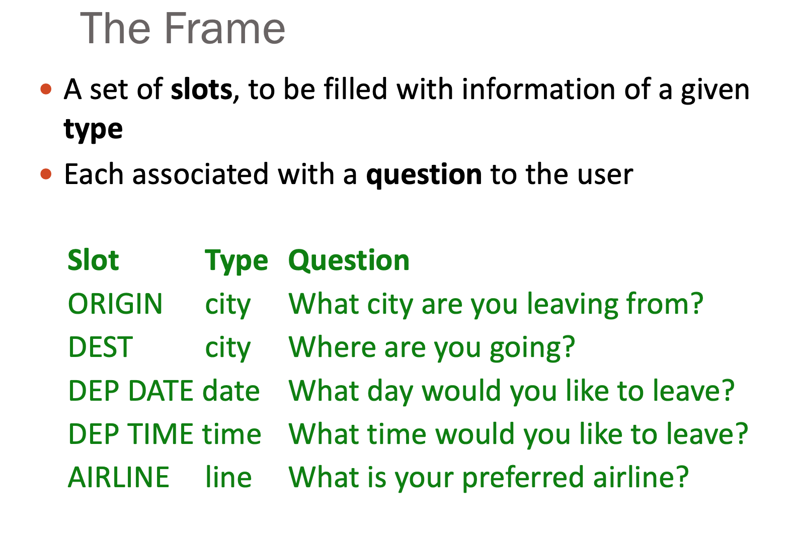

# -*- coding: utf-8 -*-
---
jupyter:
  jupytext:
    comment_magics: false
    formats: ipynb,md
    text_representation:
      extension: .md
      format_name: markdown
      format_version: '1.1'
      jupytext_version: 1.1.5
  kernelspec:
    display_name: Python 3
    language: python
    name: python3
---

```python slideshow={"slide_type": "skip"}
from IPython.display import HTML
```

<!-- #region {"slideshow": {"slide_type": "slide"}} -->
*ANYL 580: NLP for Data Analytics*

# **Dialogue**
<!-- #endregion -->

<!-- #region {"slideshow": {"slide_type": "slide"}} -->
## What is Conversation?


<!-- #endregion -->

<!-- #region {"slideshow": {"slide_type": "slide"}} -->
When we talk about NLP in dialogue or conversation, there are a variety of sorts of interaction:

- Support to human-human conversation. This is computer-mediated conversation. Think about a meeting note-taker, moderator, etc.
- Interaction between a human and a machine such as Siri or Alexa. Of course, this doesn't have to be speech but could be text chat.

Regardless, conversation is the basic means by which humans interact with each other. This means any supportive or assistive technology must support how humans talk.
<!-- #endregion -->

```python slideshow={"slide_type": "slide"}
# Joint Activity

HTML('<iframe width="560" height="315" src="https://www.youtube.com/embed/3YxXsQMAvWg?rel=0&amp;controls=0&amp;showinfo=0" frameborder="0" allowfullscreen></iframe>')
```

<!-- #region {"slideshow": {"slide_type": "notes"}} -->
We're going to talk about dialogue (conversation between two interlocutors), but let's focus in on goals and interaction since this has greater bearing on design than how we process language in the brain.

Here some examples of interaction that involve joint activity: teaching, job interview, game, dinner party, task.

For example, in a store transaction there are typically at least two roles: server and customer. What we communicate during interaction is partly defined by our role and our goals. But people also have their personal identities, beliefs, feelings & desires.

People participate in joint activities to achieve goals.

In most joint activities, people pursue multiple goals - public and private goals. Business goal (transaction), procedural goals (doing this quickly and efficiently), interpersonal goals (remaining polite), private agendas.

Joint activities require coordination. Conventional procedures and language use.

Joint activities are composed of joint actions.
- Greeting
- Request assistance
- Pay for items
- Conclude

Joint actions can be coordinated because they divide into phases: they have identifiable functions and entry/exits.

Phases get coordinated. (Imagine how your actions are coordinated when you are introduced to someone.)

For example, in conversation people take turns. These turns are distinguishable as intonation units. (Even if you can't hear what someone says, you can hear the rise and fall of their voice.) Entries and exits of turns are marked in syntax, morphology and intonation. For example, intonation units begin on a high pitch, drop gradually over the unit, and end with a distinctive fall or rise. They also tend to have a focal accented syllable at or near the end. These patterns are found in all languages. These intonational contours help aid listeners to project exit times more accurately.

Spoken language is highly synchronized. People are surprisingly good at judging entry and exit times, as well as accounting for processing difficulty.

There are boundaries - entries and exits that each participant has to recognize and understand.

People agree on the joint activity, who takes part, what roles they play before committing to the part.
<!-- #endregion -->

<!-- #region {"slideshow": {"slide_type": "slide"}} -->
Various dimensions in dialogue:
- scriptedness (Marriage ceremony versus encounter in a hallway)
- formality (formal meeting, gossip)
- verbalness (phone call, tennis game)
- cooperativeness (restaurant to competitive game)
- governance "side-edness" (greeting a colleague, versus student in a class)

<!-- #endregion -->

<!-- #region {"slideshow": {"slide_type": "slide"}} -->
## Dialogue as Discourse


<!-- #endregion -->

<!-- #region {"slideshow": {"slide_type": "notes"}} -->
Any interaction between humans that involves coordination brings into play language skills. We are a social animal and our language skills are entwined with social cooperation.
<!-- #endregion -->

<!-- #region {"slideshow": {"slide_type": "slide"}} -->
## Dialogue is multi-turn

Why don’t Siri and Alexa do this (well) yet? 
    - Inter-sentential contextual expressions: for example, he/she/it, this/that/these…, here/there, yesterday/today… 
    - Pragmatic interpretation: “what you mean” versus “what you say” - Error detection and repair
<!-- #endregion -->

<!-- #region {"slideshow": {"slide_type": "notes"}} -->
You need some sort of context modeling to interpret deictic (e.g., pointing) expressions and those which refer to previous dialogue context.
Only last year, Amazon released a simple dialogue development kit. https://developer.amazon.com/docs/custom-skills/dialog-interface-reference.html
<!-- #endregion -->

<!-- #region {"slideshow": {"slide_type": "slide"}} -->
# Conversational Agents

- Alexa, Siri, Cortana, Google Assistant
- Robot communication
- Help agents
- Etc.
<!-- #endregion -->

<!-- #region {"slideshow": {"slide_type": "slide"}} -->

<!-- #endregion -->

<!-- #region {"slideshow": {"slide_type": "slide"}} -->

<!-- #endregion -->

<!-- #region {"slideshow": {"slide_type": "notes"}} -->
https://www.theatlantic.com/technology/archive/2014/06/when-parry-met-eliza-a-ridiculous-chatbot-conversation-from-1972/372428/


> In 1966, the computer scientist Joseph Weizenbaum created a program that seemed to be a contender for Turing Test passage. The early chatbot searched for keywords in conversations conducted with human typers; if the human used one of those words,  the program would use it in its reply. If not, it would offer a generic response. It was meant to mimic a psychotherapist (which allowed it to adopt "the pose of knowing almost nothing of the real world"); he named it ELIZA. And in 1972, the Stanford scientist Kenneth Colby created another program, PARRY—a bot that tried to model the behavior of a paranoid schizophrenic. PARRY was, Colby said, "ELIZA with attitude.

Mmental model: Parry has affective variables 
- Anger, Fear, Mistrust
- “If Anger level is high, respond with hostility”


Originally designed as a testbed for clinical therapy. So it has a trick.

- Draw the patient out by reflecting patient’s statements back at them
- Rare type of conversation in which one can “assume the pose of knowing almost nothing of the real world”
<!-- #endregion -->

<!-- #region {"slideshow": {"slide_type": "slide"}} -->
## Social Interaction

**Patient:** "I went for a long boat ride” 

**Psychiatrist:** "Tell me about boats”

- You don’t assume she didn’t know what a boat is
- You assume she had some conversational goal
- Chatbots trying to pass the Turing test usually choose some such domain
<!-- #endregion -->

<!-- #region {"slideshow": {"slide_type": "slide"}} -->

<!-- #endregion -->

<!-- #region {"slideshow": {"slide_type": "slide"}} -->
## Parry


<!-- #endregion -->

<!-- #region {"slideshow": {"slide_type": "slide"}} -->

<!-- #endregion -->

<!-- #region {"slideshow": {"slide_type": "notes"}} -->
Parry implemented a crude model of the behavior of a person with paranoid schizophrenia based on concepts, conceptualizations, and beliefs (judgements about conceptualizations: accept, reject, neutral). 

PARRY encounters ELIZA

The session recorded below actually happened on 18 September 1972 and is herewith reproduced for your entertainment.ELIZA: Good Evening.

ELIZA: Tell me your problems. Please terminate input with a period or a
question mark.

PARRY: People get on my nerves sometimes.

ELIZA: I am not sure I understand you fully.

PARRY: You should pay more attention.

ELIZA: Suppose you should pay more attention.

PARRY: You’re entitled to your own opinion.

ELIZA: What makes you think I am entitled to my own opinion?

PARRY: It bothers me just to be around people in general.

ELIZA: Please go on.

PARRY: I went to the track at Bay Meadows a while back.

ELIZA: What does that suggest to you?

PARRY: I went to the races.

ELIZA: What else would you like to discuss?

PARRY: Horseracing interests me.

ELIZA: Why do you say that just now?

PARRY: There’s a lot of crooked gambling going on there.

ELIZA: I am not sure I understand you fully,

PARRY: It’s clear to me if not to you.

ELIZA: Do you think its likely that not to I?

PARRY: I went to the races.

ELIZA: Please go on.

PARRY: I gamble on horses.

ELIZA: What does that suggest to you?

PARRY: I went to the races.

ELIZA: What else would you like to discuss?

PARRY: Gambling has been nothing but trouble to me.

ELIZA: Why do you say that just now?

PARRY: I’ve had experience with crooks gambling at the track.

ELIZA: I am not sure I understand you fully.

PARRY: I’ve already told you enough about that.

ELIZA: Oh? I enough about that?

PARRY: I went to the races.

comment: This has to be the most persistent and patient
paranoid I have ever encountered.

ELIZA: Please go on.

PARRY: Do you know anything about bookies?

ELIZA: What makes you think I know anything about bookies?

PARRY: A bookie didn’t pay me off once.

ELIZA: What does that suggest to you?

PARRY: I beat up the bookie who did not pay off, and I thought he might use his friends in the underworld to get even with me.

ELIZA: What else would you like to discuss?

PARRY: What do you know about racketeers?

ELIZA: Why do you ask?

PARRY: What experience have you had gambling?

ELIZA: Why does that question interest you?

PARRY: I like horseraces.

ELIZA: What else do you like?

PARRY: I know the mob controls the big rackets.

ELIZA: Who are you really talking about?

PARRY: Have you ever really thought about the MAFIA?

ELIZA: Suppose you ever really thought about the MAFIA.

PARRY: Let’s talk about something else.

ELIZA: I am not sure I understand you fully.

PARRY: You keep asking me the same things, why not change the topic?

ELIZA: In what way?

PARRY: What do you mean?

ELIZA: Why are such questions on your mind?

PARRY: I thought I told you, people get on my nerves.

ELIZA: Your nerves?

PARRY: Well, I don’t know.

ELIZA: Don’t you really know?

PARRY: I would say so.

ELIZA: Please go on.

PARRY: I would rather not discuss that anymore.
<!-- #endregion -->

<!-- #region {"slideshow": {"slide_type": "slide"}} -->
## Task-Based Interaction

What do we need besides understanding and generation?

- Model of the task
- Some way to manage the interaction
    - Error detection and repair
    - Conversational history
    - Where we are in the task
- Some idea of how "initiative" works (user vs system)
- Lots of flexibility on chunking information
<!-- #endregion -->

<!-- #region {"slideshow": {"slide_type": "slide"}} -->
## Initiative and Sub-Dialogues

U: Set the alarm

S: Alarm for what time?

    U: What time is it
    
    S: 10:15
    
    U: OK
    
Larsson (2017) [User-initiated Sub-dialogues
in State-of-the-art Dialogue Systems](https://www.aclweb.org/anthology/W17-5503.pdf)
<!-- #endregion -->

<!-- #region {"slideshow": {"slide_type": "slide"}} -->

<!-- #endregion -->

<!-- #region {"slideshow": {"slide_type": "slide"}} -->
# Frame-Based Dialogue


<!-- #endregion -->

<!-- #region {"slideshow": {"slide_type": "notes"}} -->
This is really new! Like in the last two years! We've had slots and frames for a long time... but not operationalized in commercial speech technology. 
<!-- #endregion -->

<!-- #region {"slideshow": {"slide_type": "slide"}} -->

<!-- #endregion -->

<!-- #region {"slideshow": {"slide_type": "slide"}} -->
## Dialogue Manager


<!-- #endregion -->

<!-- #region {"slideshow": {"slide_type": "notes"}} -->
- The dialogue system controls the user interaction
- It tries to track the state of the current task
- It asks questions and receives answers from the user
- It generally ignores off-task utterances
<!-- #endregion -->

<!-- #region {"slideshow": {"slide_type": "slide"}} -->
## Traditional Dialogue Systems


<!-- #endregion -->

<!-- #region {"slideshow": {"slide_type": "notes"}} -->
This is an over-simplification. 

A dialogue policy decides how the system should respond given the current state.

But it's easy to see why **system-initiated** dialogue might be preferred in frame-based dialogue. But human-human dialogue tends to be **mixed initiative** where participants take turns and pass initiative back-and-forth.
<!-- #endregion -->

<!-- #region {"slideshow": {"slide_type": "slide"}} -->
## Knowledge

- Conversational context (dialogue history)
- Task model (knowledge about the task)
- Domain knowledge (knowledge of the world)
- User model (user's goals, plans, intentions, attitudes, beliefs)

... what about knowledge accumulation?
<!-- #endregion -->

<!-- #region {"slideshow": {"slide_type": "slide"}} -->
# Siri Dialogue


<!-- #endregion -->

<!-- #region {"slideshow": {"slide_type": "slide"}} -->
## Grounding


- Dialogue is social and a collective act by the speaker and hearer
- Common ground is the set of things mutually believed by both speaker and hearer
- Knowledge accumulates in through *grounding*

> Clark (1996): *Principle of closure*: Agents performing an action require evidence, sufficient for current purposes, that they have succeeded in performing it.

Action success or failure
<!-- #endregion -->

<!-- #region {"slideshow": {"slide_type": "slide"}} -->
## Grounding Example


<!-- #endregion -->

<!-- #region {"slideshow": {"slide_type": "slide"}} -->
## Conversation is how people exchange thoughts


<!-- #endregion -->

<!-- #region {"slideshow": {"slide_type": "slide"}} -->
## What is meant is hard


<!-- #endregion -->

```python slideshow={"slide_type": "slide"}
# How we talk depends on the external context:
# who we are talking to
# where we're talking to them
# who is listening or overhearing
# how much we want to say in the presence of others
# -- and all this changes from situation-to-situation
# -- and over time


HTML('<iframe width="560" height="315" src="https://www.youtube.com/embed/PY9RQFX28j0" frameborder="0" allowfullscreen></iframe>')


```

<!-- #region {"slideshow": {"slide_type": "slide"}} -->
## Evaluation


<!-- #endregion -->

<!-- #region {"slideshow": {"slide_type": "slide"}} -->
## Dialogue System Design


<!-- #endregion -->

<!-- #region {"slideshow": {"slide_type": "slide"}} -->
## Ethical Challenges


<!-- #endregion -->

<!-- #region {"slideshow": {"slide_type": "slide"}} -->
## Ethical Challenges


<!-- #endregion -->

<!-- #region {"slideshow": {"slide_type": "slide"}} -->
## Ethical Challenges


<!-- #endregion -->

<!-- #region {"slideshow": {"slide_type": "slide"}} -->
## Ethical Challenges


<!-- #endregion -->

<!-- #region {"slideshow": {"slide_type": "slide"}} -->
# What's Next?

- Conversation UX  -- "Many of the successful Alexa Prize teams would automatically adapt their dialogue manager based on a user’s interests"
- Greater focus on personality, culture, convention
- Diverse neural architectures and improved NLU
<!-- #endregion -->

<!-- #region {"slideshow": {"slide_type": "notes"}} -->
Good reads!

- https://medium.com/wluper/not-another-conversational-ai-report-4a094337e6f1
- https://medium.com/wluper/how-do-dialogue-systems-decide-what-to-say-or-which-actions-to-take-b32ca223aff1
<!-- #endregion -->
