# -*- coding: utf-8 -*-
<!-- #region {"slideshow": {"slide_type": "skip"}} -->

---
jupyter:
  jupytext:
    cell_markers: region,endregion
    comment_magics: false
    formats: ipynb,.pct.py:hydrogen,Rmd,md
    text_representation:
      extension: .md
      format_name: percent
      format_version: '1.1'
      jupytext_version: 1.1.5
  kernelspec:
    display_name: Python 3
    language: python
    name: python3
---
<!-- #endregion -->

<!-- #region {"slideshow": {"slide_type": "slide"}} -->
*ANLY 580: Natural Language Processing for Data Analytics* <br>
*Fall 2019* <br>
# 4. Language Modeling
<!-- #endregion -->

<!-- #region {"slideshow": {"slide_type": "slide"}} -->
Note from last week... check out https://github.com/anyl580/lectures/blob/master/3-multilingual/Tokenization.ipynb
for Unicode hex codes to find emojis including skins, hair, etc.
<!-- #endregion -->

<!-- #region {"slideshow": {"slide_type": "slide"}} -->
# Topics
* Big ideas so far
* Language modeling (ngrams)
* Norvig's Jupyter notebook
<!-- #endregion -->

<!-- #region {"slideshow": {"slide_type": "notes"}} -->
Expanding out our agenda a bit, but focusing on ngrams:

* A conundrum: Flesch reading score
* Language models
    * unigram (bag of words)
    * noisy channel
    * ngrams
* Some properties of ngrams
* Calculating ngrams
* Evaluation
* Perplexity
* Neural models
<!-- #endregion -->

<!-- #region {"slideshow": {"slide_type": "slide"}} -->
# Big ideas so far
* Variability
* Ambiguity
* Tokenizers
* Multilingual
* Pipelines
<!-- #endregion -->


<!-- #region {"slideshow": {"slide_type": "notes"}} -->
* **Language** is highly **variable** -- it requires context for understanding. The *distributional hypothesis* posits linguistic items with similar distributions share similar meanings. And distributional properties of language extend to other sorts of similarity measures (e.g., POS, named entities, etc.). This is one of the most important ideas in NLP today.
<br>
<br>
* In this chapter on language modeling, J&amp;M make reference to this idea when talking about *Kneser-Ney discounting* (n-gram smoothing) such that we'd like to use **distributional properties** beyond **absolute frequency** when making predictions with bigrams. (The example was "kong" versus "glasses" when the phrase "Hong Kong" is frequent in a corpus, but "glasses" has a wider distribution.)
<br>
<br>
* One manifestation of the value of the distributional nature of language use is **ambiguity** of meaning in words (e.g., 'bank' institution versus 'bank' verb versus bank of a river). We use surrounding context for understanding.
<br>
<br>
* **There is no clear definition of a word**. You will always have decisions to make when tokenizing.
<br>
<br>
* Choose your tokenizer based on the data, task, and **fit** if you are matching on hashes, model, index etc.
<br>
<br>
* You can check your assumption by looking at **out-of-vocabulary** words.
<br>
<br>
* **Multilingual processing** requires even more care since each language and script pair has its own considerations and you will encounter situations where the problems are not **visible**.
<br>
<br>
* Language processing typically requires **pipeline processes** where analysis occurs in steps. For some processes, the order may matter.
<!-- #endregion -->

<!-- #region {"slideshow": {"slide_type": "slide"}} -->
# Language Model Tasks

- Assume a corpus (set of sentences in some language)
- And a finite vocabulary V
- For deriving a probability distribution over a sequence of words
- So that we can do the following:
 - **Predict a sentence**
 - **Predict the next character/word**
<!-- #endregion -->

<!-- #region {"slideshow": {"slide_type": "slide"}} -->
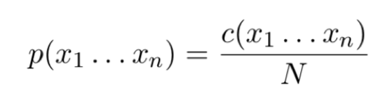

BLUF: This won't work.
<!-- #endregion -->

<!-- #region {"slideshow": {"slide_type": "notes"}} -->
- c(x1 . . . xn) - number of times that the sentence x1 . . . xn occurs in the corpus;
- N - total number of sentences in the corpus. 

This model assigns a probability of zero to any unseen data.


In this chapter, J&M talked about "models" with respect to the two *tasks* above. 
These tasks may seem relatively banal on the surface, but are so important to a wide range of problems in NLP from speech recognition, to machine translation, to part-of-spech tagging, parsing, and more.

The crux of the problem is the problem that we don't know all the sentences a language can produce and its difficult to generalize to data we haven't seen.

Let's step back for a moment and look at another type of model.[^1]

[^1]: Perhaps, a very simple definition of a model is a mathemantical representation of data that fits well enough to training data to be useful for prediction against test data.
<!-- #endregion -->

<!-- #region {"slideshow": {"slide_type": "slide"}} -->
# Is this bad science?
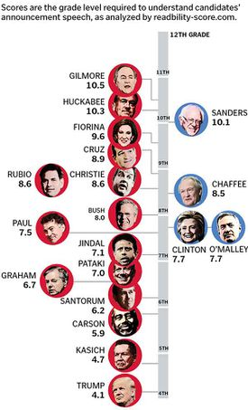
<!-- #endregion -->

<!-- #region {"slideshow": {"slide_type": "notes"}} -->
&gt; "The Globe reviewed the language used by 19 presidential candidates, Democrats and Republicans, in speeches announcing their campaigns for the 2016 presidential election. The review, using a common algorithm called the Flesch-Kincaid readability test that crunches word choice and sentence structure and spits out grade-level rankings, produced some striking results." 

From:
https://www.bostonglobe.com/news/politics/2015/10/20/donald-trump-and-ben-carson-speak-grade-school-level-that-today-voters-can-quickly-grasp/LUCBY6uwQAxiLvvXbVTSUN/story.html
<!-- #endregion -->

<!-- #region {"slideshow": {"slide_type": "slide"}} -->
# What is Flesch-Kincaid?
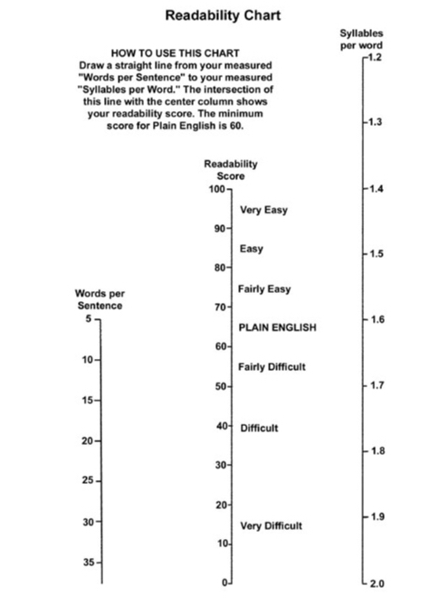
<!-- #endregion -->

<!-- #region {"slideshow": {"slide_type": "notes"}} -->
Image credit: https://web.archive.org/web/20160712094308/http://www.mang.canterbury.ac.nz/writing_guide/writing/flesch.shtml

From Wikipedia:
&gt; The Flesch-Kincaid readability tests are readability tests designed to indicate how difficult a passage in English is to understand. There are two tests, the Flesch Reading Ease, and the Flesch-Kincaid Grade Level. Although they use the same core measures (word length and sentence length), they have different weighting factors.

Original article on ["How to write plain English" (Flesch)](https://web.archive.org/web/20160712094308/http://www.mang.canterbury.ac.nz/writing_guide/writing/flesch.shtml)

From the paper:

&gt; Step 1. Count the words.
Count the words in your piece of writing. Count as single words contractions, hyphenated words, abbreviations, figures, symbols and their combinations, e.g., wouldn't, full-length, TV, 17, &amp;, $15, 7%.

&gt; Step 2. Count the syllables.
Count the syllables in your piece of writing. Count the syllables in words as they are pronounced. Count abbreviations, figures, symbols and their combinations as one-syllable words. If a word has two accepted pronunciations, use the one with fewer syllables. If in doubt, check a dictionary.

&gt;Step 3. Count the sentences.
Count the sentences in your piece of writing. Count as a sentence each full unit of speech marked off by a period, colon, semicolon, dash, question mark or exclamation point. Disregard paragraph breaks, colons, semicolons, dashes or initial capitals within a sentence. For instance, count the following as a single sentence:
You qualify if-
You are at least 58 years old; and
Your total household income is under $5,000.

&gt;Step 4. Figure the average number of syllables per word.
Divide the number of syllables by the number of words.

&gt;Step 5. Figure the average number of words per sentence.
Divide the number of words by the number of sentences.

&gt;Step 6. Find your readability score.

&gt;Find the average sentence length and word length of your piece of writing on the chart (below). Take a straightedge or ruler and connect the two figures. The intersection of the straightedge or ruler with the center column shows your readability score.
<!-- #endregion -->
<!-- #region {"slideshow": {"slide_type": "slide"}} -->
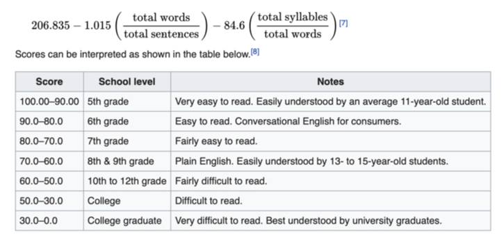
<!-- #endregion -->

```python slideshow={"slide_type": "notes"}
#!pip install textstat
import textstat

test_data = (
    "Playing games has always been thought to be important to "
    "the development of well-balanced and creative children; "
    "however, what part, if any, they should play in the lives "
    "of adults has never been researched that deeply. I believe "
    "that playing games is every bit as important for adults "
    "as for children. Not only is taking time out to play games "
    "with our children and other adults valuable to building "
    "interpersonal relationships but is also a wonderful way "
    "to release built up tension."
)

textstat.flesch_reading_ease(test_data)
```
```python slideshow={"slide_type": "notes"}
# There are also utilities in NLTK that make it easy for you to code this yourself. For example, you can count syllables using cmudict.

# For more languages, there is a library called pyphen. https://pyphen.org

from nltk.corpus import cmudict
from curses.ascii import isdigit

d = cmudict.dict()

def count_syllables(word):
    return([len(list(y for y in x if isdigit(y[-1]))) for x in d[word.lower()]][0])

num_syllables = count_syllables("estimation")
#num_syllables = count_syllables("supercalifragilisticexpialidocious")
num_syllables
```

<!-- #region {"slideshow": {"slide_type": "notes"}} -->
Articles like the one referenced earlier pop up on a seemingly regular basis. Often, the author is analyzing the *speech* of a speaker and not formal, written text.

Do you see a problem with this?
<!-- #endregion -->

<!-- #region {"slideshow": {"slide_type": "slide"}} -->
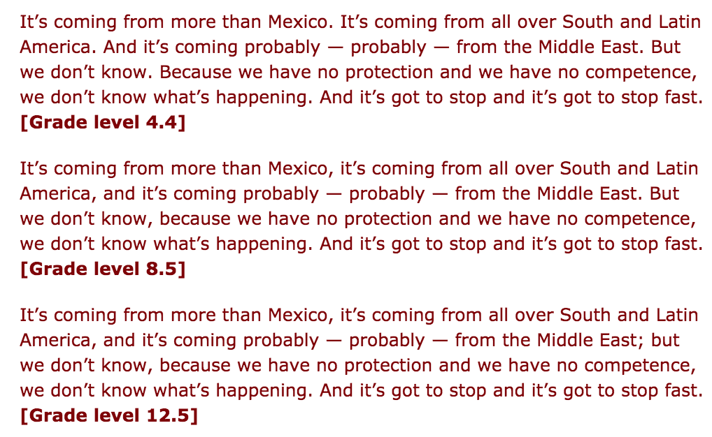
<!-- #endregion -->

<!-- #region {"slideshow": {"slide_type": "notes"}} -->
It's coming from more than Mexico. It's coming from all over South and Latin America. And it's coming probably — probably — from the Middle East. But we don't know. Because we have no protection and we have no competence, we don't know what's happening. And it's got to stop and it's got to stop fast. [Grade level 4.4]

It's coming from more than Mexico, it's coming from all over South and Latin America, and it's coming probably — probably — from the Middle East. But we don't know, because we have no protection and we have no competence, we don't know what's happening. And it's got to stop and it's got to stop fast. [Grade level 8.5]

It's coming from more than Mexico, it's coming from all over South and Latin America, and it's coming probably — probably — from the Middle East; but we don't know, because we have no protection and we have no competence, we don't know what's happening. And it's got to stop and it's got to stop fast. [Grade level 12.5]
<!-- #endregion -->

<!-- #region {"slideshow": {"slide_type": "notes"}} -->
The example is from: https://languagelog.ldc.upenn.edu/nll/?p=21847 and referring to:

http://www.bostonglobe.com/news/politics/2015/10/20/donald-trump-and-ben-carson-speak-grade-school-level-that-today-voters-can-quickly-grasp/LUCBY6uwQAxiLvvXbVTSUN/story.html?event=event25

"The Globe reviewed the language used by 19 presidential candidates, Democrats and Republicans, in speeches announcing their campaigns for the 2016 presidential election. The review, using a common algorithm called the **Flesch-Kincaid readability test** that crunches word choice and sentence structure and spits out grade-level rankings, produced some striking results."

"The Republican candidates - like Trump - who are speaking at a level easily understood by people at the lower end of the education spectrum are outperforming their highfalutin opponents in the polls. Simpler language resonates with a broader swath of voters in an era of 140-character Twitter tweets and 10-second television sound bites, say specialists on political speech."
<!-- #endregion -->

<!-- #region {"slideshow": {"slide_type": "notes"}} -->
Flesch-Kincaid is a very simple model intended to capture readability. It's not very complicated, but it is nonetheless mis-used. If you are a statistician, you can think about this as a problem in validity.

Now we're going to discuss language models. The type of language modeling that we're discussing is a very general purpose technique for NLP, though it was designed early on for Speech Recognition.

Hopefully, you've read chapter 3 of J&amp;M and also watched the videos. I'm not going to cover all those same details, but I will highlight a few important points.
<!-- #endregion -->

<!-- #region {"slideshow": {"slide_type": "slide"}} -->
# Unigram model or bag of words

Peter Norvig has a notebook we'll use to examine this.

[View on nbviwer](https://nbviewer.jupyter.org/url/norvig.com/ipython/How%20to%20Do%20Things%20with%20Words.ipynb)

[Or try on deepnote](
https://beta.deepnote.com/project/26e2e2dc-7e66-49e6-ab5c-2cb490bb0fcb)
<!-- #endregion -->

<!-- #region {"slideshow": {"slide_type": "slide"}} -->
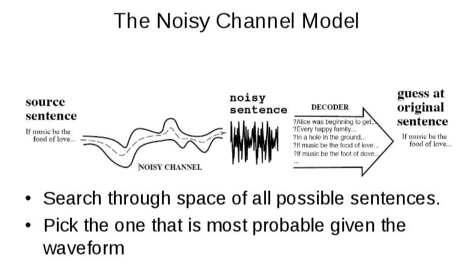
<!-- #endregion -->

<!-- #region {"slideshow": {"slide_type": "notes"}} -->
Images from: Julia Hirschberg, http://fayllar.org/julia-hirschberg-v2.html

The basic idea is that we have a noisy channel where we need to pick the best sentence/word/letter by picking the most likely.

It's easy to see the similarity between a noisy channel model for speech recognition, optical character recognition and machine translation.
<!-- #endregion -->

<!-- #region {"slideshow": {"slide_type": "slide"}} -->
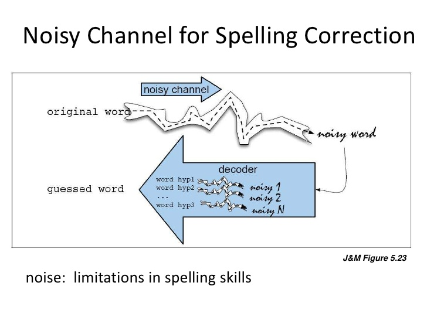
<!-- #endregion -->

<!-- #region {"slideshow": {"slide_type": "notes"}} -->
Images from:

Here is the same problem but in the context of spelling. Here you can imagine a document where there are spelling errors.

What you might want to do is pick the *best hypothesis about the best word* to pick.
<!-- #endregion -->

<!-- #region {"slideshow": {"slide_type": "slide"}} -->
# Let's say...
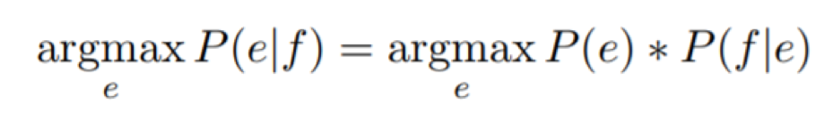
- A French preposition could be translated as **"in"** or **"on"**.
- And... let's say p(f | e) suggests both:
- in the end zone
- on the end zone

P(e) will prefer: **in** the end zone
<!-- #endregion -->

<!-- #region {"slideshow": {"slide_type": "notes"}} -->
In this formula,
- argmax is the candidate with the highest combined probability.

The basic idea is that you want to pick a word that maximizes the product of two factors:

- P(f | e) the likelihood and is also known as the **noisy channel model** (or error model) -- it accounts for the variants. (This is the probability of the incorrect word given the correct word)
- P(e) the prior (correct word). This is term is called the **language model** (the probability of the correct word)
<!-- #endregion -->

<!-- #region {"slideshow": {"slide_type": "slide"}} -->
# Back to spelling...
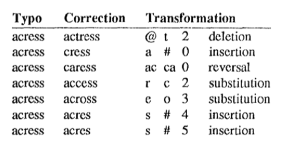
<!-- #endregion -->

<!-- #region {"slideshow": {"slide_type": "notes"}} -->
Remember edit distance?

This is our noisy channel model!

he screen capture is from a 1990 paper from [Kernighan, Church, and Gale](http://delivery.acm.org/10.1145/1000000/997975/p205-kernighan.pdf?ip=23.82.10.248&amp;id=997975&amp;acc=OPEN&amp;key=4D4702B0C3E38B35%2E4D4702B0C3E38B35%2E4D4702B0C3E38B35%2E6D218144511F3437&amp;__acm__=1569345082_068e3995f571aa2759e0764ff24f050d)

acres (45% - upcase/lowcase?) and actress (37%) are high probability. Ideally, you would like actress to be preferred because of the following word whose. We'll need a better algorithm.

If you would like to dig deeper into this case study, Manning has a great presentation here: https://slideplayer.com/slide/16489389/

He notes from a Kukich 1992 study that 25-40% of mis-spellings are actual words.
<!-- #endregion -->

<!-- #region {"slideshow": {"slide_type": "slide"}} -->
# Spell Correction

Back to Norvig (3)

[View on nbviwer](https://nbviewer.jupyter.org/url/norvig.com/ipython/How%20to%20Do%20Things%20with%20Words.ipynb)

[Run on deepnote](
https://beta.deepnote.com/project/26e2e2dc-7e66-49e6-ab5c-2cb490bb0fcb)
<!-- #endregion -->

<!-- #region {"slideshow": {"slide_type": "slide"}} -->
"a stellar and versatile **acress** whose combination of sass and glamour..."
<!-- #endregion -->

<!-- #region {"slideshow": {"slide_type": "notes"}} -->
Slide Type
Let's look at the scoring for the 44M word vocabulary from AP Newswire in the context of this sentence.
<!-- #endregion -->

<!-- #region {"slideshow": {"slide_type": "slide"}} -->
# Scoring
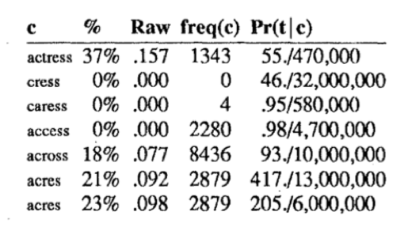
<!-- #endregion -->

<!-- #region {"slideshow": {"slide_type": "notes"}} -->
The basic idea here is that we get a cost for the number of edits in Pr(t | c) and we multiply those times a measure of frequency for each word.

Pr(t|c) (typo|correct) is basically the same algorithm that you saw from Norvig. 

*acres* (45% - upcase/lowcase?) and *actress* (37%) are high probability. Ideally, you would like *actress* to be preferred because of the following word *whose*. We'll need a better algorithm. 

More detailed explanation:

In this paper, each candidate correction, c, is scored by Pr(c) Pr(t | c), and then normalized by the sum of the scores for all proposed candidates. The prior, Pr(c), is estimated by (freq(c) + 0.5)/N, where freq(c) is the number of times that the word c appears in the 1988 AP corpus (N = 44 million words))
<!-- #endregion -->

<!-- #region {"slideshow": {"slide_type": "notes"}} -->
Unfortunately, in the original sentence 'across' is the wrong word. 

The unigram model alone could be improved. And, in fact, the authors speculated that more context would improve this algorithm. And that's where we're headed below...
<!-- #endregion -->

<!-- #region {"slideshow": {"slide_type": "slide"}} -->
# Preceding context

We'd like to handle both the case of the immediate word or a more general case of immedate (words) as context:
- **a** stellar
- **a stellar** and
- **a stellar and versatile** actress
<!-- #endregion -->

<!-- #region {"slideshow": {"slide_type": "slide"}} -->
# Markov property
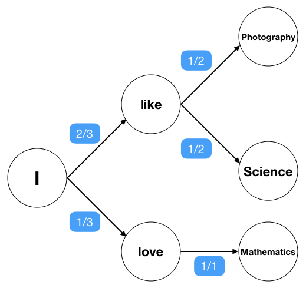
<!-- #endregion -->
<!-- #region {"slideshow": {"slide_type": "notes"}} -->
Image credit: https://medium.com/ymedialabs-innovation/next-word-prediction-using-markov-model-570fc0475f96

Using the spell correction program above, we had both a prior (frequency from vocabulary) and also an error score.

What if we look at the context of the previous word?

In a process wherein the next state depends only on the current state, such a process is said to follow Markov property.

- The only context considered is the previous observation.
- This is represented as a simple probability distribution where the sum is equal to 1:

&gt; P(like | I) = 0.67

&gt; P(love | I) = 0.33

&gt; P(fruits | like) = P(Science | like) = 0.5

&gt; P(Mathematics | love) = 1

- A sequence of events which follow the Markov model is referred to as the Markov Chain.
- You also need a special symbol such as a STOP or sentence boundary in order to calculate the first observation in a sentence.

If you wanted to know the probability of the sentence "I love mathematics", your goal might be to model the joint probability of the sequence I + love + mathematics.
<!-- #endregion -->

<!-- #region {"slideshow": {"slide_type": "notes"}} -->
# Joint and Conditional Probabilities
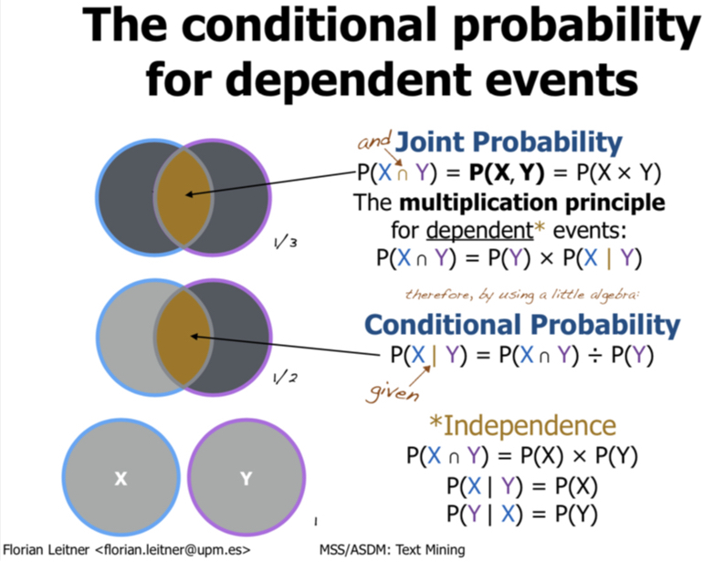
<!-- #endregion -->

<!-- #region {"slideshow": {"slide_type": "notes"}} -->
Credit: https://www.slideshare.net/asdkfjqlwef/text-mining-from-bayes-rule-to-de

Let's take a diversion at this point and look at joint and conditional probabilities.

Joint probability is the likelihood of two *independent* events happening at the same time. [Think of two dice rolls simultaneously.] But you need to know the probability of each event to calculate it.

We're interested in conditional probabilities. [Think of one dice roll following another.]

We need to take the first event into account when considering the probability of the second event.

J&amp;M show us that it's in fact easier if we try to estimate -- or approximate the history of a sentence by using just the last couple of words. We do this using a maximum likelihood estimation shortly... but first let's look at ngrams.
<!-- #endregion -->

<!-- #region {"slideshow": {"slide_type": "slide"}} -->

<!-- #endregion -->

<!-- #region {"slideshow": {"slide_type": "notes"}} -->
With a bigram model, we can look at all combinations of words. This lets us get at the problem from the Kernighan, Church, and Gale paper.
<!-- #endregion -->

<!-- #region {"slideshow": {"slide_type": "slide"}} -->
# Bigram probability
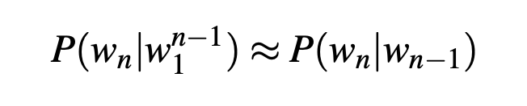
<!-- #endregion -->

<!-- #region {"slideshow": {"slide_type": "notes"}} -->
The assumption that the probability of a word depends only on the previous word is called a Markov assumption.

A bigram is simply a sequence of two observations (words). And as J&amp;M note, we use the term "bigram" both as the object (word sequence) and as the predictive model.
<!-- #endregion -->

<!-- #region {"slideshow": {"slide_type": "slide"}} -->
# Trigrams
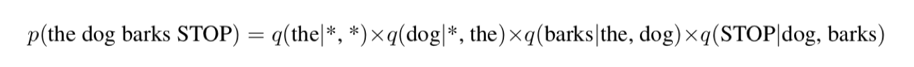
<!-- #endregion -->

<!-- #region {"slideshow": {"slide_type": "notes"}} -->
(This example is from Michael Collins: http://www.cs.columbia.edu/~mcollins/lm-spring2013.pdf)
<!-- #endregion -->

<!-- #region {"slideshow": {"slide_type": "slide"}} -->
# Chain Rule
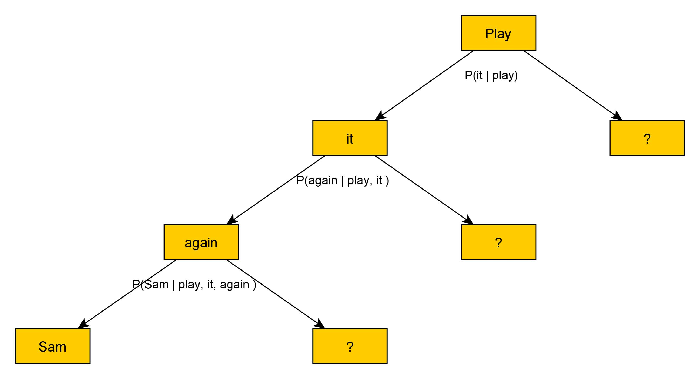
<!-- #endregion -->

<!-- #region {"slideshow": {"slide_type": "notes"}} -->
Image credit: https://www.ibm.com/developerworks/community/blogs/nlp/entry/the_chain_rule_of_probability?lang=en

But to calculate a longer sequence than a bigram (such as a trigram), we start to run into some challenges.

Language is very productive!
1. We can't count every possible sentence (recall language is always changing).
2. And we also don't know what all the possible sentences are. We have to make some sort of estimate. This means that a joint probability is not exactly going to work.
<!-- #endregion -->

<!-- #region {"slideshow": {"slide_type": "slide"}} -->
# Norvig (4)

[View on nbviwer](https://nbviewer.jupyter.org/url/norvig.com/ipython/How%20to%20Do%20Things%20with%20Words.ipynb)

[Run on deepnote](
https://beta.deepnote.com/project/26e2e2dc-7e66-49e6-ab5c-2cb490bb0fcb)

George Box - "All models are wrong, but some models are useful."
<!-- #endregion -->

<!-- #region {"slideshow": {"slide_type": "slide"}} -->
# Statistics in Linguistics

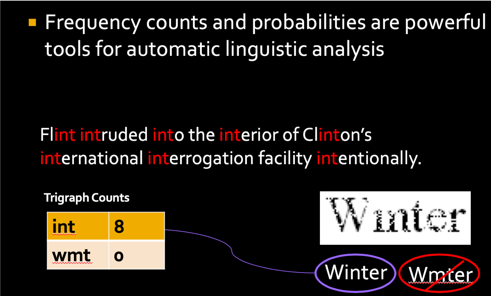
<!-- #endregion -->

<!-- #region {"slideshow": {"slide_type": "notes"}} -->
If we take seriously the problem that Norvig notes with unknown (or very low probability) words, we've move beyond calculating results from our data to making hypotheses about our data. 

That is, language suffers from a sparse data problem and we need statistical tools to deal with this.
<!-- #endregion -->

```python slideshow={"slide_type": "slide"}
# Norvig calculate ngrams just using plain old Python. NLTK makes this easy, as well.

import regex
import collections
from nltk.util import ngrams

s = "This is a paragraph about a dog. It's not a very nice paragraph - and it's not even very long."

s = s.lower()
s = regex.sub(r'[^a-zA-Z0-9\s]', ' ', s)
tokens = [token for token in s.split(" ") if token != ""]
bigrams = list(ngrams(tokens, 2))
bigrams_freq = collections.Counter(bigrams)
print(bigrams_freq)

# Note... Sentence boundaries were not retained here.
```

<!-- #region {"slideshow": {"slide_type": "slide"}} -->
# MLE
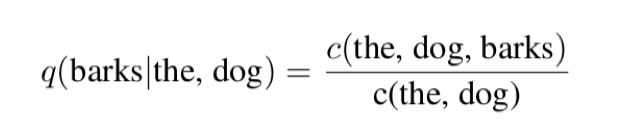


<!-- #endregion -->

<!-- #region {"slideshow": {"slide_type": "notes"}} -->
Maximum Likelihood Estimation is meant as a method of estimating the parameters of a probability distribution by maximizing a likelihood function. The whole idea is to generate a statistical model that best fits observed data.

For language data, we can start with counts and then normalizing between 0-1.


The idea behind MLE (for the case of a bigram but extending to higher order grams) is that to compute a particular bigram probability of a word y given a previous word x, **you can determine the count of the bigram C(xy) and normalize it by the sum of all the bigrams that share the same first-word x.**

In the trigram context, we'd like a distribution over possible words conditioned on the bigram context.

Regardless, this is going to lead to a real problem with many of our counts being close to zero.
<!-- #endregion -->


<!-- #region {"slideshow": {"slide_type": "slide"}} -->
# Smoothing to the rescue!
<!-- #endregion -->

<!-- #region {"slideshow": {"slide_type": "notes"}} -->
Fortunately, for us. Someone did the empirical work to examine smoothing in 
[An Empirical Study of Smoothing Techniques for Language Modeling](https://www.aclweb.org/anthology/P96-1041)

There were already a variety of smoothing algorithms in the wild. But how did they perform?

Chen and Goodman looked at:
- Training data size
- Corpus (Brown vs Wall Street Journal)
- ngram order (bigrams versus trigrams)

<!-- #endregion -->

<!-- #region {"slideshow": {"slide_type": "slide"}} -->
“Whenever data sparsity is an issue, smoothing can help performance, and data sparsity is almost always an issue in statistical modeling. In the extreme case where there is so much training data that all parameters can be accurately trained without smoothing, one can almost always expand the model, such as by moving to a higher n-gram model, to achieve improved performance. With more parameters data sparsity becomes an issue again, but with proper smoothing the models are usually more accurate than the original models. Thus, no matter how much data one has, smoothing can almost always help performace, and for a relatively small effort.”
Chen &amp; Goodman (1998)
<!-- #endregion -->

<!-- #region {"slideshow": {"slide_type": "slide"}} -->
# Intuition #1
- Zero probability for unseen words is awful so let's pretend we saw these words.
 - Laplace (add one)
 - Add-k (delta value 0 &lt; d &lt;= 1)
<!-- #endregion -->

<!-- #region {"slideshow": {"slide_type": "notes"}} -->
These don't work great... J&amp;M note poor variance since too much probability mass moves to the 0s.

There is a pretty neat experiment on ngram data here. 
http://stanford.edu/~risi/tutorials/absolute_ngram_counts.html
<!-- #endregion -->

<!-- #region {"slideshow": {"slide_type": "slide"}} -->
# Intuition #2
- Information about the number of different contexts a word appears is useful.
- We can shift to use lower-order ngrams as evidence
 - (Katz) back-off
 - (Kneser-Ney) (absolute) interpolation

<!-- #endregion -->

<!-- #region {"slideshow": {"slide_type": "notes"}} -->
From J&M "The word glasses seems much more likely to follow here than, say, the word Kong, so we’d like our unigram model to prefer glasses. But in fact it’s Kong that is more common, since Hong Kong is a very frequent word."

For backoff - if we don't find sufficient evidence for trigrams, let's shift the probability mass to use bigrams, and even unigrams.

According to the Chen &amp; Goodman paper, Katz performs better on large training sets and with n-grams with large counts.

Overall, the factor with the largest influence is the use of a modified backoff distribution as in Kneser-Ney smoothing and for low (non-zero) counts.
<!-- #endregion -->

<!-- #region {"slideshow": {"slide_type": "slide"}} -->
# What we've learned in evaluation

- Ngram models are sensitive to:
 - vocabulary (training data size)
 - ngram counts (small, large)
 - word order...
- Use a training corpus with similar **dialect** and **genre** when building ngram models.
<!-- #endregion -->

<!-- #region {"slideshow": {"slide_type": "notes"}} -->
If you don't have a data sparcity problem -- you probably don't have enough data.
<!-- #endregion -->

<!-- #region {"slideshow": {"slide_type": "slide"}} -->
# Norvig (9)
[View on nbviwer](https://nbviewer.jupyter.org/url/norvig.com/ipython/How%20to%20Do%20Things%20with%20Words.ipynb)

[Run on deepnote](
https://beta.deepnote.com/project/26e2e2dc-7e66-49e6-ab5c-2cb490bb0fcb)
<!-- #endregion -->

<!-- #region {"slideshow": {"slide_type": "slide"}} -->
# Google ngrams
https://ai.googleblog.com/2006/08/all-our-n-gram-are-belong-to-you.html
<!-- #endregion -->

<!-- #region {"slideshow": {"slide_type": "notes"}} -->
&gt; We processed 1,024,908,267,229 words of running text and are publishing the counts for all 1,176,470,663 five-word sequences that appear at least 40 times. There are 13,588,391 unique words, after discarding words that appear less than 200 times.
<!-- #endregion -->

<!-- #region {"slideshow": {"slide_type": "slide"}} -->
# [Google ngram viewer](https://books.google.com/ngrams)
<!-- #endregion -->

<!-- #region {"slideshow": {"slide_type": "notes"}} -->
Shamelessly from [Wikipedia](https://en.wikipedia.org/wiki/Google_Ngram_Viewer):

You can try 1-5 grams.

&gt; The Google Ngram Viewer or Google Books Ngram Viewer is an online search engine that charts the frequencies of any set of comma-delimited search strings using a yearly count of n-grams found in sources printed between 1500 and 2008[1][2][3][4][5] in Google's text corpora in English, Chinese (simplified), French, German, Hebrew, Italian, Russian, or Spanish.[2][6] There are also some specialized English corpora, such as American English, British English, English Fiction, and English One Million; and the 2009 version of most corpora is also available.[7]

&gt; The program can search for a single word or a phrase, including misspellings or gibberish.[6] The n-grams are matched with the text within the selected corpus, optionally using case-sensitive spelling (which compares the exact use of uppercase letters),[3] and, if found in 40 or more books, are then plotted on a graph.[8]

&gt; The Google Ngram Viewer, as of January 2016, supports searches for parts of speech and wildcards.[7]

[The pitfalls of using google ngram to study language](https://www.wired.com/2015/10/pitfalls-of-studying-language-with-google-ngram/)
<!-- #endregion -->

<!-- #region {"slideshow": {"slide_type": "slide"}} -->
# GDELT
https://www.forbes.com/sites/kalevleetaru/2019/09/02/using-the-cloud-to-explore-the-linguistic-patterns-of-half-a-trillion-words-of-news-homepage-hyperlinks/#74994b02342b
<!-- #endregion -->

<!-- #region {"slideshow": {"slide_type": "slide"}} -->
# Problems for Ngrams
- "I had to **re-boot** this old **computer** again!"
- "The **computer** which I had just put into the machine room on the fifth floor **is** crashing."

<!-- #endregion -->

<!-- #region {"slideshow": {"slide_type": "notes"}} -->
The first example is a skipgram (there is intervening context, but the two words are often associated).

As J&M notes for the second example, language is subject to long-distance dependencies... but we can often get away with N-gram models.
<!-- #endregion -->

<!-- #region {"slideshow": {"slide_type": "slide"}} -->
# Evaluation
<!-- #endregion -->
<!-- #region {"slideshow": {"slide_type": "slide"}} -->
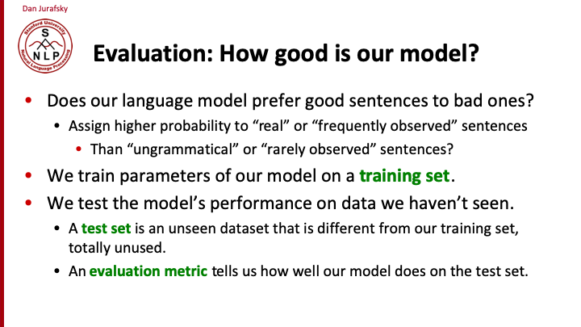
<!-- #endregion -->

<!-- #region {"slideshow": {"slide_type": "slide"}} -->
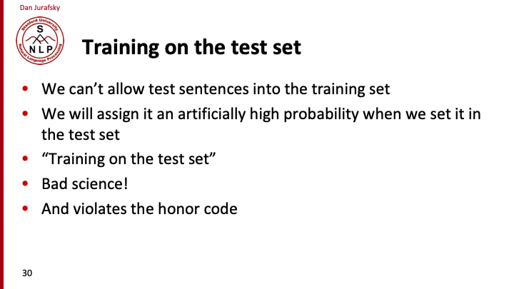
<!-- #endregion -->

<!-- #region {"slideshow": {"slide_type": "slide"}} -->
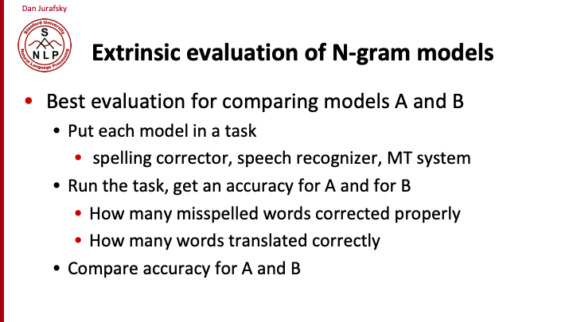
<!-- #endregion -->

<!-- #region {"slideshow": {"slide_type": "slide"}} -->
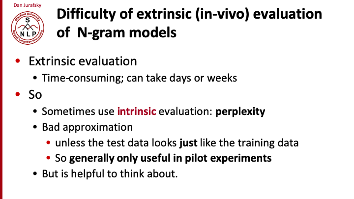
<!-- #endregion -->

<!-- #region {"slideshow": {"slide_type": "slide"}} -->
# Perplexity
<!-- #endregion -->

<!-- #region {"slideshow": {"slide_type": "slide"}} -->
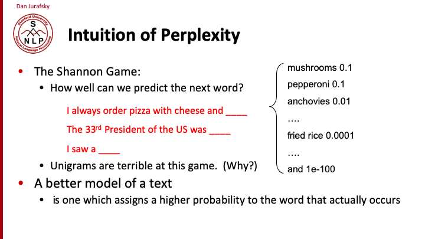
<!-- #endregion -->

<!-- #region {"slideshow": {"slide_type": "slide"}} -->
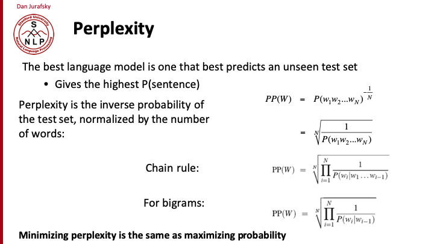
<!-- #endregion -->

<!-- #region {"slideshow": {"slide_type": "notes"}} -->
Don't forget sentence boundry tokens and also to count them in the total N.
<!-- #endregion -->

<!-- #region {"slideshow": {"slide_type": "slide"}} -->
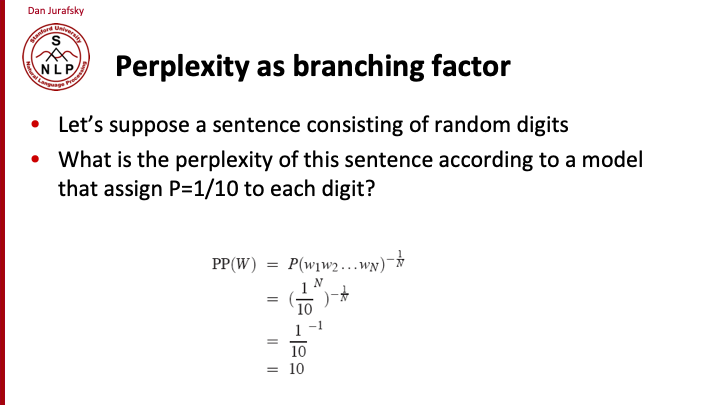
<!-- #endregion -->

<!-- #region {"slideshow": {"slide_type": "notes"}} -->
A second way to look at perplexity is as a weighted average branching factor. The branching factor of a language is the number of possible next words that can follow any word. 
<!-- #endregion -->

<!-- #region {"slideshow": {"slide_type": "slide"}} -->
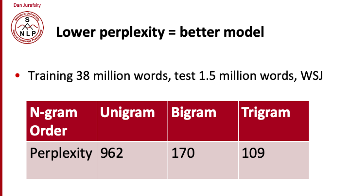
<!-- #endregion -->

<!-- #region {"slideshow": {"slide_type": "slide"}} -->
#  Neural?


<!-- #endregion -->

<!-- #region {"slideshow": {"slide_type": "notes"}} -->
Image and article: https://karpathy.github.io/2015/05/21/rnn-effectiveness/

Neural language models use continuous representations or embeddings of words to make predictions.
<!-- #endregion -->

<!-- #region {"slideshow": {"slide_type": "slide"}} -->
# GPT-2

Predicts the next word in 40GB of Internet text...
https://demo.allennlp.org/gpt2?text=Joel%20is%20a

<!-- #endregion -->

https://openai.com/blog/better-language-models/
    


```python

```
