---
jupyter:
  jupytext:
    comment_magics: false
    formats: ipynb,md
    text_representation:
      extension: .md
      format_name: markdown
      format_version: '1.1'
      jupytext_version: 1.1.5
  kernelspec:
    display_name: Python 3
    language: python
    name: python3
---

<!-- #region {"slideshow": {"slide_type": "skip"}} -->
---
jupyter:
  jupytext:
    cell_markers: region,endregion
    comment_magics: false
    formats: ipynb,.pct.py:hydrogen,Rmd,md
    text_representation:
      extension: .md
      format_name: percent
      format_version: '1.1'
      jupytext_version: 1.1.5
  kernelspec:
    display_name: Python 3
    language: python
    name: python3
---
<!-- #endregion -->

<!-- #region {"slideshow": {"slide_type": "slide"}} -->
*ANLY 580: Natural Language Processing for Data Analytics*  
*Fall 2019*  
# 5. Sentiment Analysis and Naive Bayes
<!-- #endregion -->

<!-- #region {"slideshow": {"slide_type": "notes"}} -->
Note - we're going to spend considerable time talking about the project for next week. I've dropped Python code into Canvas that gives you a start to the problem (basline solution), though with a bit of effort you should be able to do better.
<!-- #endregion -->

<!-- #region {"slideshow": {"slide_type": "slide"}} -->
# Agenda
* Some types of text classification
* Deep(er) dive into sentiment analysis
* Naive Bayes (theory)
* Project baseline algorithm
* Evaluation
* Practical considerations
* Finishing your project
<!-- #endregion -->

<!-- #region {"slideshow": {"slide_type": "notes"}} -->
While as data scientists you need to understand as much as possible in order to best select algorithms or trouble-shoot when you encounter problems, J&M leaves implementation up to others. So project # 1 was designed to help you practice skills while developing an understanding of theory.
<!-- #endregion -->

<!-- #region {"slideshow": {"slide_type": "slide"}} -->
# What do we mean by text classification?

<!-- #endregion -->

<!-- #region {"slideshow": {"slide_type": "notes"}} -->
This week we're talking about Naive Bayes and a simple tool for classifying text into categories. What categories you ask?
<!-- #endregion -->

<!-- #region {"slideshow": {"slide_type": "slide"}} -->
# Spam
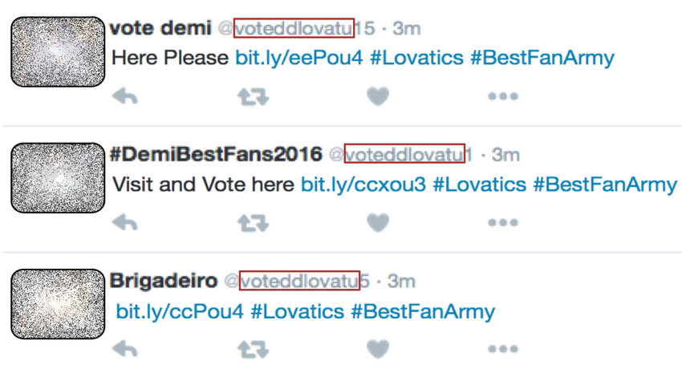

<!-- #endregion -->

<!-- #region {"slideshow": {"slide_type": "notes"}} -->
https://www.ranker.com/list/types-of-twitter-spam/kel-varnsen

How do you recognize it?
- name
- links
- tons of hashtags
- topics (e.g., porn)
- brands, ads...

ground truth spam tweets https://ieeexplore.ieee.org/document/7249453
<!-- #endregion -->

<!-- #region {"slideshow": {"slide_type": "slide"}} -->
# Authorship

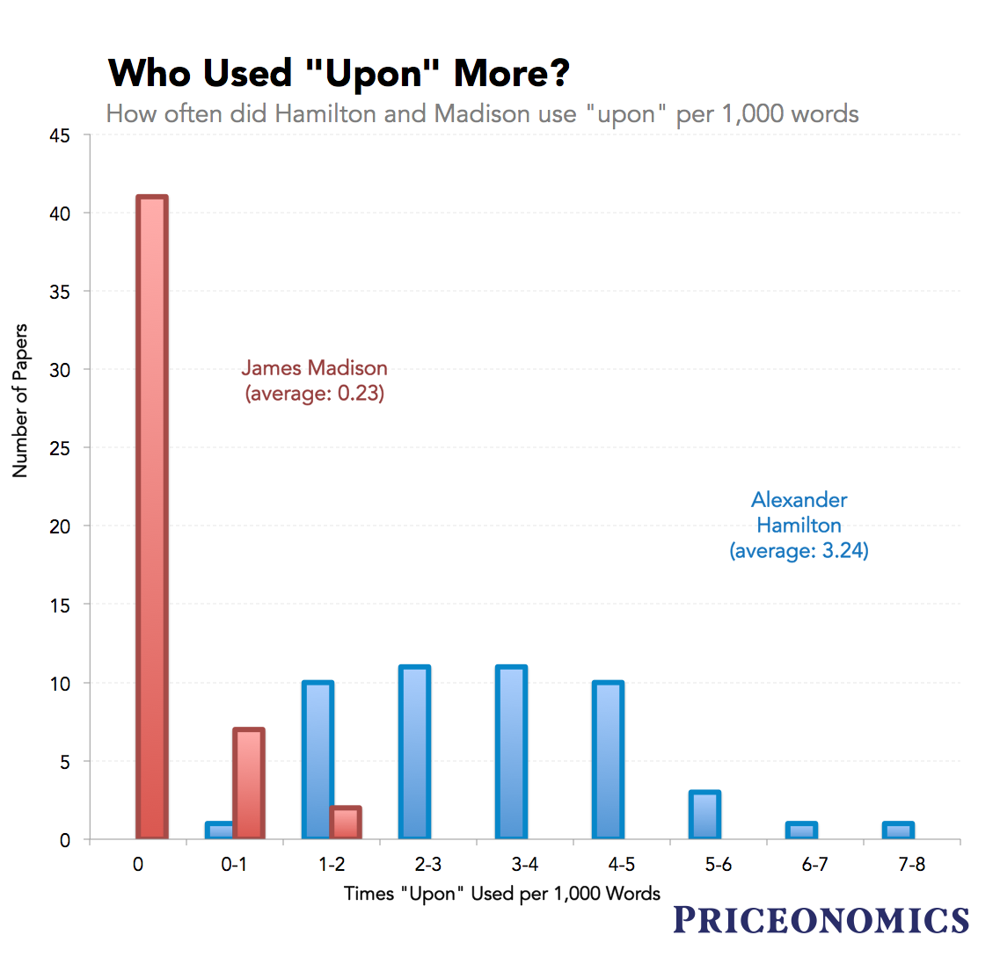
<!-- #endregion -->

<!-- #region {"slideshow": {"slide_type": "notes"}} -->
Mosteller & Wallace 1963 http://ptrckprry.com/course/ssd/reading/Most63.pdf - two mathematicians who looked at word choice statistically to determine who wrote which paper under the pseudonym Publius.

https://priceonomics.com/how-statistics-solved-a-175-year-old-mystery-about/

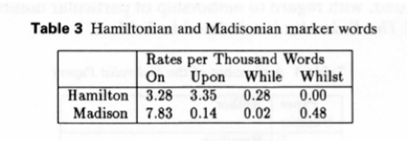

"Once all the words were printed out and sorted, the Wallace and Mosteller team set out to find “discriminators.” These are words that Madison may have used much more frequently than Hamilton, or vice versa. The best candidates were “non-contextual” words—conjunctions, prepositions, articles. These are words that people use all the time and more or less equally from one context to the next, regardless of the topic.

“These function words are much more stable than content words and, for the most part, they are also very frequent, which means you get lots of data,” explains Patrick Juola, a professor of computer science at Duquesne University and an expert in text analysis."

Pioneered the use of Baysian statistics.
<!-- #endregion -->

<!-- #region {"slideshow": {"slide_type": "slide"}} -->
# Gender
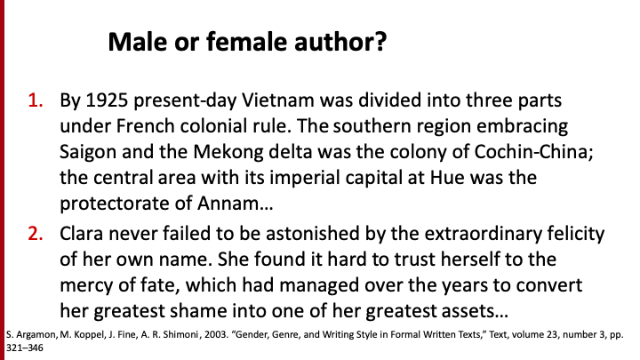
<!-- #endregion -->

<!-- #region {"slideshow": {"slide_type": "notes"}} -->
British National Corpus

"The short (less than 50) list of features which our algorithm identified as being most collectively useful for distinguishing male-authored texts from female-authored texts was very suggestive. This list included a large number of determiners {a, the, that, these} and quantifiers {one, two, more, some } as male indicators. Moreover, the parts of speech DT0 (BNC: a determiner which typically occurs either as the first word in a noun phrase or as the head of a noun phrase), AT0 (BNC: a determiner which typically begins a noun phrase but cannot appear as its head), and CRD (cardinal numbers) are all strong male indicators. Conversely, the pronouns {I, you, she, her, their, myself, yourself, herself} are all strong female indicators."

<!-- #endregion -->

<!-- #region {"slideshow": {"slide_type": "slide"}} -->
# Reviews
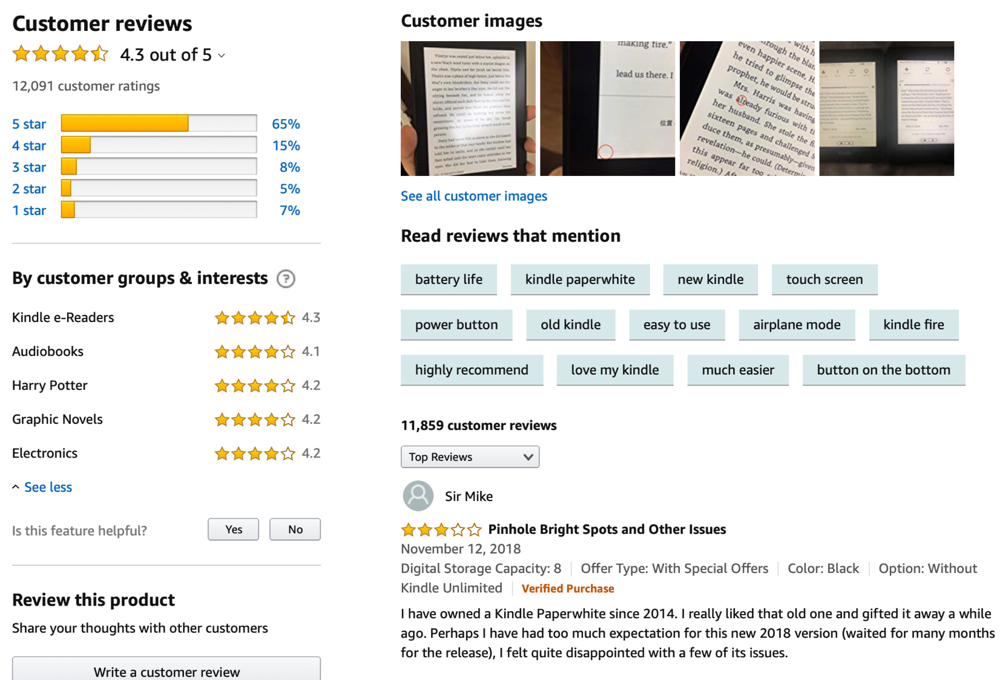

<!-- #endregion -->

<!-- #region {"slideshow": {"slide_type": "slide"}} -->
# And more tasks
- **Illocutionary acts** - Apologizing, promising, ordering, answering, requesting, complaining, warning, inviting, refusing, and congratulating
- **genre** - for example, fiction, biography, letter, news, ... Some common communicative form
- **register** - formal, informal language
- **style** - linguistic variability with a social context
- **stance** - position with respect to an issue
- **dialect** -  broadly, differences in vocabulary, grammar, and pronunciation
- **profiling** - extrapolation on the basis of patterns
<!-- #endregion -->

<!-- #region {"slideshow": {"slide_type": "slide"}} -->
# And even more tasks...
- Hate speech
- Offensive language
- "Fake news"
- Hyperpartisan language
- Rumors
- Suggestions
- Politeness
- Bias
- Deception
<!-- #endregion -->

<!-- #region {"slideshow": {"slide_type": "slide"}} -->
# Sentiment
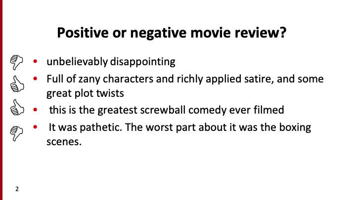
<!-- #endregion -->

<!-- #region {"slideshow": {"slide_type": "notes"}} -->
This list is not exhaustive. And the features used for detection vary broadly from linguistic to non-linguistic. 
<!-- #endregion -->

<!-- #region {"slideshow": {"slide_type": "slide"}} -->
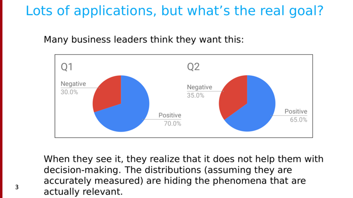
<!-- #endregion -->

<!-- #region {"slideshow": {"slide_type": "slide"}} -->
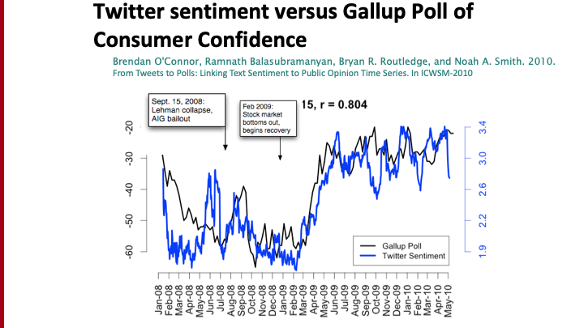
<!-- #endregion -->

<!-- #region {"slideshow": {"slide_type": "notes"}} -->
Slide from J&M

Perhaps, this is what the customer wants?

Original paper: https://www.aaai.org/ocs/index.php/ICWSM/ICWSM10/paper/viewFile/1536/1842

Abstract

We connect measures of public opinion measured from polls with sentiment measured from text. We analyze several surveys on consumer confidence and political opinion over the 2008 to 2009 period, and find they correlate to sentiment word frequencies in contemporaneous Twitter messages. While our results vary across datasets, in several cases the correlations are as high as 80%, and capture important large-scale trends. The results highlight the potential of text streams as a substitute and supplement for traditional polling.
<!-- #endregion -->

<!-- #region {"slideshow": {"slide_type": "slide"}} -->
# Deeper dive on sentiment analysis

- Sentiment (polarity)
- Opinions
- Values
- Attitudes
- Feelings (emotions)
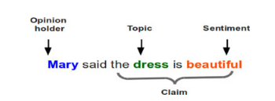
<!-- #endregion -->

<!-- #region {"slideshow": {"slide_type": "notes"}} -->
Hutto & Gilbert 2014 - http://comp.social.gatech.edu/papers/icwsm14.vader.hutto.pdf

This is a pretty good definition, though it seems the field is expanding:
> Sentiment analysis, or opinion  mining,is an active  area of study  in  the  field  of  natural  language  processing  that  analyzes people's  opinions,  sentiments,  evaluations,  attitudes, and  emotions  via  the  computational  treatment  of  subjectivity  in  text. 

E S. Kim and E. Hovy, “Automatic detection of opinion bearing words and sentences”, 2005

These days when we talk about "who" someone is in terms of values and attitudes, we're stepping into the space of psychographics.
<!-- #endregion -->

<!-- #region {"slideshow": {"slide_type": "slide"}} -->
# Special tasks
- Subjectivity / objectivity
 - movie review snippets vs plot summaries
 - "The protagonist tries to protect her good name" 
- Aspect-Based
 - "The battery life of this camera is too short"
 - Opinion spam
 - Comparisons
<!-- #endregion -->

<!-- #region {"slideshow": {"slide_type": "notes"}} -->
- First example from Bang & Lee - http://www.cs.cornell.edu/home/llee/papers/cutsent.pdf
- Second example from Bing Liu - https://www.cs.uic.edu/~liub/FBS/NLP-handbook-sentiment-analysis.pdf
<!-- #endregion -->

<!-- #region {"slideshow": {"slide_type": "slide"}} -->
Conceptual challenges (Chris Potts)
Which of the following sentences express sentiment? What is their sentiment polarity (pos/neg), if any?
1. There was an earthquake in California.
2. The team failed to complete the physical challenge. (We
win/lose!)
3. They said it would be great.
4. They said it would be great, and they were right.
5. They said it would be great, and they were wrong.
6. The party fat-cats are sipping their expensive imported wines.
7. Oh, you’re terrible!
8. Here’s to ya, ya bastard!
9. Of 2001, “Many consider the masterpiece bewildering, boring, slow-moving or annoying, . . . ”
10. long-suffering fans, bittersweet memories, hilariously embarrassing moments, . . .
<!-- #endregion -->

<!-- #region {"slideshow": {"slide_type": "slide"}} -->
# Vader
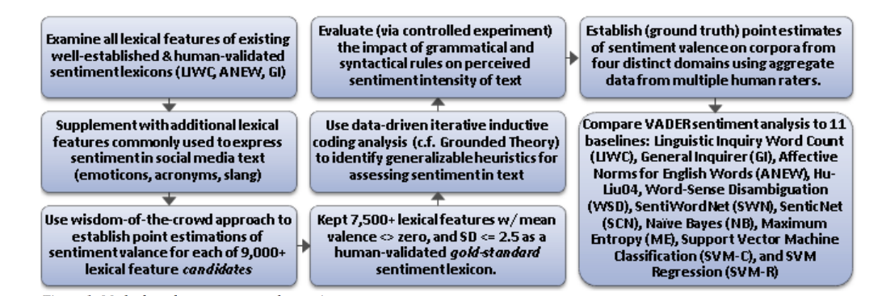

<!-- #endregion -->

<!-- #region {"slideshow": {"slide_type": "notes"}} -->
image from: http://comp.social.gatech.edu/papers/icwsm14.vader.hutto.pdf

VADER (Valence Aware Dictionary and sEntiment Reasoner) is a lexicon and rule-based sentiment analysis tool that is  attuned to sentiments expressed in social media. VADER uses a sentiment lexicon which are labeled.

"We use a combination of qualitative and quantitative methods to produce, and then empirically validate, a gold-standard sentiment lexicon that is especially attuned to microblog-like contexts. We next combine these lexical features with consideration for five generalizable rules that embody grammatical and syntactical conventions that humans use when expressing or emphasizing sentiment intensity."

1. **Punctuation, namely the exclamation point (!), increases the magnitude of the intensity without modifying the semantic orientation.** For example, “The food here is good!!!” is more intense than “The food here is good.”
2. **Capitalization, specifically using ALL-CAPS to emphasize a sentiment-relevant word** in the presence of other non-capitalized words, increases the magnitude of the sentiment intensity without affecting the semantic orientation. For example, “The food here is GREAT!” conveys more intensity than “The food here is great!”
3. **Degree modifiers (also called intensifiers, booster words, or degree adverbs) impact sentiment intensity by either increasing or decreasing the intensity.** For example, “The service here is extremely good” is more intense than “The service here is good”, whereas “The service here is marginally good” reduces the intensity. 
4. **The contrastive conjunction “but” signals a shift in sentiment polarity, with the sentiment of the text following the conjunction being dominant.** “The food here is great, but the service is horrible” has mixed sentiment, with the latter half dictating the overall rating.
5. By examining the **tri-gram preceding a sentiment-laden lexical feature, we catch nearly 90% of cases where negation flips the polarity of the text.** A negated sentence would be “The food here isn’t really all that great”.

<!-- #endregion -->

<!-- #region {"slideshow": {"slide_type": "notes"}} -->
More complete demo in the __main__ for vaderSentiment.py. The demo has:

        examples of typical use cases for sentiment analysis, including proper handling of sentences with:

                typical negations (e.g., "not good")
                use of contractions as negations (e.g., "wasn't very good")
                conventional use of punctuation to signal increased sentiment intensity (e.g., "Good!!!")
                conventional use of word-shape to signal emphasis (e.g., using ALL CAPS for words/phrases)
                using degree modifiers to alter sentiment intensity (e.g., intensity boosters such as "very" and intensity dampeners such as "kind of")
                understanding many sentiment-laden slang words (e.g., 'sux')
                understanding many sentiment-laden slang words as modifiers such as 'uber' or 'friggin' or 'kinda'
                understanding many sentiment-laden emoticons such as :) and :D
                translating utf-8 encoded emojis such as 💘 and 💋 and 😁
                understanding sentiment-laden initialisms and acronyms (for example: 'lol')

        more examples of tricky sentences that confuse other sentiment analysis tools

        example for how VADER can work in conjunction with NLTK to do sentiment analysis on longer texts...i.e., decomposing paragraphs, articles/reports/publications, or novels into sentence-level analyses

        examples of a concept for assessing the sentiment of images, video, or other tagged multimedia content

        if you have access to the Internet, the demo has an example of how VADER can work with analyzing sentiment of texts in other languages (non-English text sentences).
<!-- #endregion -->

<!-- #region {"slideshow": {"slide_type": "notes"}} -->
# Other Sentiment Lexicons

- Chapter 19 from J&M http://web.stanford.edu/~jurafsky/slp3/19.pdf

From Chris Potts http://web.stanford.edu/class/cs224u/materials/cs224u-2019-sentiment.pdf:

There are too many to try to list, so I picked some with noteworthy properties, limiting to the core task of sentiment analysis:
- IMDb movie reviews (50K) (Maas et al. 2011): http://ai.stanford.edu/~amaas/data/sentiment/index.html
- Datasets from Lillian Lee’s group: http://www.cs.cornell.edu/home/llee/data/
- Datasets from Bing Liu’s group: https://www.cs.uic.edu/~liub/FBS/sentiment- analysis.html
- RateBeer (McAuley et al. 2012; McAuley & Leskovec 2013): http://snap.stanford.edu/data/web- RateBeer.html
- Amazon Customer Review data: https://s3.amazonaws.com/amazon- reviews- pds/readme.html
- Amazon Product Data (McAuley et al. 2015; He & McAuley 2016): http://jmcauley.ucsd.edu/data/amazon/
- Sentiment and social networks together (West et al. 2014) http://infolab.stanford.edu/~west1/TACL2014/
- Stanford Sentiment Treebank (SST; Socher et al. 2013) https://nlp.stanford.edu/sentiment/
- Bing Liu’s Opinion Lexicon: nltk.corpus.opinion_lexicon
- SentiWordNet: nltk.corpus.sentiwordnet
- MPQA subjectivity lexicon: http://mpqa.cs.pitt.edu
- Harvard General Inquirer
 - Download: http://www.wjh.harvard.edu/~inquirer/spreadsheet_guide.htm
 - Documentation: http://www.wjh.harvard.edu/~inquirer/homecat.htm
- Linguistic Inquiry and Word Counts (LIWC): https://liwc.wpengine.com
- Hamilton et al. (2016): SocialSent https://nlp.stanford.edu/projects/socialsent/
- Brysbaert et al. (2014): Norms of valence, arousal, and dominance for 13,915 English lemmas
<!-- #endregion -->

<!-- #region {"slideshow": {"slide_type": "slide"}} -->
# Naive Bayes
<!-- #endregion -->

<!-- #region {"slideshow": {"slide_type": "notes"}} -->
Multiple sources of linguistic knowledge interact in problems of ambiguity, representation and understanding.
- eight and ate
- he saw the girl with the telescope

Baysian inference is useful when we're not certain all the information needed is in our model.

The main purpose of Bayesian updating is to infer the likelihood of a given hypothesis, given a series of examples as input. Naive Bayes provides a tool for dealing with uncertainty 

Baysian models rely on a kind of statistics that describe how data was generated.

We are lookiing at how plausible our hypothesis is given the data.
<!-- #endregion -->

<!-- #region {"slideshow": {"slide_type": "slide"}} -->
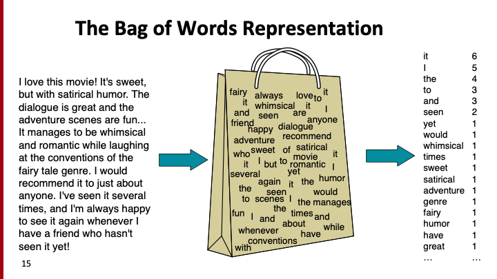
<!-- #endregion -->

<!-- #region {"slideshow": {"slide_type": "slide"}} -->
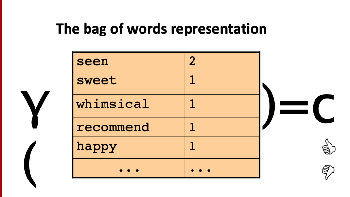

<!-- #endregion -->

<!-- #region {"slideshow": {"slide_type": "notes"}} -->
Function gamma that takes a document and returns a class.

- As input into our model, we are using words. You can think of words as a vector of words.
- We can use all the words or a subset of words.

All we use is a set of words and their counts.
<!-- #endregion -->

<!-- #region {"slideshow": {"slide_type": "slide"}} -->
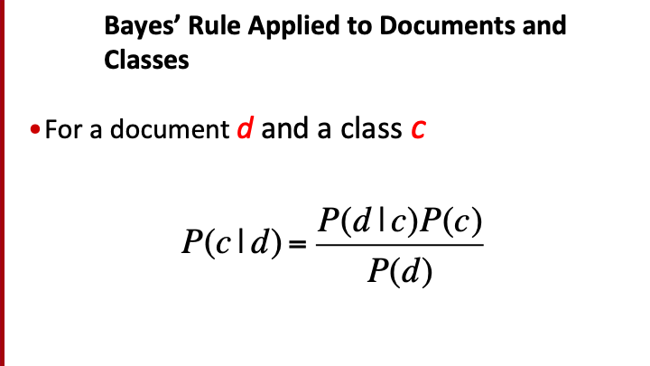
<!-- #endregion -->

<!-- #region {"slideshow": {"slide_type": "notes"}} -->
All we're doing is looking for the (conditional) probability of the class given a document.
<!-- #endregion -->

<!-- #region {"slideshow": {"slide_type": "slide"}} -->
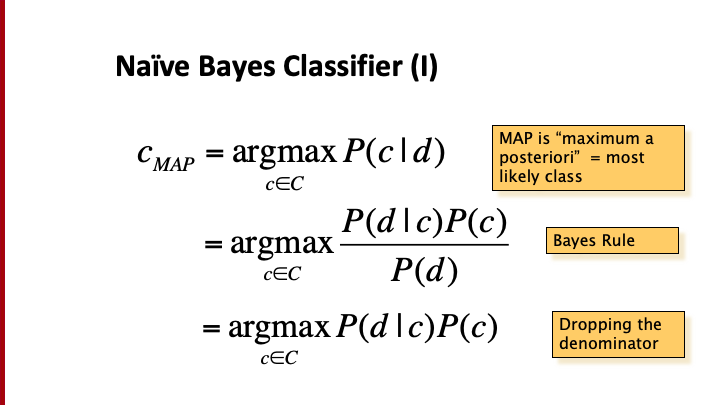
<!-- #endregion -->

<!-- #region {"slideshow": {"slide_type": "notes"}} -->
We drop the denominator since, for every class, the probability of the document is the same.

The MAP (most likely class, maximum a posteriori) is just the product of two things:
- the prior (count of the class across all documents)
- the likelihood
<!-- #endregion -->

<!-- #region {"slideshow": {"slide_type": "slide"}} -->
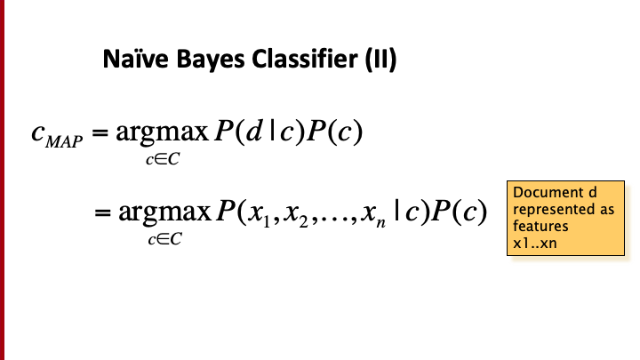
<!-- #endregion -->

<!-- #region {"slideshow": {"slide_type": "notes"}} -->
What is liklihood here? (The probability of the class given the document)

- We represent this with features that represent the document. A vector of features (as joint probabilities) x1 - xn
<!-- #endregion -->

<!-- #region {"slideshow": {"slide_type": "slide"}} -->
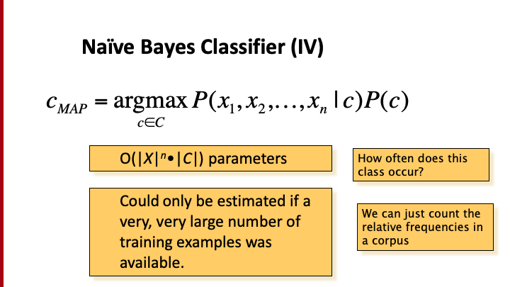
<!-- #endregion -->

<!-- #region {"slideshow": {"slide_type": "notes"}} -->
- Computing the probability of class is easy! Just the frequency.
- Computing likelihood had lots of parameters.

We saw this last week with language modeling. We needed to simplify some of the problems with joint probabilities.
<!-- #endregion -->

<!-- #region {"slideshow": {"slide_type": "slide"}} -->
# Simplifying Assumptions
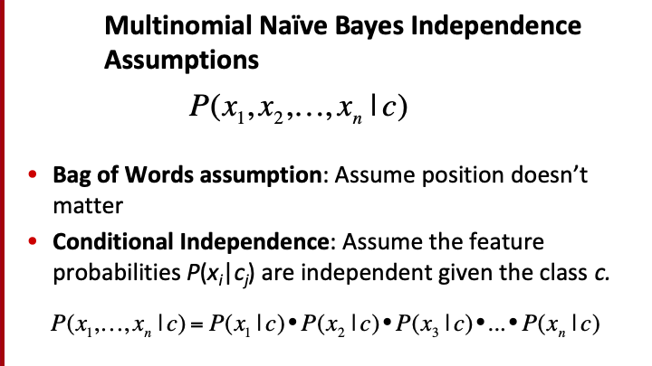
<!-- #endregion -->

<!-- #region {"slideshow": {"slide_type": "notes"}} -->
- The likelihood has a lot of parameters. More so that what we discussed with edit distance. It's so large we could only estimate it with a HUGE number of training examples. So we make simplifying assumptions.
 - Bag-of-words: position of the word in the document doesn't matter.
 - Conditional independence: the different features are independent given the class.
  - P(x1) given the class x P(x2) given the class... etc. A whole joint string of features

Both assumptions are incorrect. But by making these assumptions we are still able to achieve success despite the incorrectness.

We're just going to multiply each of these conditional probabilities without worrying about which position they are in.
<!-- #endregion -->

<!-- #region {"slideshow": {"slide_type": "slide"}} -->
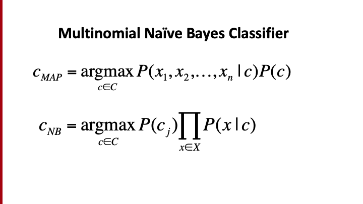
<!-- #endregion -->

We're going to say that the best class by NB, is the one where the probability of the class is multiplied by the sum of the conditional probabilities of each feature.

<!-- #region {"slideshow": {"slide_type": "slide"}} -->
# Naive Bayes and Text
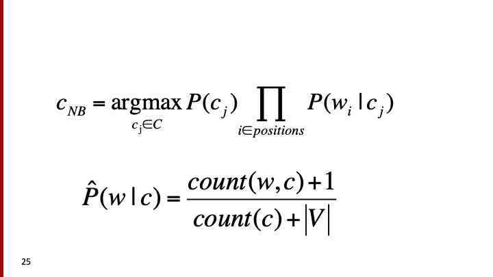
<!-- #endregion -->

<!-- #region {"slideshow": {"slide_type": "notes"}} -->
For Laplace smoothing, add 1 to the count in the numerator and V to the count in the denominator.

*If we just use word features and all the the words in text, we have a kind of language model.*
<!-- #endregion -->

<!-- #region {"slideshow": {"slide_type": "slide"}} -->
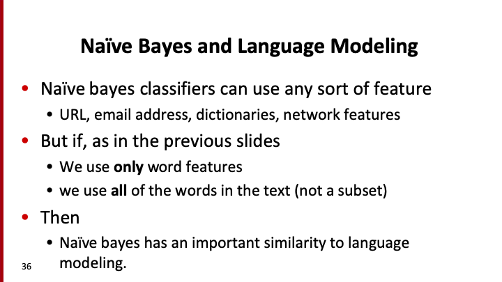
<!-- #endregion -->

<!-- #region {"slideshow": {"slide_type": "slide"}} -->
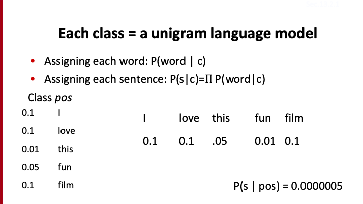
<!-- #endregion -->

<!-- #region {"slideshow": {"slide_type": "notes"}} -->
Each class is a unigram language model.

And for each sentence, we're just multiplying the likelihood of the words in the class.

We can think of this exactly as a language model.
<!-- #endregion -->

<!-- #region {"slideshow": {"slide_type": "slide"}} -->
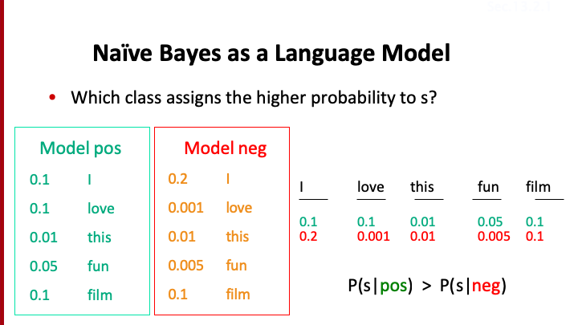
<!-- #endregion -->

<!-- #region {"slideshow": {"slide_type": "notes"}} -->
When we compare the probabilities against two separate language models.
<!-- #endregion -->

<!-- #region {"slideshow": {"slide_type": "slide"}} -->
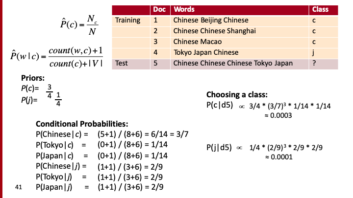
<!-- #endregion -->

<!-- #region {"slideshow": {"slide_type": "notes"}} -->
Chinese: prior 3/4, total words in class = 8, V = 6
Japanese: prior 1/4, total words in class = 3, V = 6 

Choosing a class:
Probability Chinese: Prior x Chinese given the class (3) x Tokyo (1) and Japan (1)
Probability Japanese: Ends up smaller
<!-- #endregion -->

<!-- #region {"slideshow": {"slide_type": "slide"}} -->
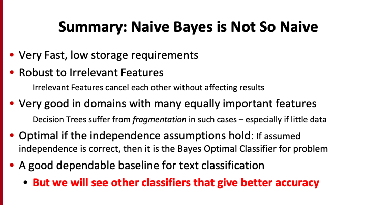
<!-- #endregion -->

<!-- #region {"slideshow": {"slide_type": "slide"}} -->
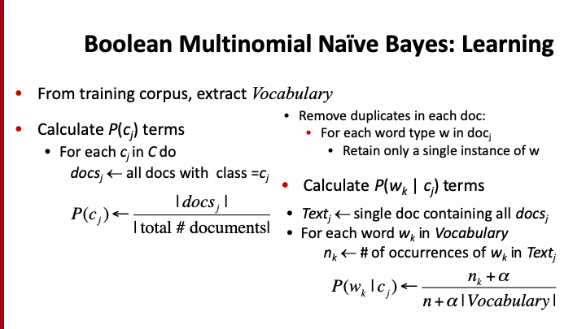
<!-- #endregion -->

<!-- #region {"slideshow": {"slide_type": "slide"}} -->
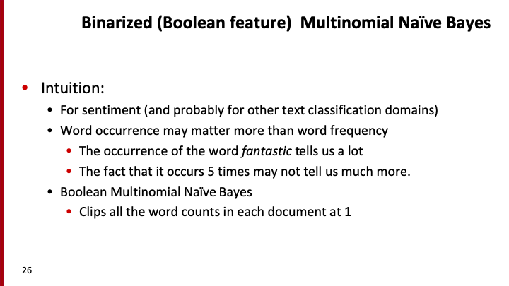
<!-- #endregion -->

<!-- #region {"slideshow": {"slide_type": "slide"}} -->
# Binarized
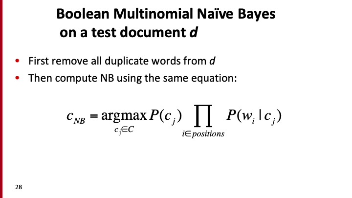
<!-- #endregion -->

<!-- #region {"slideshow": {"slide_type": "slide"}} -->
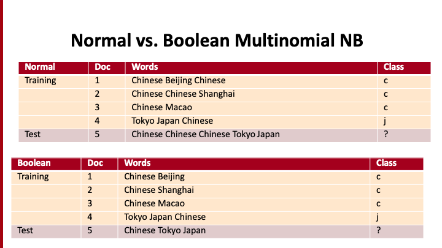
<!-- #endregion -->

<!-- #region {"slideshow": {"slide_type": "notes"}} -->
The word Chinese appears 5 times in the class Chinese. But in the Boolean form of the algorithm, the word Chinese counts as 3.
<!-- #endregion -->

<!-- #region {"slideshow": {"slide_type": "slide"}} -->
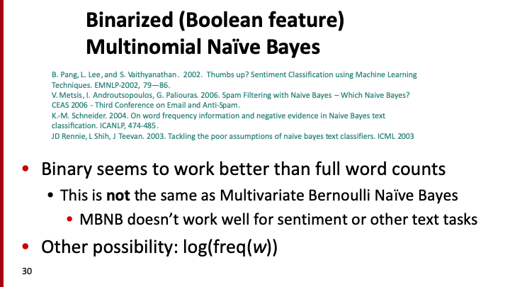
<!-- #endregion -->

<!-- #region {"slideshow": {"slide_type": "slide"}} -->
# Naive Bayes baseline (project)
- Let's walk through some code! 
- Vader (lexicon-based)
- Naive Bayes
 - NLTK
 - Scikit-learn
<!-- #endregion -->

<!-- #region {"slideshow": {"slide_type": "notes"}} -->
I don't want coding to get in the way of learning concepts. You can use these examples for your project and try to improve them. Not sure you can do much to improve Vader, but you can examine results from both to compare the types of errors that you see.
<!-- #endregion -->

<!-- #region {"slideshow": {"slide_type": "slide"}} -->
# Evaluation
<!-- #endregion -->

<!-- #region {"slideshow": {"slide_type": "slide"}} -->
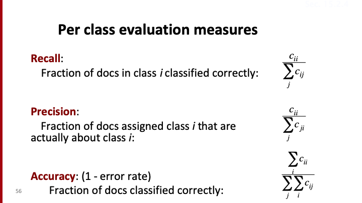
<!-- #endregion -->

<!-- #region {"slideshow": {"slide_type": "notes"}} -->
Slide from J&M.

<!-- #endregion -->

<!-- #region {"slideshow": {"slide_type": "slide"}} -->
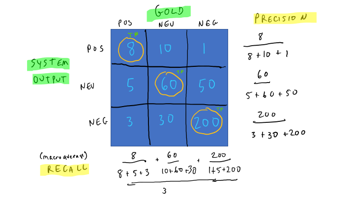
<!-- #endregion -->

<!-- #region {"slideshow": {"slide_type": "notes"}} -->
For each pair of classes <c1,c2> how many documents from c1 were incorrectly assigned to c2?
<!-- #endregion -->

<!-- #region {"slideshow": {"slide_type": "slide"}} -->
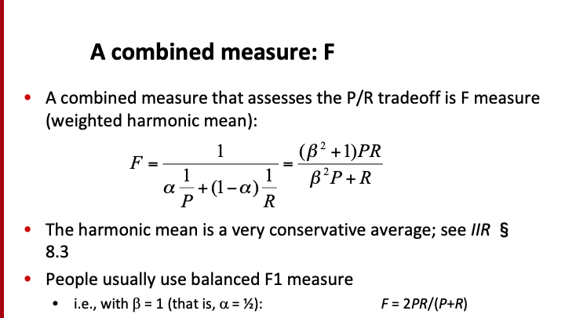
<!-- #endregion -->

<!-- #region {"slideshow": {"slide_type": "notes"}} -->
a combined measure: F-measure: weighted harmonic mean between precision and recall
- why weighted?  in some applications you may care more about P or R
- why harmonic?  it's conservative -- lower than arith or geo mean
- if P and R are far apart, F tends to be near lower value
- in order to do well on F1, need to do well on BOTH P and R

That said... think about how you communicate f-measure scores. Their meaning will not be obvious so you should explain in plain language what is behind it.

Comment: when ppl say f-measure w/o specifying beta, they mean balanced, and this is by far the most common way of doing it -- F1

F1: 2((precision*recall) / (precision+recall))
<!-- #endregion -->

<!-- #region {"slideshow": {"slide_type": "slide"}} -->
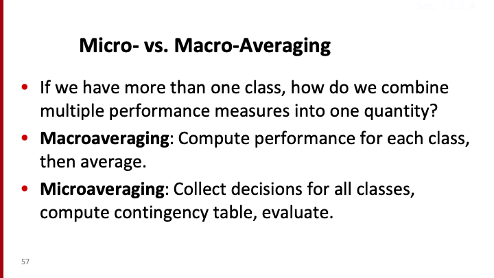
<!-- #endregion -->

<!-- #region {"slideshow": {"slide_type": "notes"}} -->
Slide from J&M

- Macroaveraging is a good strategy for a task where all categories are imporatant and also where one might be smaller than another.
<!-- #endregion -->

<!-- #region {"slideshow": {"slide_type": "slide"}} -->
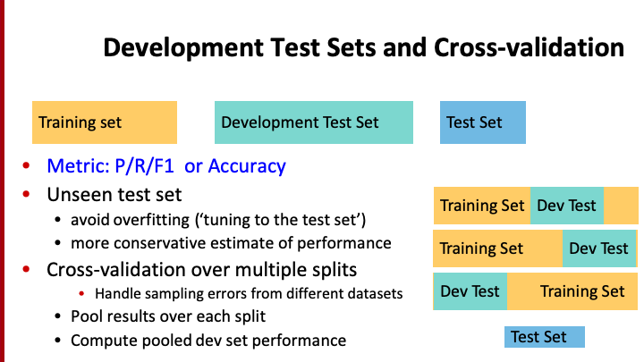
<!-- #endregion -->

<!-- #region {"slideshow": {"slide_type": "notes"}} -->
Slide from J&M
<!-- #endregion -->

<!-- #region {"slideshow": {"slide_type": "slide"}} -->
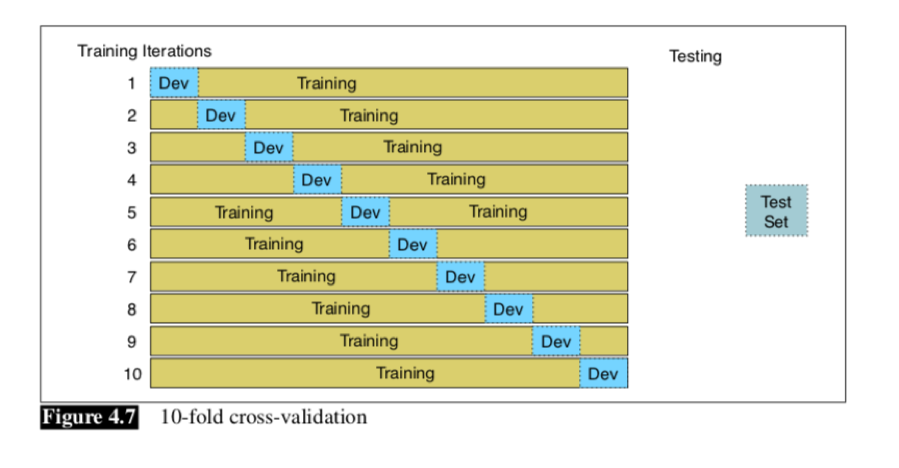
<!-- #endregion -->

<!-- #region {"slideshow": {"slide_type": "notes"}} -->
Slide from J&M

"It is common to create a fixed training set and test set, then do 10-fold cross-validation inside the training set, but compute error rate the normal way in the test set."
<!-- #endregion -->

<!-- #region {"slideshow": {"slide_type": "slide"}} -->
# Practical considerations
<!-- #endregion -->

<!-- #region {"slideshow": {"slide_type": "slide"}} -->
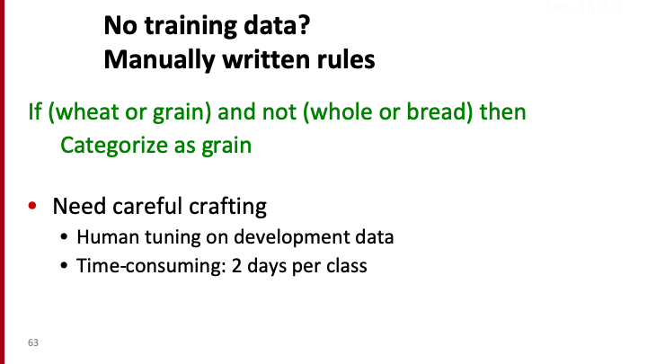
<!-- #endregion -->

<!-- #region {"slideshow": {"slide_type": "notes"}} -->
Slide from J&M
<!-- #endregion -->

<!-- #region {"slideshow": {"slide_type": "slide"}} -->
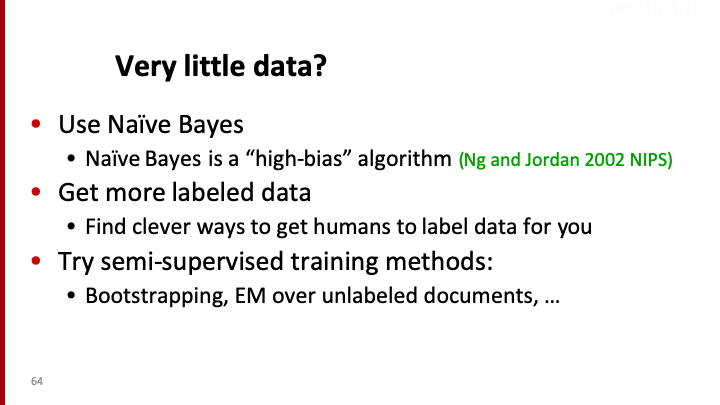
<!-- #endregion -->

<!-- #region {"slideshow": {"slide_type": "notes"}} -->
Slide from J&M
<!-- #endregion -->

<!-- #region {"slideshow": {"slide_type": "slide"}} -->
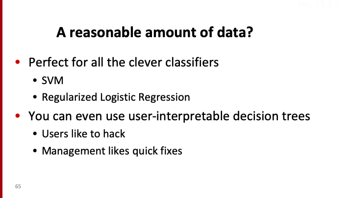
<!-- #endregion -->

<!-- #region {"slideshow": {"slide_type": "notes"}} -->
Slide from J&M
<!-- #endregion -->

<!-- #region {"slideshow": {"slide_type": "slide"}} -->
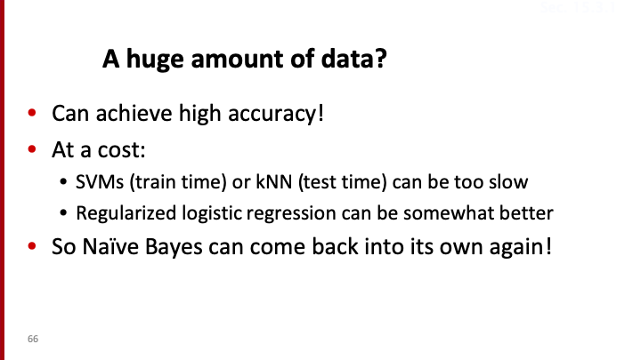
<!-- #endregion -->

<!-- #region {"slideshow": {"slide_type": "notes"}} -->
Slide from J&M
<!-- #endregion -->

<!-- #region {"slideshow": {"slide_type": "slide"}} -->
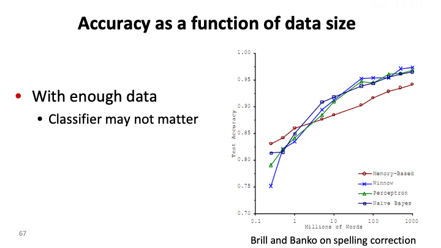
<!-- #endregion -->

<!-- #region {"slideshow": {"slide_type": "notes"}} -->
Slide from J&M
<!-- #endregion -->

<!-- #region {"slideshow": {"slide_type": "slide"}} -->
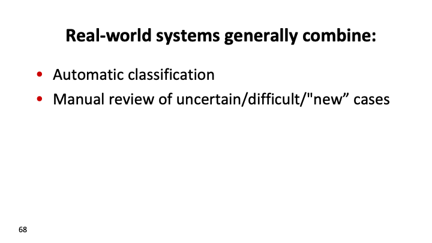
<!-- #endregion -->

<!-- #region {"slideshow": {"slide_type": "notes"}} -->
Slide from J&M
<!-- #endregion -->

<!-- #region {"slideshow": {"slide_type": "slide"}} -->
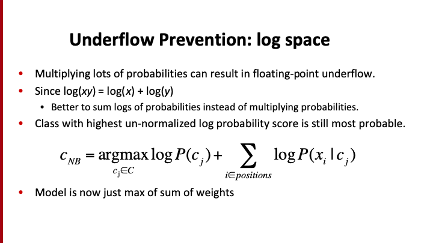
<!-- #endregion -->

<!-- #region {"slideshow": {"slide_type": "notes"}} -->
Slide from J&M
<!-- #endregion -->

<!-- #region {"slideshow": {"slide_type": "slide"}} -->
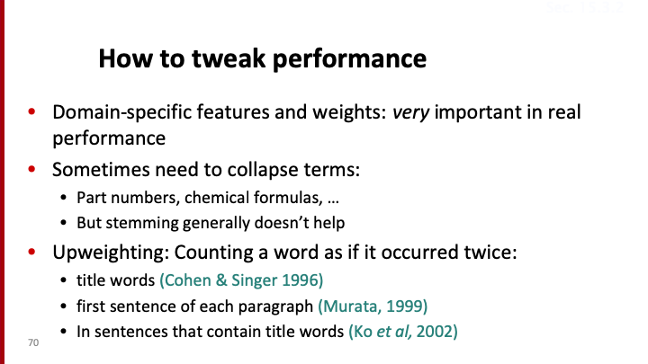
<!-- #endregion -->

<!-- #region {"slideshow": {"slide_type": "notes"}} -->
Slide from J&M
<!-- #endregion -->

<!-- #region {"slideshow": {"slide_type": "slide"}} -->
# Finishing your project

- You have to try to do better than:
 - the baseline naive bayes that I provided
 - the baseline macroaverage score of .33 for any category
- Add the macro-average score
- Generate an output file for your INPUT (test file) that has two columns: id, label
- Submit your report and output file
<!-- #endregion -->

<!-- #region {"slideshow": {"slide_type": "notes"}} -->
- You can directly use the examples I've given you and try to improve them
 - If you do, you will need to include your pre-processor. I used a separate block of code to generate csv files with features for the classifier.
- You can use your own code from scratch 

- We will score your INPUT file and set up a leaderboard for three categories: highest score, most interesting / innovative approach, best report
<!-- #endregion -->

<!-- #region {"slideshow": {"slide_type": "slide"}} -->
# Gold Files
- Why are there four?
- How can you use them?
- What you might look for...
<!-- #endregion -->

<!-- #region {"slideshow": {"slide_type": "notes"}} -->
Thoughts from discussion with an expert participant...
<!-- #endregion -->

<!-- #region {"slideshow": {"slide_type": "slide"}} -->
# Questions?
<!-- #endregion -->
