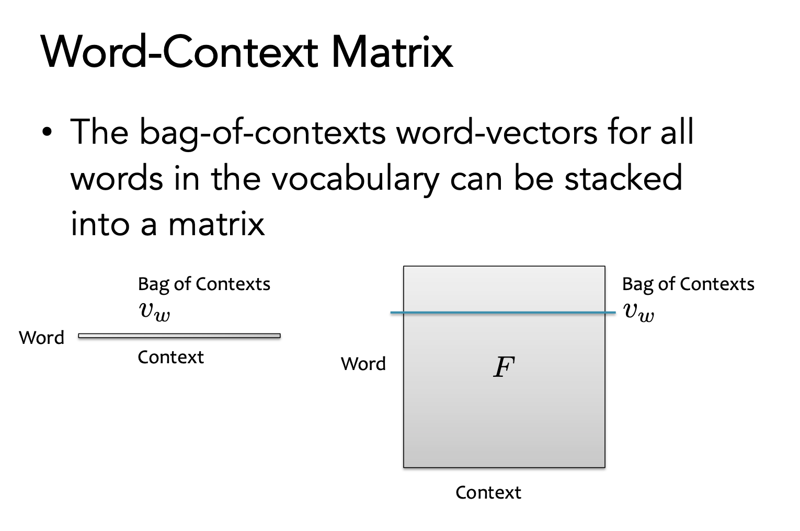
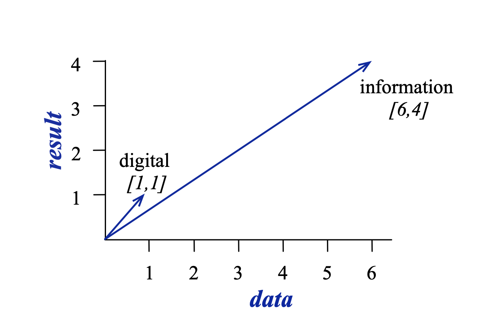
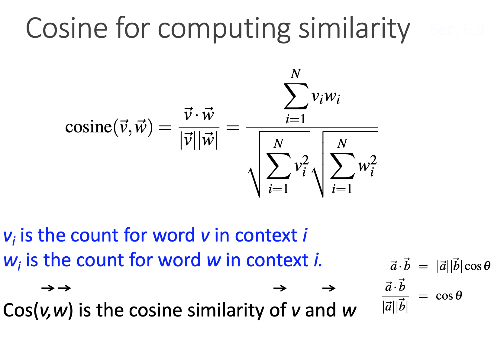

# -*- coding: utf-8 -*-
---
jupyter:
  jupytext:
    comment_magics: false
    formats: ipynb,md
    text_representation:
      extension: .md
      format_name: markdown
      format_version: '1.1'
      jupytext_version: 1.1.5
  kernelspec:
    display_name: Python 3
    language: python
    name: python3
---

```python slideshow={"slide_type": "skip"}
from IPython.display import HTML
```

<!-- #region {"slideshow": {"slide_type": "slide"}} -->
*ANYL 580: NLP for Data Analytics*

# **Lecture 6: Vector Semantics**
<!-- #endregion -->

<!-- #region {"slideshow": {"slide_type": "notes"}} -->
Logistics

- 
<!-- #endregion -->

<!-- #region {"slideshow": {"slide_type": "slide"}} -->
# Topics


<!-- #endregion -->

<!-- #region {"slideshow": {"slide_type": "slide"}} -->
# Feature Unions


<!-- #endregion -->

<!-- #region {"slideshow": {"slide_type": "notes"}} -->
From: Applied Text Analysis with Python by Benjamin Bengfort, Rebecca Bilbro & Tony Ojeda
<!-- #endregion -->

<!-- #region {"slideshow": {"slide_type": "slide"}} -->

<!-- #endregion -->

<!-- #region {"slideshow": {"slide_type": "slide"}} -->

<!-- #endregion -->

<!-- #region {"slideshow": {"slide_type": "slide"}} -->

<!-- #endregion -->

<!-- #region {"slideshow": {"slide_type": "slide"}} -->
# Term-Term Matrix

From this, we can compute word similarity utilizing methods we have already discussed:
- TF-IDF
- PPMI
- Weighted Log Odds
<!-- #endregion -->

<!-- #region {"slideshow": {"slide_type": "slide"}} -->
# Next Week

- How does word similarity help us with document similarity?
- Dense vectors (word2vec & related models)
- Topic models
<!-- #endregion -->
