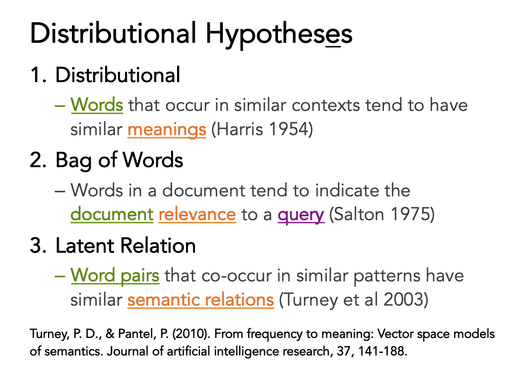
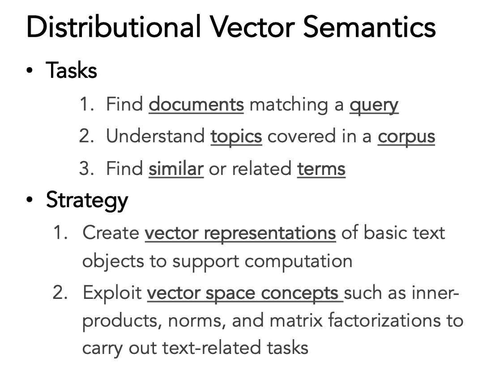
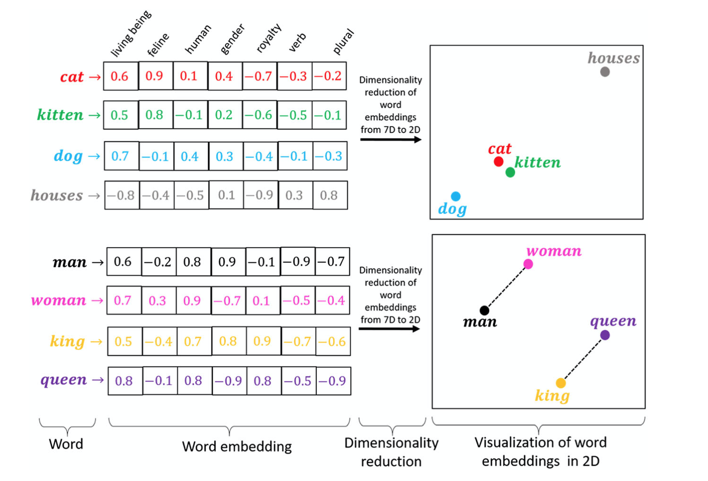
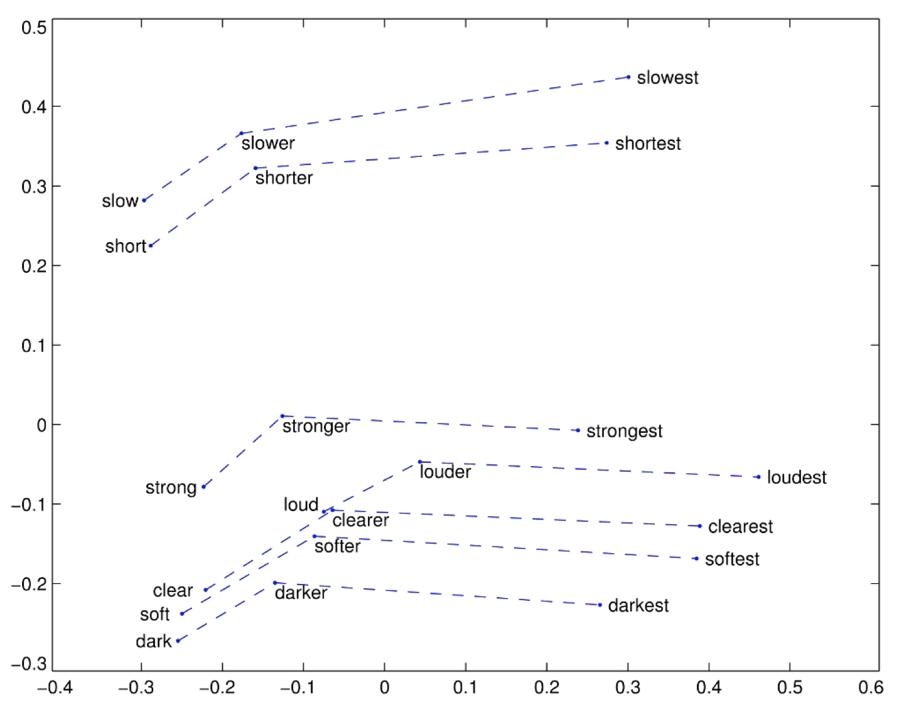

# -*- coding: utf-8 -*-
---
jupyter:
  jupytext:
    comment_magics: false
    formats: ipynb,md
    text_representation:
      extension: .md
      format_name: markdown
      format_version: '1.1'
      jupytext_version: 1.1.5
  kernelspec:
    display_name: Python 3
    language: python
    name: python3
---

```python slideshow={"slide_type": "skip"}
from IPython.display import HTML
```

<!-- #region {"slideshow": {"slide_type": "slide"}} -->
*ANYL 580: NLP for Data Analytics*

# **Lecture 7: Vector Semantics 2**
<!-- #endregion -->

<!-- #region {"slideshow": {"slide_type": "slide"}} -->
# Topics

- Where are we now in our study of NLP?
- Vector semantics part 2
- Guest Lecturer: Tony Zukas on Topic modeling 
<!-- #endregion -->

<!-- #region {"slideshow": {"slide_type": "slide"}} -->
## Where are we now in our study of NLP?

- Foundations J&M 1-6
- Naive Bayes (Bag-of-Words)
- Logistic Regression
- Distributed Representations
<!-- #endregion -->

<!-- #region {"slideshow": {"slide_type": "notes"}} -->
- We started with the idea of words as computable objects. We could do a lot very simply with a **bag-of-word model** and the assumption that words are independent of one another. Lexicons were easy to add to ground truth data to boost the performance of the model.

- But we saw that some feature were clearly more important than others for particular tasks. If we could somehow weight features, we might be able to boost relevance on our sentiment analysis task. To do this, we moved to **logistic regression**. Logistic regression has other parameters that can be tuned to improve performance, (for example, regularization) but we were also very reliant on ground truth data. You could have found ways to add more to your models.

-  In all of this, you learned that there were still phenomena that were difficult to tease out. Unknown words was one. 

- We're now talking about **distributed representations** and tools for asking more fine-grained questions of natural language data. 

- Starting next week, we will be operating in a different mode where you gain an appreciation of how neural networks and dense representations have recently, radically altered the study of NLP. We'll focus on more complex tasks and you will be learning more about linguistic representations and experiment with APIs that will enable you to ask more complex questions of data.
<!-- #endregion -->

<!-- #region {"slideshow": {"slide_type": "slide"}} -->
# Feature Unions


<!-- #endregion -->

<!-- #region {"slideshow": {"slide_type": "notes"}} -->
From: Applied Text Analysis with Python by Benjamin Bengfort, Rebecca Bilbro & Tony Ojeda

- Last week we talked a bit about **pipelines and ensemble models** to integrate data transformers into arbitrarily branching paths. Pipeline objects are Scikit-Learn specific, but they allow for integration points with NLTK and Gensim. The final transformer is an estimator for the prediction task.

- By using pipelines we could use different vectorizers and this helps us solve another problem. While we can vectorize in a variety of ways (simple frequency, one-hot, etc.), we looked closely at **tf-idf** as a means for weighting important words. These were words common to similar documents but not others. 

<!-- #endregion -->

<!-- #region {"slideshow": {"slide_type": "slide"}} -->

<!-- #endregion -->

<!-- #region {"slideshow": {"slide_type": "notes"}} -->
- But tf-idf fails us in some tasks -- we looked at a couple of examples from Monroe et al. on partisan language (Democrats versus Republicans on common issues) and saw that we needed a more fine-grained way to understand language use that was "important" for framing narratives. 
- Thus, we talked about **weighted log odds** as a means to "tune" (like a radio frequency) vectors. The goal was to *know the extent to which a word is used differently across two bodies of text*. This table is from,  [narrative framing of consumer sentiment in online restaurant reviews by Jurafsky, Chahuneau, Routledge, and Smith 2014](https://firstmonday.org/ojs/index.php/fm/article/view/4944/3863). 
- TF-IDF could not help with the question "How do reviewers express fine–grained differences in sentiment beyond just positive or negative?" and weighted log odds was a better tool for this.
<!-- #endregion -->

```python slideshow={"slide_type": "slide"}
# !pip install fightin-words

fw = __import__('fightin-words')
import sklearn.feature_extraction.text as sk_text

# Strings/text corpora to be compared
l1 = 'The quick brown fox jumps over the lazy pig'
l2 = 'The lazy purple pig jumps over the lazier donkey'

# Extractor configuration parameters
prior = 0.05
cv = sk_text.CountVectorizer(max_features=15000)

fw.FWExtractor(prior, cv).fit_transform([l1, l2])
```

<!-- #region {"slideshow": {"slide_type": "notes"}} -->
 [GitHub - kenlimmj/fightin-words: A scikit-learn compliant implementation of Monroe et al.'s Fightin' Words analysis method.](https://github.com/kenlimmj/fightin-words) 

*Thus, moving from a frequency or tf-idf-based vectorizer, we can incorporate and reflect other weightings in order to draw out different aspects of meaning.*

From [jmhessel](https://github.com/jmhessel/FightingWords):

- Say you have two groups of people talking, and you'd like to know which side is saying what. There are two problems that you might encounter when attempting this comparison:

 - You have a disproportionate number of language samples from one side, so methods based on **raw counts are not going to work**.
 - **One side uses words that the other side doesn't**, and it's not clear whether this occurs because the word is actually used more by one side, or because the word just happens to be rare.

- Monroe et al. solve the first problem by examining the usage rates of each word/n-gram, rather than the raw counts. They solve the second problem by introducing a smoothing Dirichlet prior on vocabulary items. These two solutions are unified under a single, simple framework.
<!-- #endregion -->

<!-- #region {"slideshow": {"slide_type": "slide"}} -->

<!-- #endregion -->

<!-- #region {"slideshow": {"slide_type": "notes"}} -->
- Section 2 then went on to talk about similarity and what this meant. We left off at the idea that everything we have been talking has revolved around similarity. 
- This is a powerful concept since language is constantly evolving and our vocabularies are never complete, nor is there an objective way to understand the meaning of a word. 
- In fact, we know from linguistic theory **the meaning of a word is always contextual**. You cannot know meaning with out context. 
- From Turney and Pantel above - **"If units of text have similar vectors in a text frequency matrix, then they tend to have similar meanings."**

<!-- #endregion -->

<!-- #region {"slideshow": {"slide_type": "slide"}} -->
## Distributed Word Representations

<!-- #endregion -->

<!-- #region {"slideshow": {"slide_type": "notes"}} -->
- This section draws from Chris Pott's notes: https://web.stanford.edu/class/linguist236/materials/ling236-handout-05-09-vsm.pdf. 

- The corpus are IMDB reviews.
- In all of this we've been using word vectors for the representation of meaning, though primarily at the document level as bag-of-words.
- Let's take a look at a document term matrix. Here rows are labeled with words and columns are labeled with document indices (bag-of-words representations). Cell values are frequency counts.
- Note this matrix is very sparse - this can be a computational advantage but has other disadvantages.
- The idea in an IR task is to rank documents (columns) according to their values for a given query (set of rows).
<!-- #endregion -->

<!-- #region {"slideshow": {"slide_type": "slide"}} -->

<!-- #endregion -->

<!-- #region {"slideshow": {"slide_type": "notes"}} -->
- Note, that both documents and terms can be vectors. 
- By using the idea of distributional vector semantics we can perform a variety of tasks.


(Looking back to the word-document matrix in the previous slide, we can ask the following sorts of questions)

For a word x document matrix:
- How do the rows relate to each other
- How do the columns relate to each other
- For a given group of documents D, which word epitomize D?
- For a given group of words W, which documents epitomize W (IR)?

<!-- #endregion -->

<!-- #region {"slideshow": {"slide_type": "slide"}} -->
# Word x Word matrix

<!-- #endregion -->

<!-- #region {"slideshow": {"slide_type": "notes"}} -->
This dense matrix is derivable from the word-document matrix. Implicit here is co-occuring context.  For example *ain't* and *against* occur 15 times in the corpus.

- This matrix is particularly dense since IMDB reviews are pretty long.
- We could also constrain co-occurence to the same sentence, paragraph, etc. We're not limited to the entire document. You can also arbitrarily do this on some number of words such as 5000 x 5000 words.
<!-- #endregion -->

<!-- #region {"slideshow": {"slide_type": "slide"}} -->

<!-- #endregion -->

<!-- #region {"slideshow": {"slide_type": "slide"}} -->
# Other possible designs
* word × search query 
* word × syntactic context 
* pair × pattern (e.g., *mason*: *stone*, *cuts*) 
* adj. × modified noun 
* word × dependency rel. 
* person × product (think about this from an advertising perspective)
* word × person 
* word × word × pattern 
* verb × subject × object 
* . . . 
<!-- #endregion -->

<!-- #region {"slideshow": {"slide_type": "slide"}} -->
# Matrix Design Choices

<!-- #endregion -->

<!-- #region {"slideshow": {"slide_type": "notes"}} -->
 This can seem overwhelming
    
- We've already seen the importance of tokenization, feature selection and labeled data in terms of importance in a matrix design. 
- You have many more choices for matrices. 
- You could decide to treat as a document, all of the tweets from a single person.
- We briefly talked about how direct counts weren't that useful and weighting to amplify certain characteristics is an important aspect of design.
- Today, we'll talk more on dimensionality reduction to further refine the matrix. Word2vec (and Glove) combines both weighting and dimensionality reduction and we'll look briefly at that.
- Finally, there will be vector comparisons -- and there are many options.
<!-- #endregion -->

<!-- #region {"slideshow": {"slide_type": "slide"}} -->
# Vector Comparision Example

<!-- #endregion -->

<!-- #region {"slideshow": {"slide_type": "notes"}} -->
 Semantically related words should be closer together and semantically unrelated words should be farther apart. We'll use this concept for guiding the development of representations.
- In this small example, there are three words (A, B, C) and two documents.
	- Document x is along the x axis
	- Document y is along the y axis
- The intuition we hope to capture is that words A & B have similar distributions. We think they should be close together.
- In this example, imagine that words A & B have similar distributions. 
	- Maybe A is a positive but low frequency word
	- Maybe B is a positive, high frequency word like good
	- Maybe dy is a positive movie review and dx is more ambivalent.
	- Maybe word c is a word like disappointing with a bias to a more negative review like dx
<!-- #endregion -->

<!-- #region {"slideshow": {"slide_type": "slide"}} -->

<!-- #endregion -->

<!-- #region {"slideshow": {"slide_type": "notes"}} -->
The value in the denominator is the normalized distance
- The numerator is the dot product.
- We subtract the quotient from 1 to get a rough distance calculation
For similarity we actually measuring the angles. 
<!-- #endregion -->

<!-- #region {"slideshow": {"slide_type": "slide"}} -->
# Other similarity (comparison) methods
- Manhattan distance
- Matching coefficient
- Dice coefficient
- Jaccard coefficient
- Probabilistic methods
- ...
<!-- #endregion -->

<!-- #region {"slideshow": {"slide_type": "slide"}} -->
## Matrix Re-weighting
Amplify the important, trustworthy, and unusual; deemphasize the distracting, mundane, quirky, or mistakes
- The intuition is that we want to move away from raw counts
- For weighting schemes, assess:
- How do they compare to raw count values?
- How does it compare  to word frequencies?
- What is the overall distribution of values
- We should prefer not to do feature selection the basis of counts, stop words, etc.
<!-- #endregion -->

<!-- #region {"slideshow": {"slide_type": "slide"}} -->
## Weighting / Normalization schemes
- TF-IDF variants
- Pairwise distance measures  (e.g., PPMI)
- Recall... these are **sparse representations**
<!-- #endregion -->

<!-- #region {"slideshow": {"slide_type": "notes"}} -->
- For other TF-IDF variants, see Manning and Schuetze’s textbook Foundations of Statistical  Natural Language Processing, p. 553)
- *long**(length |V|= 20,000 to 50,000)
- **sparse**(most elements are zero) 
<!-- #endregion -->

<!-- #region {"slideshow": {"slide_type": "slide"}} -->
 Shorter vectors may be easier to use as features in ML (fewer weights to tune)
- Dense vectors may generalize better that storing explicit counts
- They may do better at capturing similarity such as synonymy 
- They tend to work well for NLP!
- Three downloadable dense embeddings:
	- Word2vec (Mikolov et. al.[Google Code Archive - Long-term storage for Google Code Project Hosting.](https://code.google.com/archive/p/word2vec/)
	- Fasttext (from Facebook) - ([fastText](http://www.fasttext.cc/)
	- Glove (Pennington, Socher, Manning) - [GloVe: Global Vectors for Word Representation](https://nlp.stanford.edu/projects/glove/)
<!-- #endregion -->

<!-- #region {"slideshow": {"slide_type": "slide"}} -->
## Word2vec
Instead of counting how often two words co-occur,
- Train a classifier on a binary prediction task: is w likely to be near y?
- We take the learned classifier weights as embeddings
- This is amazing since we now have "gold" answers to these questions ... no labeled data needed!
 - Insights from Bengio et al. (2003) and Collobert et al. (2011)
<!-- #endregion -->

<!-- #region {"slideshow": {"slide_type": "slide"}} -->

<!-- #endregion -->

<!-- #region {"slideshow": {"slide_type": "notes"}} -->
This example is from Rozado (2019) Using Word Embeddings to Analyze how Universities Conceptualize “Diversity” in their Online Institutional Presence

- Note that we're gaining more than simply informationed encoded lexically: vector space models *can encode semantic and syntactic meaning based on word use in the corpus from which the word embedding model was trained*. 

- This 2D visualization makes it possible to visualize word relationships more easily.
<!-- #endregion -->

<!-- #region {"slideshow": {"slide_type": "slide"}} -->
## Word2vec with skipgrams (sgns)
1. Treat the target word and a neighboring context word as positive examples. 
2. Randomly sample other words in the lexicon to get negative samples 
3. Use logistic regression to train a classifier to distinguish those two cases 
4. Use the weights as the embeddings 
<!-- #endregion -->

<!-- #region {"slideshow": {"slide_type": "slide"}} -->

<!-- #endregion -->

<!-- #region {"slideshow": {"slide_type": "notes"}} -->
For each positive example, we create k negative examples using noise words that are not t.

Then we train a logistic regression classifier iterative over the training set! To evaluate these -- use human scores from similarity-type tasks such as the SimLex task mentioned last week.
<!-- #endregion -->

<!-- #region {"slideshow": {"slide_type": "slide"}} -->

<!-- #endregion -->

<!-- #region {"slideshow": {"slide_type": "notes"}} -->
- similarity depends on the window size c
- C = ±2 The nearest words to *Hogwarts:* are *Sunnydale*, *Evernight*
- C = ±5 The nearest words to *Hogwarts:* are *Dumbledore*, *Malfoy*, *halfblood*
<!-- #endregion -->

<!-- #region {"slideshow": {"slide_type": "slide"}} -->

<!-- #endregion -->

<!-- #region {"slideshow": {"slide_type": "slide"}} -->

<!-- #endregion -->

<!-- #region {"slideshow": {"slide_type": "slide"}} -->
## NAACL 2019 Tutorial on measuring and modeling change


<!-- #endregion -->

<!-- #region {"slideshow": {"slide_type": "notes"}} -->
From the [2019 NAACL tutorial on Measuring and Modeling Language Change (Jacob Eisenstein)](https://github.com/jacobeisenstein/language-change-tutorial/blob/master/eisenstein-naacl-slides.pdf)


- Note... we have been focused on doing predictive tasks with text. These examples are focused around **explanation**.  NLP is used to operationalize variables of interest.
<!-- #endregion -->

<!-- #region {"slideshow": {"slide_type": "slide"}} -->
## Dimensionality Reduction & Topic Modeling<div class="cite2c-biblio"></div>
<!-- #endregion -->
