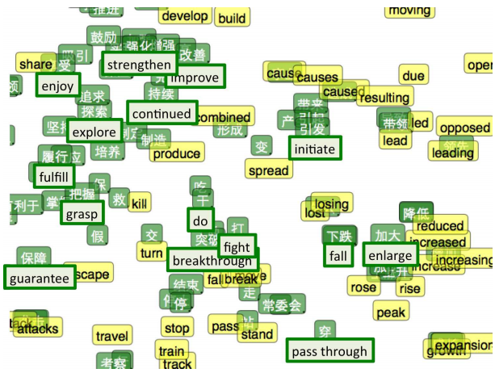
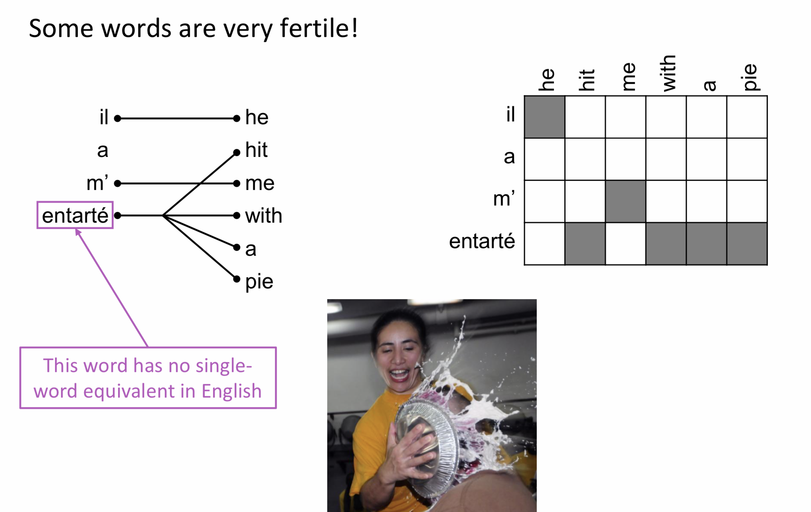
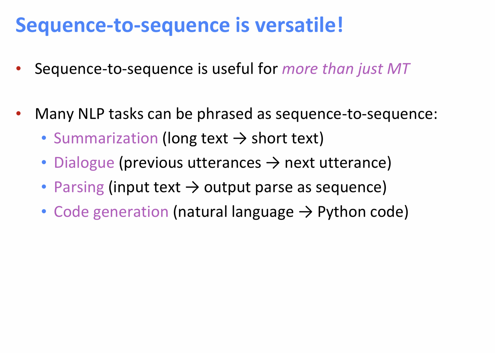

# -*- coding: utf-8 -*-
---
jupyter:
  jupytext:
    comment_magics: false
    formats: ipynb,md
    text_representation:
      extension: .md
      format_name: markdown
      format_version: '1.1'
      jupytext_version: 1.1.5
  kernelspec:
    display_name: Python 3
    language: python
    name: python3
---

```python slideshow={"slide_type": "skip"}
from IPython.display import HTML
```

<!-- #region {"slideshow": {"slide_type": "slide"}} -->
*ANYL 580: NLP for Data Analytics*

# **Machine Translation**
<!-- #endregion -->

<!-- #region {"slideshow": {"slide_type": "slide"}} -->
# Topics

- Summary of topic models
- Cross-lingual embeddings
- Machine Translation
<!-- #endregion -->

<!-- #region {"slideshow": {"slide_type": "slide"}} -->
## What are topic models?
- A means to discover and organize a collection of documents in terms of larger themes
- Adaptable to many kinds of data
- Operationalized as patterns across a corpus. For example, "recipe", "slice", "apple", "flour" versus "recipe", "chili", "beans", "onion" 
- For text, input is a document-term matrix
<!-- #endregion -->

<!-- #region {"slideshow": {"slide_type": "notes"}} -->
- Simple python implementation in LDA: https://www.analyticsvidhya.com/blog/2016/08/beginners-guide-to-topic-modeling-in-python/
- Also discussed last week was an article by David Blei on LDA: http://www.cs.columbia.edu/~blei/papers/Blei2012.pdf
<!-- #endregion -->

<!-- #region {"slideshow": {"slide_type": "slide"}} -->

<!-- #endregion -->

<!-- #region {"slideshow": {"slide_type": "notes"}} -->
From the Blei article, these are topics. They are labelled with numbers because topics are a colletion of words. More importantly, for probabalistic models such as LDA. Topics represent latent patterns.

Note: while for many of the methods we've been talking about, eliminating stop words can lead to unexpected consequences. But for topic modeling, you may want to reduce overly general words.
<!-- #endregion -->

<!-- #region {"slideshow": {"slide_type": "slide"}} -->

<!-- #endregion -->

<!-- #region {"slideshow": {"slide_type": "notes"}} -->
LDA is considered an example of generative, probabilistic  modeling, where data includes  hidden  (or latent) variables.  This  generative  process  defines  a  joint  probability  distribution over observed and hidden variables.

In this diagram, you can see that observed words have topics assigned to them and ALSO participate in topics.
<!-- #endregion -->

<!-- #region {"slideshow": {"slide_type": "slide"}} -->
## Common topic modeling methods
- **LDA** – Latent Dirichlet Allocation – Probabilistic Graphical Model. Assumes documents are a mixture of topics with a probability distribution.
- **LSA or LSI** – Latent Semantic Analysis or Latent Semantic Indexing – Singular Value Decomposition (SVD) on the Document-Term Matrix. Based on Linear Algebra (Gensim)
- **NMF** – Non-Negative Matrix Factorization – Based on Linear Algebra
<!-- #endregion -->

<!-- #region {"slideshow": {"slide_type": "slide"}} -->
## Commonalities between them
- The **number of topics** as a parameter. None of the algorithms can infer the number of topics in the document collection.
- Input is a **Document-Word Matrix**
 - DWM[i][j] = The number of occurrences of $word_j$ in $document_i$.
- Output is 2 matrices
 - WTM (Word Topic Matrix) and TDM (Topic Document Matrix). The matrices are significantly smaller and the result of their multiplication should be as close as possible to the original DWM matrix.
<!-- #endregion -->

<!-- #region {"slideshow": {"slide_type": "slide"}} -->
## How do you use results of topic modeling (UX)

<!-- #endregion -->

<!-- #region {"slideshow": {"slide_type": "notes"}} -->
Image from: https://tedunderwood.com/2012/11/11/visualizing-topic-models/

An important question for topic modeling is 'how are the results used'? Ted Underwood created the visualiation above. He works in the social sciences in literary research. Ostensibly, this is a visualization that he can interpret, or share with colleauges. 

But if you are digitizing large collections as from a library, perhaps your topic models support some element of a user interface such as the information architecture driving how users interact with a website.
<!-- #endregion -->

<!-- #region {"slideshow": {"slide_type": "slide"}} -->
## Non-Negative Matrix Factorization

<!-- #endregion -->

<!-- #region {"slideshow": {"slide_type": "notes"}} -->
Image from: http://citeseerx.ist.psu.edu/viewdoc/download?doi=10.1.1.702.4867&rep=rep1&type=pdf

http://lsa.colorado.edu/LexicalSemantics/seung-nonneg-matrix.pdf

Lee and Seung introduced NNMF for learning parts of objects in images and semantic features text. NMF: an unsupervised family of algorithms that simultaneously perform dimension reduction and clustering.

In MF, we basically factorize 𝑋 into two matrices, W and H.

- W are word-specific features
- H are document-specific features 

In plain words, documents are linear combinations of topics and topics are linear combinations of words. We’ll fix the number of topics to  𝑟 and look for an  𝑚×𝑟  matrix  𝐴  and an  𝑟×𝑛  matrix  𝑊  for which  𝑀=𝐴𝑊.
<!-- #endregion -->

<!-- #region {"slideshow": {"slide_type": "slide"}} -->
## Non-Negative Matrix Factorization

<!-- #endregion -->

<!-- #region {"slideshow": {"slide_type": "notes"}} -->
Image from: http://citeseerx.ist.psu.edu/viewdoc/download?doi=10.1.1.702.4867&rep=rep1&type=pdf

Recommended methodology:

1. Construct vector space model for documents (after stop- word filtering), resulting in a term-document matrix A.
2. Apply TF-IDF term weight normalisation to A.
3. Normalize TF-IDF vectors to unit length.
4. Initialise factors using NNDSVD on A.
5. Apply Projected Gradient NMF to A.
<!-- #endregion -->

<!-- #region {"slideshow": {"slide_type": "slide"}} -->
## Non-Negative Matrix Factorization

<!-- #endregion -->

<!-- #region {"slideshow": {"slide_type": "notes"}} -->
Image from: http://citeseerx.ist.psu.edu/viewdoc/download?doi=10.1.1.702.4867&rep=rep1&type=pdf

Interpreting NMF output:
- Basis vectors: the topics (clusters) in the data.
- Coefficient matrix: the membership weights for documents
relative to each topic (cluster).
<!-- #endregion -->

<!-- #region {"slideshow": {"slide_type": "slide"}} -->
## Matrix Factorization and Word2vec


<!-- #endregion -->

<!-- #region {"slideshow": {"slide_type": "notes"}} -->
If you are interested, this series of blog posts describes a  matrix factorization implementation of SGNS (i.e., skip-gram with negative sampling, Word2vec) in Tensorflow 2.0. 
- Produces word embeddings in less than 30 minutes
- Does not require the original text corpus
- Only requires a file containing pre-extracted corpus statistics

https://medium.com/radix-ai-blog/unifying-word-embeddings-and-matrix-factorization-part-1-cb3984e95141, Kian Kenyon-Dean

In effect, this work builds off work from Levy & Goldberg 2015. Improving Distributional Similarity with Lessons Learned from Word Embeddings. Transactions of the Association for Computational Linguistics.

If you recall, Pointwise Mutual Information (PMI), it largely builds off this statistic.


<!-- #endregion -->

<!-- #region {"slideshow": {"slide_type": "slide"}} -->
# Distributed Representations... why are they so important?

<!-- #endregion -->

<!-- #region {"slideshow": {"slide_type": "notes"}} -->
1. Model important properties of language.
2. Learn a good representation on one task and use it on another
3. Map multiple kinds of data into a single representation
<!-- #endregion -->

<!-- #region {"slideshow": {"slide_type": "slide"}} -->
# Encoding semantic features

<!-- #endregion -->

<!-- #region {"slideshow": {"slide_type": "notes"}} -->
Remember from last week that a word embedding is a very simple representation that maps a word to a vector. In fact, it maps to a high dimensional vector. 

In theory, is this not very similar to lexicon coding... not by hand, but by language use itself!
<!-- #endregion -->

<!-- #region {"slideshow": {"slide_type": "slide"}} -->
# Cross-lingual Embeddings


<!-- #endregion -->

<!-- #region {"slideshow": {"slide_type": "notes"}} -->
So let's take our word vectors and do something a bit different. 

W is initialized with a random vector for each word and learns meaningful vectors for some task.
<!-- #endregion -->

<!-- #region {"slideshow": {"slide_type": "slide"}} -->
## Embeddings

<!-- #endregion -->

<!-- #region {"slideshow": {"slide_type": "notes"}} -->
One such task is to learn if a 5-gram is "valid". Does it occur in data?

Thus, the network has to learn good parameters for both W (vector) and R (predictor).
https://arxiv.org/pdf/1102.1808v3.pdf
<!-- #endregion -->

<!-- #region {"slideshow": {"slide_type": "slide"}} -->
## Vector Math


<!-- #endregion -->

<!-- #region {"slideshow": {"slide_type": "notes"}} -->
Something very neat from embedding spaces is that when we map back down to 2-dimensions (using t-SNE, for example) we see similar words cluster together. 

We can even do very neat things like do vector mathematics on word embeddings!

We saw last week how amazing this was because we didn't need labelled data to find these relationships. *They are in the data* -- we just found a different way to represent the data in a useful way.
<!-- #endregion -->

<!-- #region {"slideshow": {"slide_type": "slide"}} -->
## Multiple Representations

<!-- #endregion -->

<!-- #region {"slideshow": {"slide_type": "notes"}} -->
Recall, that the idea of word embeddings came from Collobert, Bengio...

- What has revolutionized NLP is not Neural Networks... but new forms of *dense and distributed representations*
- A nove concept with these new word representations is that we train a good representation (like a word embedding) and use it to learn another task. 
<!-- #endregion -->

<!-- #region {"slideshow": {"slide_type": "slide"}} -->
## Cross-lingual Embeddings

<!-- #endregion -->

<!-- #region {"slideshow": {"slide_type": "notes"}} -->
We can also map multiple kinds of data into a single representation. 

Socher et al. Embed words from two different languages into the same shared space.
<!-- #endregion -->

<!-- #region {"slideshow": {"slide_type": "slide"}} -->
## T-SNE

<!-- #endregion -->

<!-- #region {"slideshow": {"slide_type": "notes"}} -->
We can also map multiple kinds of data into a single representation. 

Socher et al. Embed words from two different languages into the same shared space.

http://ai.stanford.edu/~wzou/emnlp2013_ZouSocherCerManning.pdf

We already know that word embeddings pull similar words together. Look at Chinese and English in the same space. Similar words end up close to one another!

Similarly, Socher et al. Use two very different representations in the same space and get similar results. Here are both words and images in the same vector space.
<!-- #endregion -->

<!-- #region {"slideshow": {"slide_type": "slide"}} -->
## Unknown class?

<!-- #endregion -->

<!-- #region {"slideshow": {"slide_type": "notes"}} -->
What happens when you test the model on a new class of images? Socher et. Al did this with 8 known and 2 unknown classes. You get images of unknown classes to the right neighborhood.

Later this has been done with a much larger number of categories. There is much active research around text and image models.
<!-- #endregion -->

<!-- #region {"slideshow": {"slide_type": "slide"}} -->

<!-- #endregion -->

<!-- #region {"slideshow": {"slide_type": "slide"}} -->
# FB Laser

<!-- #endregion -->

<!-- #region {"slideshow": {"slide_type": "notes"}} -->
https://engineering.fb.com/ai-research/laser-multilingual-sentence-embeddings/

We're now moving towards talking about neural networks and MT. Laser uses sequence-to-sequence process that we will talk about shortly.

It has a shared encoder for all input languages and a shared decoder to generate the output language.

LASER (Language-Agnostic SEntence Representations) toolkit. We are now open-sourcing our work, making LASER the first successful exploration of massively multilingual sentence representations to be shared publicly with the NLP community. The toolkit now works with more than 90 languages, written in 28 different alphabets. LASER achieves these results by embedding all languages jointly in a single shared space (rather than having a separate model for each). We are now making the multilingual encoder and PyTorch code freely available, along with a multilingual test set for more than 100 languages.

LASER opens the door to performing zero-shot transfer of NLP models from one language, such as English, to scores of others — including languages where training data is extremely limited. LASER is the first such library to use one single model to handle this variety of languages, including low-resource languages, like Kabyle and Uighur, as well as dialects such as Wu Chinese. The work could one day help Facebook and others launch a particular NLP feature, such as classifying movie reviews as positive or negative, in one language and then instantly deploy it in more than 100 other languages.
<!-- #endregion -->

<!-- #region {"slideshow": {"slide_type": "slide"}} -->

<!-- #endregion -->

<!-- #region {"slideshow": {"slide_type": "slide"}} -->
## Modularity

<!-- #endregion -->

<!-- #region {"slideshow": {"slide_type": "notes"}} -->
Note, this is a simple example of modularity in a network. There are two components W and R. http://arxiv.org/pdf/1102.1808v3.pdf
<!-- #endregion -->

<!-- #region {"slideshow": {"slide_type": "slide"}} -->
## Sequences

<!-- #endregion -->

<!-- #region {"slideshow": {"slide_type": "slide"}} -->
## Tree-like Structures (Recursion)

<!-- #endregion -->

<!-- #region {"slideshow": {"slide_type": "notes"}} -->
By adding another representation (sequences), we can create longer and longer phrases and there don't have to be a fixed number of inputs.
<!-- #endregion -->

<!-- #region {"slideshow": {"slide_type": "slide"}} -->
## Trees and Sentiment

<!-- #endregion -->

<!-- #region {"slideshow": {"slide_type": "notes"}} -->
These models are called **recursive neural networks** because one often has the output of a module go into a module of the same type. Note the tree-like structure.
http://nlp.stanford.edu/~socherr/EMNLP2013_RNTN.pdf

Socher et al. Have used this sort of architecture to predict sentence sentiment.
<!-- #endregion -->

<!-- #region {"slideshow": {"slide_type": "slide"}} -->
# Phrase-Based MT

<!-- #endregion -->

<!-- #region {"slideshow": {"slide_type": "notes"}} -->
RNN Encoder–Decoder that consists of two recurrent neural networks (RNN). One RNN encodes a sequence of symbols into a fixed-length vector representation, and the other decodes the representation into another sequence of symbols.

Learning Phrase Representations using RNN Encoder–Decoder for Statistical Machine Translation (2014)
http://arxiv.org/pdf/1406.1078v1.pdf
<!-- #endregion -->

<!-- #region {"slideshow": {"slide_type": "slide"}} -->
# Machine Translation

- Machine Translation (MT) is the task of translating a sentence x from one language (the source language) to a sentence y in another language (the target language).
- Requires us to talk about a neural architecture called seq2seq and also a neural technique called attention.
<!-- #endregion -->

<!-- #region {"slideshow": {"slide_type": "slide"}} -->
## Why is MT so difficult?
- Morphology
 - Some languages have 1 morpheme/words
   - For example, Vietnamese; an isolating language
 - Some languages have many morphemes/words
   - For example, Yupik ("Eskimo"), entire sentence is one words
  - A polysynthetic language
- Syntax
 - Some languages are Subject-Verb-Object (SVO)
   - E.g. English; He adores listening to music
 - Some languages are VSO, SOV, etc.
   - E.g. Japanese: [gloss] He music to listening adores
- Languages mark direction and manner of motion differently
 - English: The bottle floated into the cave
 - Spanish: [gloss] The bottle entered the cave floatingly
- Lexical differences
 - English wall:
   - German Wand (inside a building)
   - German Mauer (outside a building)
 - German leihen:
   - English borrow
   - English lend
<!-- #endregion -->

<!-- #region {"slideshow": {"slide_type": "slide"}} -->

<!-- #endregion -->

<!-- #region {"slideshow": {"slide_type": "notes"}} -->
We were doing rule-based MT until the 1990's. 
https://www.youtube.com/watch?v=K-HfpsHPmvw&feature=youtu.be

The first demonstration of MT in 1954 was at Georgetown with IBM! They so over-sold this, predictions were that MT would be a solved problem in 5 years. After little progress, the Government stopped funding in the mid-1960s. MT research was sidelined for a long time.

There were still some limited success. MT was successful for very constrained (limited domain) language use like weather. 
<!-- #endregion -->

<!-- #region {"slideshow": {"slide_type": "slide"}} -->

<!-- #endregion -->

<!-- #region {"slideshow": {"slide_type": "notes"}} -->
Encoding all information about translation is very hard. There have been no successful interlinguas.

Note the idea of word embeddings does seem to capture some commonalities between languages.

Try out rule-based MT at:
http://www.apertium.org

A rule-based system, consisting of dictionaries, grammar files, etc.
Open-source; anyone can create their own new language pair (and many have)
<!-- #endregion -->

<!-- #region {"slideshow": {"slide_type": "slide"}} -->

<!-- #endregion -->

<!-- #region {"slideshow": {"slide_type": "notes"}} -->
Statistical - core idea is to learn a probabilistic model from data. 

IBM pioneered statistical MT based on parallel corpora. The quality was such that it was only useful for "gisting" documents.

1990's to about 2013. That said, both Google and Microsoft released their first neural MT systems in 2016.
<!-- #endregion -->

<!-- #region {"slideshow": {"slide_type": "slide"}} -->

<!-- #endregion -->

<!-- #region {"slideshow": {"slide_type": "notes"}} -->
We break this problem down into two parts.

Training the model:
- word alignment
- phrase pair extraction
- phrase pair scoring
<!-- #endregion -->

<!-- #region {"slideshow": {"slide_type": "slide"}} -->

<!-- #endregion -->

<!-- #region {"slideshow": {"slide_type": "notes"}} -->
You need millions of words in parallel data.
<!-- #endregion -->

<!-- #region {"slideshow": {"slide_type": "slide"}} -->

<!-- #endregion -->

<!-- #region {"slideshow": {"slide_type": "notes"}} -->
But to learn from a translation corpus, we have to deal with the problem of alignment.
<!-- #endregion -->

<!-- #region {"slideshow": {"slide_type": "slide"}} -->

<!-- #endregion -->

<!-- #region {"slideshow": {"slide_type": "notes"}} -->
The idea here is some words translate one-to-many or many-to-many. It is also not unusual for words to not have a corresponding translation.

Translations of sentences are often not the same length. Some languages use more or fewer words. Or perhaps even no words.
<!-- #endregion -->

<!-- #region {"slideshow": {"slide_type": "slide"}} -->

<!-- #endregion -->

<!-- #region {"slideshow": {"slide_type": "slide"}} -->

<!-- #endregion -->

<!-- #region {"slideshow": {"slide_type": "slide"}} -->

<!-- #endregion -->

<!-- #region {"slideshow": {"slide_type": "notes"}} -->
From: Investigating ‘Aspect’ in NMT and SMT: Translating the English Simple Past and Present Perfect, Eva Vanmassenhove, Jinhua Du, Andy Way 2017

The core component of phrase-based translation models and the main knowledge source for the decoder are the phrase-tables, which contain the probabilities of translating a word (or a sequence of words) from one language into another. These word sequences are referred to as phrases.

Unlike the linguistic use of the term phrase (verb phrase, nouns phrase etc.), phrases in the phrase-tables do not have any linguistic motivation but are just an arbitrary sequence of words (Koehn 2009). All the knowledge that phrase-tables contain is extracted from the word and phrase alignments obtained from the parallel data they were trained on. 

This example shows phrase-translations extracted from a phrase-table trained on Europarl data.

The possible phrase translations are followed by four scores: the inverse phrase translation probability (p(english|french)), the inverse lexical weighting (lex(english|french)), the direct phrase translation probability (p(french|english)) and the direct lexical weighting (lex(french |english)). 

http://www.statmt.org/book/slides/05-phrase-based-models.pdf
<!-- #endregion -->

<!-- #region {"slideshow": {"slide_type": "slide"}} -->

<!-- #endregion -->

<!-- #region {"slideshow": {"slide_type": "slide"}} -->

<!-- #endregion -->

<!-- #region {"slideshow": {"slide_type": "slide"}} -->

<!-- #endregion -->

<!-- #region {"slideshow": {"slide_type": "notes"}} -->
Lots of stored and maintained resources such as large tables of equivalences.

“Moses” is an open-source MT system you can work with)
http://www.statmt.org/ 
<!-- #endregion -->

<!-- #region {"slideshow": {"slide_type": "slide"}} -->
# Neural MT

<!-- #endregion -->

<!-- #region {"slideshow": {"slide_type": "notes"}} -->
Image from: https://www.slideshare.net/IconicTranslation/machine-translation-the-neural-frontier-74363623

This stuff is really new! It wasn't even taught last year. Why do data scientists need to know about this.

1. We need to talk about sequence problems anyway
2. You need to know something about how they work. It's possible you could need to tune NMT for some domain.
<!-- #endregion -->

<!-- #region {"slideshow": {"slide_type": "slide"}} -->

<!-- #endregion -->

<!-- #region {"slideshow": {"slide_type": "notes"}} -->
We're just going to barely touch on sequence-to-sequence models with attention. 

A sequence-to-sequence model is a model that takes a sequence of items (words, letters, features of an images…etc) and outputs another sequence of items. 

In seq2seq, the idea is to have two recurrent neural networks (RNNs) with an encoder-decoder architecture: read the input words one by one to obtain a (context) vector representation of a fixed dimensionality (encoder), and, conditioned on these inputs, extract the output words one by one using another RNN (decoder).

http://jalammar.github.io/visualizing-neural-machine-translation-mechanics-of-seq2seq-models-with-attention/

https://towardsdatascience.com/attn-illustrated-attention-5ec4ad276ee3
<!-- #endregion -->

<!-- #region {"slideshow": {"slide_type": "slide"}} -->

<!-- #endregion -->

<!-- #region {"slideshow": {"slide_type": "notes"}} -->
Note that input into the encoder is a vector like a pre-trained embedding. 
<!-- #endregion -->

<!-- #region {"slideshow": {"slide_type": "slide"}} -->

<!-- #endregion -->

<!-- #region {"slideshow": {"slide_type": "notes"}} -->
 Seq-to-sq is a conditional LM because its predictions are conditioned on the source sentence. Note that unlike SMT, NMT directly calculates probabilities of the entire sequence.
<!-- #endregion -->

<!-- #region {"slideshow": {"slide_type": "slide"}} -->

<!-- #endregion -->

<!-- #region {"slideshow": {"slide_type": "slide"}} -->
# Attention

<!-- #endregion -->

<!-- #region {"slideshow": {"slide_type": "notes"}} -->
To imagine a sequence-to-sequence model without attention, imagine an interpreter translating in real time between Chinese and English without taking notes. If the sequence is long, then the interpreter may forget key words or concepts by the end of an utterance.

With attention, the translator has help. In essence, the translator can take notes. Not only that, but with a bi-directional model, the translator has the help of a second translator that is reading backwards and they can compare notes and translate each sentence together.

Note in this image from Bahdanau, Cho, and Bengio 2015 - the model learns to both align (soft-)search for parts of a text while predicting a target word.

https://arxiv.org/pdf/1409.0473.pdf
<!-- #endregion -->

<!-- #region {"slideshow": {"slide_type": "slide"}} -->
## What is a good translation?

- Human raters
 - Fluency – How clear, intelligible, readable, etc.
 - Fidelity – How accurate, informative, etc.
- Automated 
 - IBM’s “BLEU” score
 - Weighted average of N-gram overlaps 
 - Uses unigrams, bigrams, trigrams, quadrigrams
<!-- #endregion -->

<!-- #region {"slideshow": {"slide_type": "slide"}} -->

https://www.sdl.com/blog/understanding-mt-quality-bleu-scores.html
<!-- #endregion -->

<!-- #region {"slideshow": {"slide_type": "slide"}} -->
# Challenges for MT

- NMT have lower quality **out-of-domain**.
- NMT systems have a steeper learning curve with respect to the **amount of training data**, resulting in worse quality in low-resource settings, but better performance in high- resource settings.
- NMT systems that operate at the sub-word level (e.g. with byte-pair encoding) perform better than SMT systems on extremely low-frequency words, but still show **weakness in translating low-frequency words belonging to highly-inflected categories (e.g. verbs)**.
- NMT systems have lower translation quality on **very long sentences**, but do comparably better up to a sentence length of about 60 words.
- The attention model for NMT does not always fulfill the role of a word alignment model, but may in fact dramatically diverge. (There may be mismatch between attention states and desired word alignments)
- NMT are much less interpretable.
<!-- #endregion -->

<!-- #region {"slideshow": {"slide_type": "notes"}} -->
Six Challenges for Neural Machine Translation, Koehn and Knowles. Proceedings of the First Workshop on Neural Machine Translation, pages 28–39, Vancouver, Canada, August 4, 2017. https://www.aclweb.org/anthology/W17-3204.pdf

<!-- #endregion -->

<!-- #region {"slideshow": {"slide_type": "slide"}} -->
## Final thought -- is this the end?

<!-- #endregion -->

<!-- #region {"slideshow": {"slide_type": "notes"}} -->
Machine Translation is hard and we've been working on it a long time. We lacked adequate computational tools until very recently. Even then, 


In this example, authors posit a 5-way aspectual system to account for how sentential aspects interact with properties of verbs in a sentence context.

Tense relates the time of a situation. Aspect refers to completion or non-completion of a verb in time.

- John went running this morning.
- John runs every morning.
- John is running an errand.
- John had been running an errand when his car broke down.


(a) “He made dinner.” “ Hizo la comida” PERFECTIVE
(b) “He made dinner.” “ Hac ́ıa la comida” IMPERFECTIVE

SMT reflects lexical aspect of verbs in it's ‘knowledge source’, i.e. the phrase-tables. SMT’s knowledge is limited to the size of the n-grams in the phrase-tables, so they cannot cover other aspectual factors that appear in a sentence (in case they fall out of the n-gram range).

NMT does have the means to store information about the entire source sentence and NMT encoding vectors do capture aspectual information.  Although aspect can accurately (90.95%) be predicted from the encoding vectors by a logistic regression model, the NMT decoder loses some of this information during the decoding process.

Vanmassenhove, E., Du, J., & Way, A. (2017). Investigating ‘aspect’in nmt and smt: Translating the english simple past and present perfect. Computational Linguistics in the Netherlands Journal, 7, 109-128.

Toward a Computational Model of Aspect and Verb Semantics, Winfield S. Bennett, Tanya Herlick, Katherine Hoyt, Joseph Liro and Ana Santisteban, Machine Translation
Vol. 4, No. 4 (Dec., 1989), pp. 247-280 (34 pages)

Coding the lexicon using features (+,-,0)

- DYNAMIC
- ATOMIC (iterator)
- TELIC (completion)

accomplishment - [+d +t -a]

The queen rules England. (state)
John has known French for five years. (not finished)
John has run. (finished)
<!-- #endregion -->
